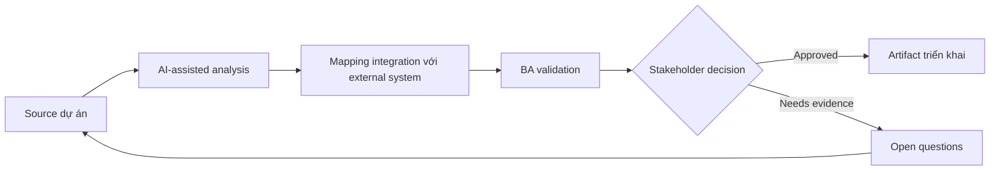

# Mapping integration với external system

<div class="case-meta">
  <span>Data and Integration</span>
  <span>External integrations</span>
  <span>Use case dự án</span>
</div>

## Project context

Platform integrate với tax provider, CRM, payment gateway và document verification service. Mỗi system có data model, SLA, authentication và error behavior riêng. Trong môi trường delivery thật, tình huống này thường xuất hiện dưới áp lực thời gian: stakeholder cần clarity, delivery cần backlog, QA cần behavior test được, operations cần process chịu được exception. BA dùng AI để tăng tốc analysis và synthesis, nhưng BA vẫn chịu trách nhiệm về evidence, business meaning, stakeholder decisioning và artifact quality.

## BA challenge

BA phải map integration behavior end to end để team biết data nào move, vì sao move, khi nào move, fail gì có thể xảy ra và ai own từng failure. Khó khăn thực tế là AI có thể làm material ban đầu trông hoàn chỉnh hơn mức thật sự. BA giỏi giữ output ở trạng thái reviewable bằng cách tách source-backed fact, assumption, unsupported claim, decision gap và recommended next action. Mục tiêu không phải làm document dài hơn; mục tiêu là làm project decision rõ hơn và an toàn hơn.

## Where AI fits

<div class="ba-workbench-panel">
AI hữu ích trong use case này khi được giới hạn vào analysis support, pattern detection, structured drafting và critique. AI không được approve scope, invent policy, quyết định business trade-off hoặc thay thế judgment của stakeholder chịu trách nhiệm.
</div>

- Generate integration context diagram và dependency question.
- Identify data mapping, auth, SLA và failure behavior gap.
- Draft integration scenario matrix.
- Tạo operational support và escalation requirement.

## Inputs to prepare

- System context diagram
- Provider docs
- Data mapping drafts
- SLA commitments
- Support process

BA nên label các input này trước khi dùng AI: source owner, source date, approval status, sensitivity level, và source đó là fact, opinion, policy, draft hay historical evidence. Việc chuẩn bị này ngăn model xem mọi input đều current và authoritative như nhau.

## BA workflow

1. Tạo system context map và integration inventory.
2. Yêu cầu AI generate question cho data, auth, SLA, error, retry và support.
3. Define integration scenario cho success, failure, timeout, duplicate và provider outage.
4. Map ownership giữa internal và external team.
5. Review data privacy và contractual obligation.
6. Publish integration requirement và operational escalation path.

Workflow hiệu quả nhất khi dùng AI theo từng stage: trước hết organize evidence, sau đó yêu cầu analysis, tiếp theo tạo artifact, rồi chạy critique pass. BA nên giữ decision log visible xuyên suốt để suggestion do AI sinh ra không âm thầm trở thành approved scope.

## Diagram



## Deliverables

| Deliverable | Nội dung | Owner | Done signal |
| --- | --- | --- | --- |
| Integration inventory | System, purpose, data, auth, SLA, owner và dependency | BA và architect | Mọi integration visible |
| Scenario matrix | Success, failure, timeout, duplicate, retry và provider outage behavior | BA | Failure behavior defined |
| Data exchange map | Source, target, transform, frequency và privacy classification | Data owner | Data movement controlled |
| Escalation playbook | Issue, owner, provider contact, SLA và support communication | Operations | Support escalate được |

Các deliverable này nên được xem là artifact do BA own. AI có thể draft, nhưng BA phải validate source support, stakeholder meaning, traceability và artifact đã sẵn sàng handoff hay chưa.

## Prompt to try

```text
Hãy đóng vai senior Business Analyst hiểu AI. Hỗ trợ tôi áp dụng use case "Mapping integration với external system" vào dự án. Trước hết hỏi source evidence và constraint. Sau đó tạo structured analysis gồm project context, assumption, AI-fit boundary, workflow step, deliverable, risk, control, open question và stakeholder decision. Không tự bịa policy, threshold hoặc approval.
```

## Review checklist

- Mọi statement do AI hỗ trợ đều gắn với source, assumption hoặc validation question.
- BA đã tách drafting assistance khỏi business approval.
- Workflow step có human owner cho decision, review và exception.
- Deliverable trace được về project input và review được bởi QA, product hoặc operations.
- Risk control đủ thực tế để dùng trong meeting dự án thật.
- Success metric: External integration có data, failure, ownership và escalation behavior rõ.

## Risks and controls

| Rủi ro | Vì sao quan trọng | Control của BA |
| --- | --- | --- |
| Dependency opacity | Team không hiểu impact khi external fail | Map dependency và owner |
| Provider behavior mismatch | Provider error không match expectation nội bộ | Review provider doc và scenario |
| Data privacy issue | External system nhận sensitive data | Classify data và review contract |
| Escalation delay | Incident stall vì không có owner | Define escalation playbook |

Control quan trọng nhất là làm uncertainty visible. Nếu evidence yếu, output nên tạo validation question hoặc decision item, không phải final requirement. Nếu artifact ảnh hưởng delivery, release, compliance, customer experience hoặc operational workload, BA nên yêu cầu human review explicit trước khi handoff.
