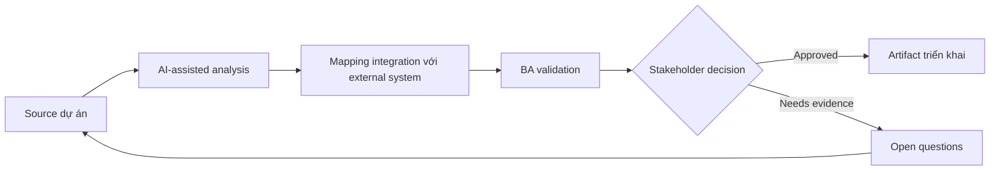

# Mapping integration với external system

<div class="case-meta">
  <span>Data and Integration</span>
  <span>External integrations</span>
  <span>Use case dự án</span>
</div>

## Project context

Platform integrate với tax provider, CRM, payment gateway và document verification service. Mỗi system có data model, SLA, authentication và error behavior riêng. Trong External integrations, công việc này thường bắt đầu khi data movement, mapping, reconciliation, privacy và lineage decision ảnh hưởng nhiều system và owner. BA nên xem System context diagram và Provider docs là evidence cần organize, không phải raw material để AI trả lời không kiểm soát. Mục tiêu là làm decision tiếp theo rõ hơn cho người own outcome.

## BA challenge

BA phải map integration behavior end to end để team biết data nào move, vì sao move, khi nào move, fail gì có thể xảy ra và ai own từng failure. Với Mapping integration với external system, khó khăn thực tế là silent data loss và lineage yếu. AI có thể tăng tốc field mapping, rule comparison, reconciliation design, lineage review và exception analysis, nhưng BA vẫn phải làm rõ assumption, approval còn thiếu và điểm cần stakeholder judgment.

## Where AI fits

<div class="ba-workbench-panel">
AI phù hợp với use case Data và Integration khi được giới hạn vào field mapping, rule comparison, reconciliation design, lineage review và exception analysis. AI task hữu ích đầu tiên là: Generate integration context diagram và dependency question. AI không được approve scope, invent policy, bỏ qua source schema, sample payload, mapping rule, data-quality report và ownership matrix, hoặc biến draft thành final decision.
</div>

- Generate integration context diagram và dependency question.
- Identify data mapping, auth, SLA và failure behavior gap.
- Draft integration scenario matrix.
- Tạo operational support và escalation requirement.

## Inputs to prepare

- System context diagram
- Provider docs
- Data mapping drafts
- SLA commitments
- Support process

Trước khi prompt cho Mapping integration với external system, hãy label từng input theo owner, date, approval status, sensitivity và vai trò trong decision. Evidence lens quan trọng nhất là source schema, sample payload, mapping rule, data-quality report và ownership matrix; nếu thiếu, AI có thể xem old note, draft design và approved rule có authority như nhau.

## BA workflow

1. Tạo system context map và integration inventory.
2. Yêu cầu AI generate question cho data, auth, SLA, error, retry và support.
3. Define integration scenario cho success, failure, timeout, duplicate và provider outage.
4. Map ownership giữa internal và external team.
5. Review data privacy và contractual obligation.
6. Publish integration requirement và operational escalation path.

Chạy workflow như data contract review trước integration build: bắt đầu với "Tạo system context map và integration inventory.", sau đó giữ decision log visible khi artifact tiến tới Integration inventory. Cách này ngăn suggestion của AI âm thầm trở thành backlog, design, release hoặc operational commitment.

## Diagram



## Deliverables

| Deliverable | Nội dung | Owner | Done signal |
| --- | --- | --- | --- |
| Integration inventory | System, purpose, data, auth, SLA, owner và dependency | BA và architect | Mọi integration visible |
| Scenario matrix | Success, failure, timeout, duplicate, retry và provider outage behavior | BA | Failure behavior defined |
| Data exchange map | Source, target, transform, frequency và privacy classification | Data owner | Data movement controlled |
| Escalation playbook | Issue, owner, provider contact, SLA và support communication | Operations | Support escalate được |

Hãy xem Integration inventory là data and integration control pack do BA own. AI có thể draft structure, nhưng BA phải validate "Mọi integration visible" có thật sự đúng không, artifact có trace được về evidence không và receiving team có hành động được không.

## Prompt to try

```text
Hãy đóng vai senior Business Analyst hiểu AI. Hỗ trợ tôi áp dụng use case "Mapping integration với external system" vào dự án. Trước hết hỏi source evidence và constraint. Sau đó tạo structured analysis gồm project context, assumption, AI-fit boundary, workflow step, deliverable, risk, control, open question và stakeholder decision. Không tự bịa policy, threshold hoặc approval.
```

## Review checklist

- System context diagram được label owner, date, approval status và sensitivity.
- Integration inventory trace được về source evidence và có human owner rõ.
- AI task nằm trong boundary field mapping, rule comparison, reconciliation design, lineage review và exception analysis và không approve scope hoặc policy.
- Risk "Dependency opacity" có control thực tế: Map dependency và owner.
- Open assumption được chuyển thành validation question hoặc stakeholder decision.
- Success metric: External integration có data, failure, ownership và escalation behavior rõ.

## Risks and controls

| Rủi ro | Vì sao quan trọng | Control của BA |
| --- | --- | --- |
| Dependency opacity | Team không hiểu impact khi external fail | Map dependency và owner |
| Provider behavior mismatch | Provider error không match expectation nội bộ | Review provider doc và scenario |
| Data privacy issue | External system nhận sensitive data | Classify data và review contract |
| Escalation delay | Incident stall vì không có owner | Define escalation playbook |

Control chính cho risk "Dependency opacity" là human accountability explicit: Map dependency và owner. Nếu evidence yếu, output nên tạo validation question hoặc decision item, không phải final requirement.
