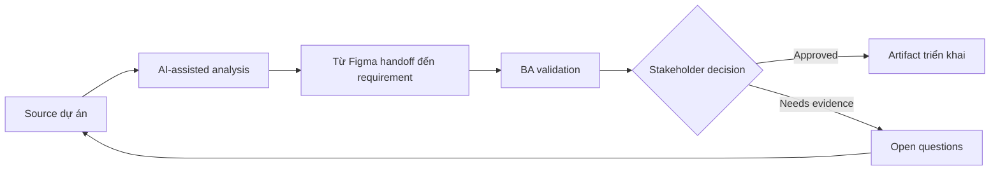

# Từ Figma handoff đến requirement

<div class="case-meta">
  <span>Frontend, UI, and UX</span>
  <span>Design handoff</span>
  <span>Use case dự án</span>
</div>

## Project context

Product designer share file Figma cho customer self-service dashboard. Developer hỏi behavior rule vì design chỉ có frame nhưng thiếu permission, state, API dependency và analytics event. Trong môi trường delivery thật, tình huống này thường xuất hiện dưới áp lực thời gian: stakeholder cần clarity, delivery cần backlog, QA cần behavior test được, operations cần process chịu được exception. BA dùng AI để tăng tốc analysis và synthesis, nhưng BA vẫn chịu trách nhiệm về evidence, business meaning, stakeholder decisioning và artifact quality.

## BA challenge

BA phải chuyển visual design thành requirement build được mà không làm mất UX intent. BA cần capture screen purpose, user action, dynamic state, data dependency, empty/error state và phần cần validate với product, UX, frontend, backend và QA. Khó khăn thực tế là AI có thể làm material ban đầu trông hoàn chỉnh hơn mức thật sự. BA giỏi giữ output ở trạng thái reviewable bằng cách tách source-backed fact, assumption, unsupported claim, decision gap và recommended next action. Mục tiêu không phải làm document dài hơn; mục tiêu là làm project decision rõ hơn và an toàn hơn.

## Where AI fits

<div class="ba-workbench-panel">
AI hữu ích trong use case này khi được giới hạn vào analysis support, pattern detection, structured drafting và critique. AI không được approve scope, invent policy, quyết định business trade-off hoặc thay thế judgment của stakeholder chịu trách nhiệm.
</div>

- Extract screen, component, action và state gap từ Figma notes.
- Generate UI behavior matrix cho normal, empty, loading, error và permission state.
- Draft question cho UX, frontend, backend, analytics và QA.
- Critique handoff để tìm missing data, validation và interaction rule.

## Inputs to prepare

- Figma frames và design annotations
- User flow hoặc journey map
- Component library rules
- Permission matrix
- Known API hoặc data source notes

BA nên label các input này trước khi dùng AI: source owner, source date, approval status, sensitivity level, và source đó là fact, opinion, policy, draft hay historical evidence. Việc chuẩn bị này ngăn model xem mọi input đều current và authoritative như nhau.

## BA workflow

1. Inventory từng screen, component, action và visible data element.
2. Yêu cầu AI chuyển design thành behavior matrix có state coverage.
3. Review generated behavior theo UX intent và product rule.
4. Identify backend data dependency và unresolved API question.
5. Thêm acceptance criteria cho state, copy, validation, accessibility và analytics.
6. Chạy handoff review với UX, frontend, backend, QA và product owner.

Workflow hiệu quả nhất khi dùng AI theo từng stage: trước hết organize evidence, sau đó yêu cầu analysis, tiếp theo tạo artifact, rồi chạy critique pass. BA nên giữ decision log visible xuyên suốt để suggestion do AI sinh ra không âm thầm trở thành approved scope.

## Diagram



## Deliverables

| Deliverable | Nội dung | Owner | Done signal |
| --- | --- | --- | --- |
| UI behavior matrix | Screen, component, trigger, state, rule, data source và owner | BA | Developer implement không phải đoán state behavior |
| Design gap register | Missing copy, data, permission, validation và interaction rule | BA và UX | Mọi gap có owner |
| Frontend acceptance criteria | Given-When-Then criteria cho UI state và interaction | BA và QA | QA test được screen behavior |
| API dependency list | Data field, source endpoint, loading behavior và fallback | Backend lead | Backend question visible trước build |

Các deliverable này nên được xem là artifact do BA own. AI có thể draft, nhưng BA phải validate source support, stakeholder meaning, traceability và artifact đã sẵn sàng handoff hay chưa.

## Prompt to try

```text
Hãy đóng vai senior Business Analyst hiểu AI. Hỗ trợ tôi áp dụng use case "Từ Figma handoff đến requirement" vào dự án. Trước hết hỏi source evidence và constraint. Sau đó tạo structured analysis gồm project context, assumption, AI-fit boundary, workflow step, deliverable, risk, control, open question và stakeholder decision. Không tự bịa policy, threshold hoặc approval.
```

## Review checklist

- Mọi statement do AI hỗ trợ đều gắn với source, assumption hoặc validation question.
- BA đã tách drafting assistance khỏi business approval.
- Workflow step có human owner cho decision, review và exception.
- Deliverable trace được về project input và review được bởi QA, product hoặc operations.
- Risk control đủ thực tế để dùng trong meeting dự án thật.
- Success metric: Design handoff trở thành UI specification test được, có state behavior và backend dependency rõ.

## Risks and controls

| Rủi ro | Vì sao quan trọng | Control của BA |
| --- | --- | --- |
| Design-only handoff | Frame nhìn complete nhưng behavior missing | Bắt buộc behavior matrix và state coverage |
| UX intent loss | Developer implement layout nhưng miss decision logic | Record screen purpose và user goal |
| Backend surprise | UI field có thể cần data API chưa có | Tạo API dependency list sớm |
| QA ambiguity | QA không biết expected behavior cho empty/error state | Thêm acceptance criteria cho mọi state |

Control quan trọng nhất là làm uncertainty visible. Nếu evidence yếu, output nên tạo validation question hoặc decision item, không phải final requirement. Nếu artifact ảnh hưởng delivery, release, compliance, customer experience hoặc operational workload, BA nên yêu cầu human review explicit trước khi handoff.
