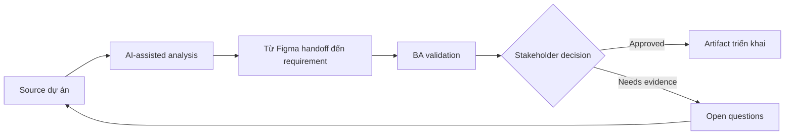

# Từ Figma handoff đến requirement

<div class="case-meta">
  <span>Frontend, UI, and UX</span>
  <span>Design handoff</span>
  <span>Use case dự án</span>
</div>

## Project context

Product designer share file Figma cho customer self-service dashboard. Developer hỏi behavior rule vì design chỉ có frame nhưng thiếu permission, state, API dependency và analytics event. Trong Design handoff, công việc này thường bắt đầu khi screen behavior, accessibility, design state, analytics và user feedback phải thành requirement implement được. BA nên xem Figma frames và design annotations và User flow hoặc journey map là evidence cần organize, không phải raw material để AI trả lời không kiểm soát. Mục tiêu là làm decision tiếp theo rõ hơn cho người own outcome.

## BA challenge

BA phải chuyển visual design thành requirement build được mà không làm mất UX intent. BA cần capture screen purpose, user action, dynamic state, data dependency, empty/error state và phần cần validate với product, UX, frontend, backend và QA. Với Từ Figma handoff đến requirement, khó khăn thực tế là missing state và UX không đo được. AI có thể tăng tốc UI-state analysis, content critique, accessibility review, event taxonomy và edge-case discovery, nhưng BA vẫn phải làm rõ assumption, approval còn thiếu và điểm cần stakeholder judgment.

## Where AI fits

<div class="ba-workbench-panel">
AI phù hợp với use case Frontend, UI và UX khi được giới hạn vào UI-state analysis, content critique, accessibility review, event taxonomy và edge-case discovery. AI task hữu ích đầu tiên là: Extract screen, component, action và state gap từ Figma notes. AI không được approve scope, invent policy, bỏ qua wireframe, design token, user journey, analytics question và accessibility expectation, hoặc biến draft thành final decision.
</div>

- Extract screen, component, action và state gap từ Figma notes.
- Generate UI behavior matrix cho normal, empty, loading, error và permission state.
- Draft question cho UX, frontend, backend, analytics và QA.
- Critique handoff để tìm missing data, validation và interaction rule.

## Inputs to prepare

- Figma frames và design annotations
- User flow hoặc journey map
- Component library rules
- Permission matrix
- Known API hoặc data source notes

Trước khi prompt cho Từ Figma handoff đến requirement, hãy label từng input theo owner, date, approval status, sensitivity và vai trò trong decision. Evidence lens quan trọng nhất là wireframe, design token, user journey, analytics question và accessibility expectation; nếu thiếu, AI có thể xem old note, draft design và approved rule có authority như nhau.

## BA workflow

1. Inventory từng screen, component, action và visible data element.
2. Yêu cầu AI chuyển design thành behavior matrix có state coverage.
3. Review generated behavior theo UX intent và product rule.
4. Identify backend data dependency và unresolved API question.
5. Thêm acceptance criteria cho state, copy, validation, accessibility và analytics.
6. Chạy handoff review với UX, frontend, backend, QA và product owner.

Chạy workflow như screen-state review trước frontend build: bắt đầu với "Inventory từng screen, component, action và visible data element.", sau đó giữ decision log visible khi artifact tiến tới UI behavior matrix. Cách này ngăn suggestion của AI âm thầm trở thành backlog, design, release hoặc operational commitment.

## Diagram



## Deliverables

| Deliverable | Nội dung | Owner | Done signal |
| --- | --- | --- | --- |
| UI behavior matrix | Screen, component, trigger, state, rule, data source và owner | BA | Developer implement không phải đoán state behavior |
| Design gap register | Missing copy, data, permission, validation và interaction rule | BA và UX | Mọi gap có owner |
| Frontend acceptance criteria | Given-When-Then criteria cho UI state và interaction | BA và QA | QA test được screen behavior |
| API dependency list | Data field, source endpoint, loading behavior và fallback | Backend lead | Backend question visible trước build |

Hãy xem UI behavior matrix là frontend requirement specification do BA own. AI có thể draft structure, nhưng BA phải validate "Developer implement không phải đoán state behavior" có thật sự đúng không, artifact có trace được về evidence không và receiving team có hành động được không.

## Prompt to try

```text
Hãy đóng vai senior Business Analyst hiểu AI. Hỗ trợ tôi áp dụng use case "Từ Figma handoff đến requirement" vào dự án. Trước hết hỏi source evidence và constraint. Sau đó tạo structured analysis gồm project context, assumption, AI-fit boundary, workflow step, deliverable, risk, control, open question và stakeholder decision. Không tự bịa policy, threshold hoặc approval.
```

## Review checklist

- Figma frames và design annotations được label owner, date, approval status và sensitivity.
- UI behavior matrix trace được về source evidence và có human owner rõ.
- AI task nằm trong boundary UI-state analysis, content critique, accessibility review, event taxonomy và edge-case discovery và không approve scope hoặc policy.
- Risk "Design-only handoff" có control thực tế: Bắt buộc behavior matrix và state coverage.
- Open assumption được chuyển thành validation question hoặc stakeholder decision.
- Success metric: Design handoff trở thành UI specification test được, có state behavior và backend dependency rõ.

## Risks and controls

| Rủi ro | Vì sao quan trọng | Control của BA |
| --- | --- | --- |
| Design-only handoff | Frame nhìn complete nhưng behavior missing | Bắt buộc behavior matrix và state coverage |
| UX intent loss | Developer implement layout nhưng miss decision logic | Record screen purpose và user goal |
| Backend surprise | UI field có thể cần data API chưa có | Tạo API dependency list sớm |
| QA ambiguity | QA không biết expected behavior cho empty/error state | Thêm acceptance criteria cho mọi state |

Control chính cho risk "Design-only handoff" là human accountability explicit: Bắt buộc behavior matrix và state coverage. Nếu evidence yếu, output nên tạo validation question hoặc decision item, không phải final requirement.
