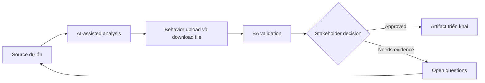

# Behavior upload và download file

<div class="case-meta">
  <span>Data and Integration</span>
  <span>Files and documents</span>
  <span>Use case dự án</span>
</div>

## Project context

Document portal cho customer upload contract, certificate và evidence file. User cần progress, validation, virus scanning, preview, download permission và failure recovery. Trong môi trường delivery thật, tình huống này thường xuất hiện dưới áp lực thời gian: stakeholder cần clarity, delivery cần backlog, QA cần behavior test được, operations cần process chịu được exception. BA dùng AI để tăng tốc analysis và synthesis, nhưng BA vẫn chịu trách nhiệm về evidence, business meaning, stakeholder decisioning và artifact quality.

## BA challenge

BA phải specify file behavior qua UI, backend, storage, security và operations. File handling gồm size, type, scan, retention, access, preview, versioning và error recovery. Khó khăn thực tế là AI có thể làm material ban đầu trông hoàn chỉnh hơn mức thật sự. BA giỏi giữ output ở trạng thái reviewable bằng cách tách source-backed fact, assumption, unsupported claim, decision gap và recommended next action. Mục tiêu không phải làm document dài hơn; mục tiêu là làm project decision rõ hơn và an toàn hơn.

## Where AI fits

<div class="ba-workbench-panel">
AI hữu ích trong use case này khi được giới hạn vào analysis support, pattern detection, structured drafting và critique. AI không được approve scope, invent policy, quyết định business trade-off hoặc thay thế judgment của stakeholder chịu trách nhiệm.
</div>

- Generate file handling requirement checklist.
- Identify validation, scanning, storage và permission gap.
- Draft upload/download state matrix.
- Tạo QA scenario cho large file, bad file và permission case.

## Inputs to prepare

- Document type list
- Storage policy
- Security scanning rules
- UI design
- Access control requirements

BA nên label các input này trước khi dùng AI: source owner, source date, approval status, sensitivity level, và source đó là fact, opinion, policy, draft hay historical evidence. Việc chuẩn bị này ngăn model xem mọi input đều current và authoritative như nhau.

## BA workflow

1. List document type, allowed format, size limit và required metadata.
2. Yêu cầu AI generate upload/download state và error scenario.
3. Define validation, scan, quarantine, preview, versioning và retention behavior.
4. Review access rule cho upload, view, download, replace và delete.
5. Viết acceptance criteria cho progress, failure, retry và permission state.
6. Tạo support và operational requirement cho infected hoặc failed file.

Workflow hiệu quả nhất khi dùng AI theo từng stage: trước hết organize evidence, sau đó yêu cầu analysis, tiếp theo tạo artifact, rồi chạy critique pass. BA nên giữ decision log visible xuyên suốt để suggestion do AI sinh ra không âm thầm trở thành approved scope.

## Diagram



## Deliverables

| Deliverable | Nội dung | Owner | Done signal |
| --- | --- | --- | --- |
| File behavior matrix | Action, state, validation, scan, permission, message và owner | BA | File state explicit |
| Document type rule table | Type, allowed format, size, metadata, retention và source | Compliance | Rule source-backed |
| Access control matrix | Role, upload, view, download, replace, delete và audit | Security | File permission testable |
| File QA scenario set | Large, invalid, infected, retry, permission, preview và download case | QA | File behavior covered |

Các deliverable này nên được xem là artifact do BA own. AI có thể draft, nhưng BA phải validate source support, stakeholder meaning, traceability và artifact đã sẵn sàng handoff hay chưa.

## Prompt to try

```text
Hãy đóng vai senior Business Analyst hiểu AI. Hỗ trợ tôi áp dụng use case "Behavior upload và download file" vào dự án. Trước hết hỏi source evidence và constraint. Sau đó tạo structured analysis gồm project context, assumption, AI-fit boundary, workflow step, deliverable, risk, control, open question và stakeholder decision. Không tự bịa policy, threshold hoặc approval.
```

## Review checklist

- Mọi statement do AI hỗ trợ đều gắn với source, assumption hoặc validation question.
- BA đã tách drafting assistance khỏi business approval.
- Workflow step có human owner cho decision, review và exception.
- Deliverable trace được về project input và review được bởi QA, product hoặc operations.
- Risk control đủ thực tế để dùng trong meeting dự án thật.
- Success metric: File handling an toàn, recoverable, permission-aware và testable qua UI/backend.

## Risks and controls

| Rủi ro | Vì sao quan trọng | Control của BA |
| --- | --- | --- |
| Unsafe file | Malicious file có thể được store hoặc download | Specify scanning và quarantine |
| Permission leakage | User download file không được thấy | Define role-based access và audit |
| Upload frustration | User mất progress mà không recover được | Specify progress, retry và error message |
| Retention miss | File giữ quá lâu hoặc delete quá sớm | Define retention theo document type |

Control quan trọng nhất là làm uncertainty visible. Nếu evidence yếu, output nên tạo validation question hoặc decision item, không phải final requirement. Nếu artifact ảnh hưởng delivery, release, compliance, customer experience hoặc operational workload, BA nên yêu cầu human review explicit trước khi handoff.
