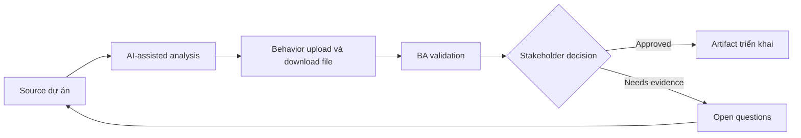

# Behavior upload và download file

<div class="case-meta">
  <span>Data and Integration</span>
  <span>Files and documents</span>
  <span>Data and integration</span>
  <span>Advanced</span>
  <span>File behavior matrix</span>
  <span>Use case dự án</span>
</div>

## Project context

Document portal cho customer upload contract, certificate và evidence file. User cần progress, validation, virus scanning, preview, download permission và failure recovery. Trong Files and documents, công việc này thường bắt đầu khi data movement, mapping, reconciliation, privacy và lineage decision ảnh hưởng nhiều system và owner. BA nên xem Document type list và Storage policy là evidence cần organize, không phải raw material để AI trả lời không kiểm soát. Mục tiêu là làm decision tiếp theo rõ hơn cho người own outcome.

## BA challenge

BA phải specify file behavior qua UI, backend, storage, security và operations. File handling gồm size, type, scan, retention, access, preview, versioning và error recovery. Với Behavior upload và download file, khó khăn thực tế là silent data loss và lineage yếu. AI có thể tăng tốc field mapping, rule comparison, reconciliation design, lineage review và exception analysis, nhưng BA vẫn phải làm rõ assumption, approval còn thiếu và điểm cần stakeholder judgment.

## Where AI fits

<div class="ba-workbench-panel">
AI phù hợp với use case Data và Integration khi được giới hạn vào field mapping, rule comparison, reconciliation design, lineage review và exception analysis. AI task hữu ích đầu tiên là: Generate file handling requirement checklist. AI không được approve scope, invent policy, bỏ qua source schema, sample payload, mapping rule, data-quality report và ownership matrix, hoặc biến draft thành final decision.
</div>

- Generate file handling requirement checklist.
- Identify validation, scanning, storage và permission gap.
- Draft upload/download state matrix.
- Tạo QA scenario cho large file, bad file và permission case.

## Inputs to prepare

- Document type list
- Storage policy
- Security scanning rules
- UI design
- Access control requirements

Trước khi prompt cho Behavior upload và download file, hãy label từng input theo owner, date, approval status, sensitivity và vai trò trong decision. Evidence lens quan trọng nhất là source schema, sample payload, mapping rule, data-quality report và ownership matrix; nếu thiếu, AI có thể xem old note, draft design và approved rule có authority như nhau.

## BA workflow

1. List document type, allowed format, size limit và required metadata.
2. Yêu cầu AI generate upload/download state và error scenario.
3. Define validation, scan, quarantine, preview, versioning và retention behavior.
4. Review access rule cho upload, view, download, replace và delete.
5. Viết acceptance criteria cho progress, failure, retry và permission state.
6. Tạo support và operational requirement cho infected hoặc failed file.

Chạy workflow như data contract review trước integration build: bắt đầu với "List document type, allowed format, size limit và required metadata.", sau đó giữ decision log visible khi artifact tiến tới File behavior matrix. Cách này ngăn suggestion của AI âm thầm trở thành backlog, design, release hoặc operational commitment.

## Diagram



## Deliverables

| Deliverable | Nội dung | Owner | Done signal |
| --- | --- | --- | --- |
| File behavior matrix | Action, state, validation, scan, permission, message và owner | BA | File state explicit |
| Document type rule table | Type, allowed format, size, metadata, retention và source | Compliance | Rule source-backed |
| Access control matrix | Role, upload, view, download, replace, delete và audit | Security | File permission testable |
| File QA scenario set | Large, invalid, infected, retry, permission, preview và download case | QA | File behavior covered |

Hãy xem File behavior matrix là data and integration control pack do BA own. AI có thể draft structure, nhưng BA phải validate "File state explicit" có thật sự đúng không, artifact có trace được về evidence không và receiving team có hành động được không.

## Prompt to try

```text
Hãy đóng vai senior Business Analyst hiểu AI. Hỗ trợ tôi áp dụng use case "Behavior upload và download file" vào dự án. Trước hết hỏi source evidence và constraint. Sau đó tạo structured analysis gồm project context, assumption, AI-fit boundary, workflow step, deliverable, risk, control, open question và stakeholder decision. Không tự bịa policy, threshold hoặc approval.
```

## Review checklist

- Document type list được label owner, date, approval status và sensitivity.
- File behavior matrix trace được về source evidence và có human owner rõ.
- AI task nằm trong boundary field mapping, rule comparison, reconciliation design, lineage review và exception analysis và không approve scope hoặc policy.
- Risk "Unsafe file" có control thực tế: Specify scanning và quarantine.
- Open assumption được chuyển thành validation question hoặc stakeholder decision.
- Success metric: File handling an toàn, recoverable, permission-aware và testable qua UI/backend.

## Risks and controls

| Rủi ro | Vì sao quan trọng | Control của BA |
| --- | --- | --- |
| Unsafe file | Malicious file có thể được store hoặc download | Specify scanning và quarantine |
| Permission leakage | User download file không được thấy | Define role-based access và audit |
| Upload frustration | User mất progress mà không recover được | Specify progress, retry và error message |
| Retention miss | File giữ quá lâu hoặc delete quá sớm | Define retention theo document type |

Control chính cho risk "Unsafe file" là human accountability explicit: Specify scanning và quarantine. Nếu evidence yếu, output nên tạo validation question hoặc decision item, không phải final requirement.
