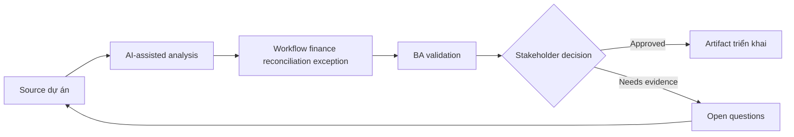

# Workflow finance reconciliation exception

<div class="case-meta">
  <span>Domain project scenarios</span>
  <span>Finance operations</span>
  <span>Use case dự án</span>
</div>

## Project context

Finance operations team reconcile payment, invoice và ledger entry. Exception xử lý thủ công qua spreadsheet, email và analyst judgment, gây delay và audit concern. Trong Finance operations, công việc này thường bắt đầu khi domain policy, operational exception và regulatory expectation quyết định product có thể làm gì an toàn. BA nên xem Exception logs và Reconciliation rules là evidence cần organize, không phải raw material để AI trả lời không kiểm soát. Mục tiêu là làm decision tiếp theo rõ hơn cho người own outcome.

## BA challenge

BA phải đặc tả exception workflow classify mismatch type, capture evidence, route work, support analyst decision và giữ auditability. AI có thể suggest match hoặc category, nhưng finance approval vẫn do human own. Với Workflow finance reconciliation exception, khó khăn thực tế là policy hallucination và exception blindness. AI có thể tăng tốc domain-rule extraction, exception mapping, safe-message drafting và owner review, nhưng BA vẫn phải làm rõ assumption, approval còn thiếu và điểm cần stakeholder judgment.

## Where AI fits

<div class="ba-workbench-panel">
AI phù hợp với use case Tình huống theo domain khi được giới hạn vào domain-rule extraction, exception mapping, safe-message drafting và owner review. AI task hữu ích đầu tiên là: Cluster exception type và recurring mismatch pattern. AI không được approve scope, invent policy, bỏ qua policy source, operational sample, compliance constraint và domain-owner decision, hoặc biến draft thành final decision.
</div>

- Cluster exception type và recurring mismatch pattern.
- Draft analyst work queue requirement.
- Generate evidence capture và decision reason code.
- Tạo human review và audit trail requirement.

## Inputs to prepare

- Exception logs
- Reconciliation rules
- Invoice và payment data definitions
- Audit requirements
- Analyst SOPs

Trước khi prompt cho Workflow finance reconciliation exception, hãy label từng input theo owner, date, approval status, sensitivity và vai trò trong decision. Evidence lens quan trọng nhất là policy source, operational sample, compliance constraint và domain-owner decision; nếu thiếu, AI có thể xem old note, draft design và approved rule có authority như nhau.

## BA workflow

1. Analyze exception history và classify mismatch category.
2. Yêu cầu AI propose routing rule và decision support field.
3. Define evidence needed cho từng exception type.
4. Specify analyst action: match, split, escalate, write off hoặc request information.
5. Design audit trail, approval và segregation-of-duty requirement.
6. Tạo metric cho aging, resolution, override và repeat exception pattern.

Chạy workflow như domain validation trước implementation detail: bắt đầu với "Analyze exception history và classify mismatch category.", sau đó giữ decision log visible khi artifact tiến tới Exception taxonomy. Cách này ngăn suggestion của AI âm thầm trở thành backlog, design, release hoặc operational commitment.

## Diagram



## Deliverables

| Deliverable | Nội dung | Owner | Done signal |
| --- | --- | --- | --- |
| Exception taxonomy | Mismatch type, example, root cause, owner và priority | Finance operations | Analyst có common language |
| Work queue specification | Routing, priority, SLA, status và assignment rule | BA | Exception move predictably |
| Decision reason codes | Allowed action, evidence, approval và audit need | Finance controller | Decision explainable |
| Monitoring metrics | Aging, resolution, repeat exception và override trend | Operations lead | Process health visible |

Hãy xem Exception taxonomy là domain-specific requirement pack do BA own. AI có thể draft structure, nhưng BA phải validate "Analyst có common language" có thật sự đúng không, artifact có trace được về evidence không và receiving team có hành động được không.

## Prompt to try

```text
Hãy đóng vai senior Business Analyst hiểu AI. Hỗ trợ tôi áp dụng use case "Workflow finance reconciliation exception" vào dự án. Trước hết hỏi source evidence và constraint. Sau đó tạo structured analysis gồm project context, assumption, AI-fit boundary, workflow step, deliverable, risk, control, open question và stakeholder decision. Không tự bịa policy, threshold hoặc approval.
```

## Review checklist

- Exception logs được label owner, date, approval status và sensitivity.
- Exception taxonomy trace được về source evidence và có human owner rõ.
- AI task nằm trong boundary domain-rule extraction, exception mapping, safe-message drafting và owner review và không approve scope hoặc policy.
- Risk "Automated finance decision" có control thực tế: Giữ analyst approval và audit trail.
- Open assumption được chuyển thành validation question hoặc stakeholder decision.
- Success metric: Exception resolution nhanh hơn trong khi finance decision vẫn controlled và auditable.

## Risks and controls

| Rủi ro | Vì sao quan trọng | Control của BA |
| --- | --- | --- |
| Automated finance decision | AI suggestion có thể bị xem là approval | Giữ analyst approval và audit trail |
| Poor taxonomy | Category có thể không match work thật của analyst | Validate với exception sample |
| Audit weakness | Reason resolution có thể missing | Yêu cầu evidence và reason code |
| Segregation issue | Cùng user có thể create và approve adjustment | Define role control và approval |

Control chính cho risk "Automated finance decision" là human accountability explicit: Giữ analyst approval và audit trail. Nếu evidence yếu, output nên tạo validation question hoặc decision item, không phải final requirement.
