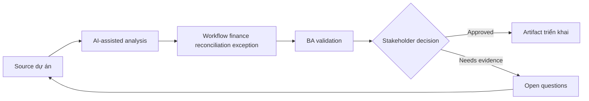

# Workflow finance reconciliation exception

<div class="case-meta">
  <span>Domain project scenarios</span>
  <span>Finance operations</span>
  <span>Use case dự án</span>
</div>

## Project context

Finance operations team reconcile payment, invoice và ledger entry. Exception xử lý thủ công qua spreadsheet, email và analyst judgment, gây delay và audit concern. Trong môi trường delivery thật, tình huống này thường xuất hiện dưới áp lực thời gian: stakeholder cần clarity, delivery cần backlog, QA cần behavior test được, operations cần process chịu được exception. BA dùng AI để tăng tốc analysis và synthesis, nhưng BA vẫn chịu trách nhiệm về evidence, business meaning, stakeholder decisioning và artifact quality.

## BA challenge

BA phải đặc tả exception workflow classify mismatch type, capture evidence, route work, support analyst decision và giữ auditability. AI có thể suggest match hoặc category, nhưng finance approval vẫn do human own. Khó khăn thực tế là AI có thể làm material ban đầu trông hoàn chỉnh hơn mức thật sự. BA giỏi giữ output ở trạng thái reviewable bằng cách tách source-backed fact, assumption, unsupported claim, decision gap và recommended next action. Mục tiêu không phải làm document dài hơn; mục tiêu là làm project decision rõ hơn và an toàn hơn.

## Where AI fits

<div class="ba-workbench-panel">
AI hữu ích trong use case này khi được giới hạn vào analysis support, pattern detection, structured drafting và critique. AI không được approve scope, invent policy, quyết định business trade-off hoặc thay thế judgment của stakeholder chịu trách nhiệm.
</div>

- Cluster exception type và recurring mismatch pattern.
- Draft analyst work queue requirement.
- Generate evidence capture và decision reason code.
- Tạo human review và audit trail requirement.

## Inputs to prepare

- Exception logs
- Reconciliation rules
- Invoice và payment data definitions
- Audit requirements
- Analyst SOPs

BA nên label các input này trước khi dùng AI: source owner, source date, approval status, sensitivity level, và source đó là fact, opinion, policy, draft hay historical evidence. Việc chuẩn bị này ngăn model xem mọi input đều current và authoritative như nhau.

## BA workflow

1. Analyze exception history và classify mismatch category.
2. Yêu cầu AI propose routing rule và decision support field.
3. Define evidence needed cho từng exception type.
4. Specify analyst action: match, split, escalate, write off hoặc request information.
5. Design audit trail, approval và segregation-of-duty requirement.
6. Tạo metric cho aging, resolution, override và repeat exception pattern.

Workflow hiệu quả nhất khi dùng AI theo từng stage: trước hết organize evidence, sau đó yêu cầu analysis, tiếp theo tạo artifact, rồi chạy critique pass. BA nên giữ decision log visible xuyên suốt để suggestion do AI sinh ra không âm thầm trở thành approved scope.

## Diagram



## Deliverables

| Deliverable | Nội dung | Owner | Done signal |
| --- | --- | --- | --- |
| Exception taxonomy | Mismatch type, example, root cause, owner và priority | Finance operations | Analyst có common language |
| Work queue specification | Routing, priority, SLA, status và assignment rule | BA | Exception move predictably |
| Decision reason codes | Allowed action, evidence, approval và audit need | Finance controller | Decision explainable |
| Monitoring metrics | Aging, resolution, repeat exception và override trend | Operations lead | Process health visible |

Các deliverable này nên được xem là artifact do BA own. AI có thể draft, nhưng BA phải validate source support, stakeholder meaning, traceability và artifact đã sẵn sàng handoff hay chưa.

## Prompt to try

```text
Hãy đóng vai senior Business Analyst hiểu AI. Hỗ trợ tôi áp dụng use case "Workflow finance reconciliation exception" vào dự án. Trước hết hỏi source evidence và constraint. Sau đó tạo structured analysis gồm project context, assumption, AI-fit boundary, workflow step, deliverable, risk, control, open question và stakeholder decision. Không tự bịa policy, threshold hoặc approval.
```

## Review checklist

- Mọi statement do AI hỗ trợ đều gắn với source, assumption hoặc validation question.
- BA đã tách drafting assistance khỏi business approval.
- Workflow step có human owner cho decision, review và exception.
- Deliverable trace được về project input và review được bởi QA, product hoặc operations.
- Risk control đủ thực tế để dùng trong meeting dự án thật.
- Success metric: Exception resolution nhanh hơn trong khi finance decision vẫn controlled và auditable.

## Risks and controls

| Rủi ro | Vì sao quan trọng | Control của BA |
| --- | --- | --- |
| Automated finance decision | AI suggestion có thể bị xem là approval | Giữ analyst approval và audit trail |
| Poor taxonomy | Category có thể không match work thật của analyst | Validate với exception sample |
| Audit weakness | Reason resolution có thể missing | Yêu cầu evidence và reason code |
| Segregation issue | Cùng user có thể create và approve adjustment | Define role control và approval |

Control quan trọng nhất là làm uncertainty visible. Nếu evidence yếu, output nên tạo validation question hoặc decision item, không phải final requirement. Nếu artifact ảnh hưởng delivery, release, compliance, customer experience hoặc operational workload, BA nên yêu cầu human review explicit trước khi handoff.
