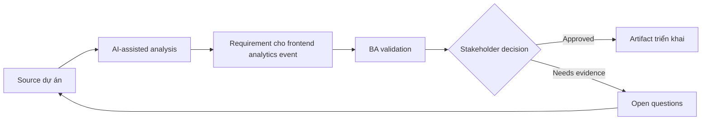

# Requirement cho frontend analytics event

<div class="case-meta">
  <span>Frontend, UI, and UX</span>
  <span>Product analytics</span>
  <span>Use case dự án</span>
</div>

## Project context

Product muốn đo user có hoàn thành onboarding flow mới không. Team có screen và story, nhưng chưa có event taxonomy, property definition, funnel step hoặc privacy control rõ. Trong Product analytics, công việc này thường bắt đầu khi screen behavior, accessibility, design state, analytics và user feedback phải thành requirement implement được. BA nên xem User flow và Business questions là evidence cần organize, không phải raw material để AI trả lời không kiểm soát. Mục tiêu là làm decision tiếp theo rõ hơn cho người own outcome.

## BA challenge

BA phải define analytics như một phần requirement để product decision đo được sau release. Event phải meaningful, privacy-safe, technically feasible và aligned với business question. Với Requirement cho frontend analytics event, khó khăn thực tế là missing state và UX không đo được. AI có thể tăng tốc UI-state analysis, content critique, accessibility review, event taxonomy và edge-case discovery, nhưng BA vẫn phải làm rõ assumption, approval còn thiếu và điểm cần stakeholder judgment.

## Where AI fits

<div class="ba-workbench-panel">
AI phù hợp với use case Frontend, UI và UX khi được giới hạn vào UI-state analysis, content critique, accessibility review, event taxonomy và edge-case discovery. AI task hữu ích đầu tiên là: Generate event taxonomy từ user flow và product question. AI không được approve scope, invent policy, bỏ qua wireframe, design token, user journey, analytics question và accessibility expectation, hoặc biến draft thành final decision.
</div>

- Generate event taxonomy từ user flow và product question.
- Identify missing event property và privacy-sensitive field.
- Draft funnel measurement và success metric.
- Tạo QA check cho event firing và payload correctness.

## Inputs to prepare

- User flow
- Business questions
- Analytics platform constraints
- Privacy rules
- Screen behavior spec

Trước khi prompt cho Requirement cho frontend analytics event, hãy label từng input theo owner, date, approval status, sensitivity và vai trò trong decision. Evidence lens quan trọng nhất là wireframe, design token, user journey, analytics question và accessibility expectation; nếu thiếu, AI có thể xem old note, draft design và approved rule có authority như nhau.

## BA workflow

1. Bắt đầu từ product question và decision data cần support.
2. Yêu cầu AI propose event name, trigger, property và funnel step.
3. Remove property expose sensitive data hoặc duplicate existing event.
4. Review feasibility với frontend và analytics owner.
5. Thêm acceptance criteria cho event trigger, payload và non-trigger case.
6. Tạo QA và monitoring checklist cho analytics release.

Chạy workflow như screen-state review trước frontend build: bắt đầu với "Bắt đầu từ product question và decision data cần support.", sau đó giữ decision log visible khi artifact tiến tới Analytics event spec. Cách này ngăn suggestion của AI âm thầm trở thành backlog, design, release hoặc operational commitment.

## Diagram



## Deliverables

| Deliverable | Nội dung | Owner | Done signal |
| --- | --- | --- | --- |
| Analytics event spec | Event, trigger, property, data type, source và privacy classification | BA và analytics owner | Event trả lời business question |
| Funnel map | Step, event, success signal, drop-off question và owner | Product owner | Flow measurement rõ |
| Privacy review list | Sensitive property, redaction, consent và approval | Privacy owner | Event an toàn |
| Analytics QA checklist | Trigger, payload, duplicate, non-trigger và environment test | QA | Instrumentation test được |

Hãy xem Analytics event spec là frontend requirement specification do BA own. AI có thể draft structure, nhưng BA phải validate "Event trả lời business question" có thật sự đúng không, artifact có trace được về evidence không và receiving team có hành động được không.

## Prompt to try

```text
Hãy đóng vai senior Business Analyst hiểu AI. Hỗ trợ tôi áp dụng use case "Requirement cho frontend analytics event" vào dự án. Trước hết hỏi source evidence và constraint. Sau đó tạo structured analysis gồm project context, assumption, AI-fit boundary, workflow step, deliverable, risk, control, open question và stakeholder decision. Không tự bịa policy, threshold hoặc approval.
```

## Review checklist

- User flow được label owner, date, approval status và sensitivity.
- Analytics event spec trace được về source evidence và có human owner rõ.
- AI task nằm trong boundary UI-state analysis, content critique, accessibility review, event taxonomy và edge-case discovery và không approve scope hoặc policy.
- Risk "Vanity events" có control thực tế: Tie mọi event với product question.
- Open assumption được chuyển thành validation question hoặc stakeholder decision.
- Success metric: Frontend instrumentation tạo product data dùng được cho decision mà không vi phạm privacy.

## Risks and controls

| Rủi ro | Vì sao quan trọng | Control của BA |
| --- | --- | --- |
| Vanity events | Event có thể không trả lời decision question | Tie mọi event với product question |
| PII exposure | Payload có thể chứa sensitive field | Classify và redact property |
| Duplicate firing | Metric có thể inflate | Define exact trigger và QA check |
| Missing funnel step | Không diagnose được drop-off | Map funnel trước implementation |

Control chính cho risk "Vanity events" là human accountability explicit: Tie mọi event với product question. Nếu evidence yếu, output nên tạo validation question hoặc decision item, không phải final requirement.
