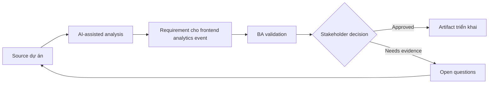

# Requirement cho frontend analytics event

<div class="case-meta">
  <span>Frontend, UI, and UX</span>
  <span>Product analytics</span>
  <span>Use case dự án</span>
</div>

## Project context

Product muốn đo user có hoàn thành onboarding flow mới không. Team có screen và story, nhưng chưa có event taxonomy, property definition, funnel step hoặc privacy control rõ. Trong môi trường delivery thật, tình huống này thường xuất hiện dưới áp lực thời gian: stakeholder cần clarity, delivery cần backlog, QA cần behavior test được, operations cần process chịu được exception. BA dùng AI để tăng tốc analysis và synthesis, nhưng BA vẫn chịu trách nhiệm về evidence, business meaning, stakeholder decisioning và artifact quality.

## BA challenge

BA phải define analytics như một phần requirement để product decision đo được sau release. Event phải meaningful, privacy-safe, technically feasible và aligned với business question. Khó khăn thực tế là AI có thể làm material ban đầu trông hoàn chỉnh hơn mức thật sự. BA giỏi giữ output ở trạng thái reviewable bằng cách tách source-backed fact, assumption, unsupported claim, decision gap và recommended next action. Mục tiêu không phải làm document dài hơn; mục tiêu là làm project decision rõ hơn và an toàn hơn.

## Where AI fits

<div class="ba-workbench-panel">
AI hữu ích trong use case này khi được giới hạn vào analysis support, pattern detection, structured drafting và critique. AI không được approve scope, invent policy, quyết định business trade-off hoặc thay thế judgment của stakeholder chịu trách nhiệm.
</div>

- Generate event taxonomy từ user flow và product question.
- Identify missing event property và privacy-sensitive field.
- Draft funnel measurement và success metric.
- Tạo QA check cho event firing và payload correctness.

## Inputs to prepare

- User flow
- Business questions
- Analytics platform constraints
- Privacy rules
- Screen behavior spec

BA nên label các input này trước khi dùng AI: source owner, source date, approval status, sensitivity level, và source đó là fact, opinion, policy, draft hay historical evidence. Việc chuẩn bị này ngăn model xem mọi input đều current và authoritative như nhau.

## BA workflow

1. Bắt đầu từ product question và decision data cần support.
2. Yêu cầu AI propose event name, trigger, property và funnel step.
3. Remove property expose sensitive data hoặc duplicate existing event.
4. Review feasibility với frontend và analytics owner.
5. Thêm acceptance criteria cho event trigger, payload và non-trigger case.
6. Tạo QA và monitoring checklist cho analytics release.

Workflow hiệu quả nhất khi dùng AI theo từng stage: trước hết organize evidence, sau đó yêu cầu analysis, tiếp theo tạo artifact, rồi chạy critique pass. BA nên giữ decision log visible xuyên suốt để suggestion do AI sinh ra không âm thầm trở thành approved scope.

## Diagram



## Deliverables

| Deliverable | Nội dung | Owner | Done signal |
| --- | --- | --- | --- |
| Analytics event spec | Event, trigger, property, data type, source và privacy classification | BA và analytics owner | Event trả lời business question |
| Funnel map | Step, event, success signal, drop-off question và owner | Product owner | Flow measurement rõ |
| Privacy review list | Sensitive property, redaction, consent và approval | Privacy owner | Event an toàn |
| Analytics QA checklist | Trigger, payload, duplicate, non-trigger và environment test | QA | Instrumentation test được |

Các deliverable này nên được xem là artifact do BA own. AI có thể draft, nhưng BA phải validate source support, stakeholder meaning, traceability và artifact đã sẵn sàng handoff hay chưa.

## Prompt to try

```text
Hãy đóng vai senior Business Analyst hiểu AI. Hỗ trợ tôi áp dụng use case "Requirement cho frontend analytics event" vào dự án. Trước hết hỏi source evidence và constraint. Sau đó tạo structured analysis gồm project context, assumption, AI-fit boundary, workflow step, deliverable, risk, control, open question và stakeholder decision. Không tự bịa policy, threshold hoặc approval.
```

## Review checklist

- Mọi statement do AI hỗ trợ đều gắn với source, assumption hoặc validation question.
- BA đã tách drafting assistance khỏi business approval.
- Workflow step có human owner cho decision, review và exception.
- Deliverable trace được về project input và review được bởi QA, product hoặc operations.
- Risk control đủ thực tế để dùng trong meeting dự án thật.
- Success metric: Frontend instrumentation tạo product data dùng được cho decision mà không vi phạm privacy.

## Risks and controls

| Rủi ro | Vì sao quan trọng | Control của BA |
| --- | --- | --- |
| Vanity events | Event có thể không trả lời decision question | Tie mọi event với product question |
| PII exposure | Payload có thể chứa sensitive field | Classify và redact property |
| Duplicate firing | Metric có thể inflate | Define exact trigger và QA check |
| Missing funnel step | Không diagnose được drop-off | Map funnel trước implementation |

Control quan trọng nhất là làm uncertainty visible. Nếu evidence yếu, output nên tạo validation question hoặc decision item, không phải final requirement. Nếu artifact ảnh hưởng delivery, release, compliance, customer experience hoặc operational workload, BA nên yêu cầu human review explicit trước khi handoff.
