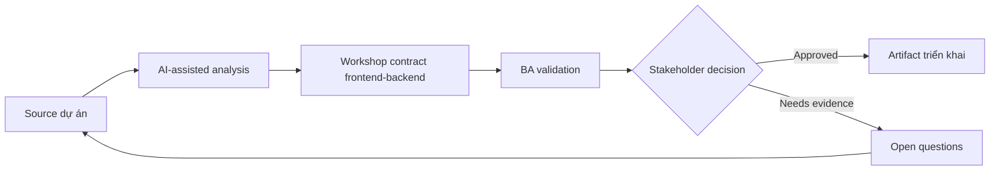

# Workshop contract frontend-backend

<div class="case-meta">
  <span>Cross-functional BA Collaboration</span>
  <span>Contract workshops</span>
  <span>Use case dự án</span>
</div>

## Project context

Frontend cần data và behavior cho dashboard mới, backend vẫn design API, product muốn estimate delivery. Misalignment có thể tạo rework. Trong môi trường delivery thật, tình huống này thường xuất hiện dưới áp lực thời gian: stakeholder cần clarity, delivery cần backlog, QA cần behavior test được, operations cần process chịu được exception. BA dùng AI để tăng tốc analysis và synthesis, nhưng BA vẫn chịu trách nhiệm về evidence, business meaning, stakeholder decisioning và artifact quality.

## BA challenge

BA phải facilitate contract workshop align screen behavior, API contract, error handling, data semantics và test responsibility. Khó khăn thực tế là AI có thể làm material ban đầu trông hoàn chỉnh hơn mức thật sự. BA giỏi giữ output ở trạng thái reviewable bằng cách tách source-backed fact, assumption, unsupported claim, decision gap và recommended next action. Mục tiêu không phải làm document dài hơn; mục tiêu là làm project decision rõ hơn và an toàn hơn.

## Where AI fits

<div class="ba-workbench-panel">
AI hữu ích trong use case này khi được giới hạn vào analysis support, pattern detection, structured drafting và critique. AI không được approve scope, invent policy, quyết định business trade-off hoặc thay thế judgment của stakeholder chịu trách nhiệm.
</div>

- Generate agenda và contract question từ screen/API note.
- Identify missing data field, state behavior và error handling.
- Draft contract decision log và dependency list.
- Tạo follow-up acceptance criteria.

## Inputs to prepare

- Screen behavior matrix
- API draft
- Data glossary
- Error taxonomy
- Open technical questions

BA nên label các input này trước khi dùng AI: source owner, source date, approval status, sensitivity level, và source đó là fact, opinion, policy, draft hay historical evidence. Việc chuẩn bị này ngăn model xem mọi input đều current và authoritative như nhau.

## BA workflow

1. Prepare source pack có UI state, data need và API draft.
2. Yêu cầu AI generate workshop question và dependency risk.
3. Facilitate decision về field, validation, error, pagination và state.
4. Record contract decision, owner và unresolved gap.
5. Update UI story và API requirement sau workshop.
6. Tạo contract test scenario cho QA.

Workflow hiệu quả nhất khi dùng AI theo từng stage: trước hết organize evidence, sau đó yêu cầu analysis, tiếp theo tạo artifact, rồi chạy critique pass. BA nên giữ decision log visible xuyên suốt để suggestion do AI sinh ra không âm thầm trở thành approved scope.

## Diagram



## Deliverables

| Deliverable | Nội dung | Owner | Done signal |
| --- | --- | --- | --- |
| Workshop agenda | Decision topic, question, evidence và required owner | BA | Workshop decision-focused |
| Contract decision log | Field, rule, error, owner, decision và open item | BA và tech lead | Decision traceable |
| Updated UI/API artifacts | Story criteria, API behavior và schema update | BA | Artifact aligned |
| Contract test list | Scenario, request, response, error và expected UI | QA | Contract testable |

Các deliverable này nên được xem là artifact do BA own. AI có thể draft, nhưng BA phải validate source support, stakeholder meaning, traceability và artifact đã sẵn sàng handoff hay chưa.

## Prompt to try

```text
Hãy đóng vai senior Business Analyst hiểu AI. Hỗ trợ tôi áp dụng use case "Workshop contract frontend-backend" vào dự án. Trước hết hỏi source evidence và constraint. Sau đó tạo structured analysis gồm project context, assumption, AI-fit boundary, workflow step, deliverable, risk, control, open question và stakeholder decision. Không tự bịa policy, threshold hoặc approval.
```

## Review checklist

- Mọi statement do AI hỗ trợ đều gắn với source, assumption hoặc validation question.
- BA đã tách drafting assistance khỏi business approval.
- Workflow step có human owner cho decision, review và exception.
- Deliverable trace được về project input và review được bởi QA, product hoặc operations.
- Risk control đủ thực tế để dùng trong meeting dự án thật.
- Success metric: Frontend và backend kết thúc workshop với contract decision và test scenario aligned.

## Risks and controls

| Rủi ro | Vì sao quan trọng | Control của BA |
| --- | --- | --- |
| Meeting without decisions | Workshop chỉ discussion | Dùng decision agenda và owner list |
| Field ambiguity | Frontend/backend dùng cùng từ khác meaning | Define field meaning và example |
| Error gap | Contract ignore negative case | Include error taxonomy |
| Artifact divergence | Decision không update story và API doc | Update artifact ngay |

Control quan trọng nhất là làm uncertainty visible. Nếu evidence yếu, output nên tạo validation question hoặc decision item, không phải final requirement. Nếu artifact ảnh hưởng delivery, release, compliance, customer experience hoặc operational workload, BA nên yêu cầu human review explicit trước khi handoff.
