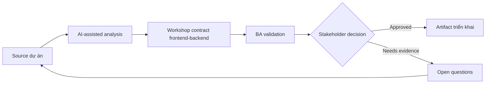

# Workshop contract frontend-backend

<div class="case-meta">
  <span>Cross-functional BA Collaboration</span>
  <span>Contract workshops</span>
  <span>Use case dự án</span>
</div>

## Project context

Frontend cần data và behavior cho dashboard mới, backend vẫn design API, product muốn estimate delivery. Misalignment có thể tạo rework. Trong Contract workshops, công việc này thường bắt đầu khi mỗi role cần artifact khác nhau, nhưng BA phải giữ decision nhất quán giữa product, design, engineering, QA, data và operations. BA nên xem Screen behavior matrix và API draft là evidence cần organize, không phải raw material để AI trả lời không kiểm soát. Mục tiêu là làm decision tiếp theo rõ hơn cho người own outcome.

## BA challenge

BA phải facilitate contract workshop align screen behavior, API contract, error handling, data semantics và test responsibility. Với Workshop contract frontend-backend, khó khăn thực tế là role misalignment và hidden trade-off. AI có thể tăng tốc role-specific synthesis, decision memo drafting, conflict surfacing và shared artifact critique, nhưng BA vẫn phải làm rõ assumption, approval còn thiếu và điểm cần stakeholder judgment.

## Where AI fits

<div class="ba-workbench-panel">
AI phù hợp với use case Collaboration cross-functional của BA khi được giới hạn vào role-specific synthesis, decision memo drafting, conflict surfacing và shared artifact critique. AI task hữu ích đầu tiên là: Generate agenda và contract question từ screen/API note. AI không được approve scope, invent policy, bỏ qua role feedback, decision log, design note, technical constraint, test concern và support need, hoặc biến draft thành final decision.
</div>

- Generate agenda và contract question từ screen/API note.
- Identify missing data field, state behavior và error handling.
- Draft contract decision log và dependency list.
- Tạo follow-up acceptance criteria.

## Inputs to prepare

- Screen behavior matrix
- API draft
- Data glossary
- Error taxonomy
- Open technical questions

Trước khi prompt cho Workshop contract frontend-backend, hãy label từng input theo owner, date, approval status, sensitivity và vai trò trong decision. Evidence lens quan trọng nhất là role feedback, decision log, design note, technical constraint, test concern và support need; nếu thiếu, AI có thể xem old note, draft design và approved rule có authority như nhau.

## BA workflow

1. Prepare source pack có UI state, data need và API draft.
2. Yêu cầu AI generate workshop question và dependency risk.
3. Facilitate decision về field, validation, error, pagination và state.
4. Record contract decision, owner và unresolved gap.
5. Update UI story và API requirement sau workshop.
6. Tạo contract test scenario cho QA.

Chạy workflow như cross-role decision alignment trước handoff: bắt đầu với "Prepare source pack có UI state, data need và API draft.", sau đó giữ decision log visible khi artifact tiến tới Workshop agenda. Cách này ngăn suggestion của AI âm thầm trở thành backlog, design, release hoặc operational commitment.

## Diagram



## Deliverables

| Deliverable | Nội dung | Owner | Done signal |
| --- | --- | --- | --- |
| Workshop agenda | Decision topic, question, evidence và required owner | BA | Workshop decision-focused |
| Contract decision log | Field, rule, error, owner, decision và open item | BA và tech lead | Decision traceable |
| Updated UI/API artifacts | Story criteria, API behavior và schema update | BA | Artifact aligned |
| Contract test list | Scenario, request, response, error và expected UI | QA | Contract testable |

Hãy xem Workshop agenda là collaboration decision artifact do BA own. AI có thể draft structure, nhưng BA phải validate "Workshop decision-focused" có thật sự đúng không, artifact có trace được về evidence không và receiving team có hành động được không.

## Prompt to try

```text
Hãy đóng vai senior Business Analyst hiểu AI. Hỗ trợ tôi áp dụng use case "Workshop contract frontend-backend" vào dự án. Trước hết hỏi source evidence và constraint. Sau đó tạo structured analysis gồm project context, assumption, AI-fit boundary, workflow step, deliverable, risk, control, open question và stakeholder decision. Không tự bịa policy, threshold hoặc approval.
```

## Review checklist

- Screen behavior matrix được label owner, date, approval status và sensitivity.
- Workshop agenda trace được về source evidence và có human owner rõ.
- AI task nằm trong boundary role-specific synthesis, decision memo drafting, conflict surfacing và shared artifact critique và không approve scope hoặc policy.
- Risk "Meeting without decisions" có control thực tế: Dùng decision agenda và owner list.
- Open assumption được chuyển thành validation question hoặc stakeholder decision.
- Success metric: Frontend và backend kết thúc workshop với contract decision và test scenario aligned.

## Risks and controls

| Rủi ro | Vì sao quan trọng | Control của BA |
| --- | --- | --- |
| Meeting without decisions | Workshop chỉ discussion | Dùng decision agenda và owner list |
| Field ambiguity | Frontend/backend dùng cùng từ khác meaning | Define field meaning và example |
| Error gap | Contract ignore negative case | Include error taxonomy |
| Artifact divergence | Decision không update story và API doc | Update artifact ngay |

Control chính cho risk "Meeting without decisions" là human accountability explicit: Dùng decision agenda và owner list. Nếu evidence yếu, output nên tạo validation question hoặc decision item, không phải final requirement.
