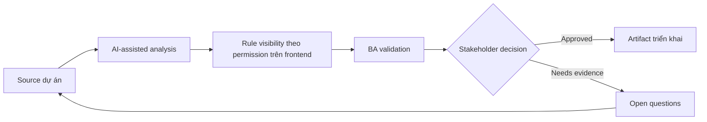

# Rule visibility theo permission trên frontend

<div class="case-meta">
  <span>Frontend, UI, and UX</span>
  <span>Permissioned UI</span>
  <span>Use case dự án</span>
</div>

## Project context

Admin console có nhiều role: viewer, editor, approver, auditor và tenant admin. Backend enforce permission, nhưng frontend behavior cho hidden, disabled và read-only control chưa rõ. Trong môi trường delivery thật, tình huống này thường xuất hiện dưới áp lực thời gian: stakeholder cần clarity, delivery cần backlog, QA cần behavior test được, operations cần process chịu được exception. BA dùng AI để tăng tốc analysis và synthesis, nhưng BA vẫn chịu trách nhiệm về evidence, business meaning, stakeholder decisioning và artifact quality.

## BA challenge

BA phải specify permission hiển thị trong UI ra sao mà không làm yếu security. User cần clarity, nhưng frontend không bao giờ là source of truth cho authorization. Khó khăn thực tế là AI có thể làm material ban đầu trông hoàn chỉnh hơn mức thật sự. BA giỏi giữ output ở trạng thái reviewable bằng cách tách source-backed fact, assumption, unsupported claim, decision gap và recommended next action. Mục tiêu không phải làm document dài hơn; mục tiêu là làm project decision rõ hơn và an toàn hơn.

## Where AI fits

<div class="ba-workbench-panel">
AI hữu ích trong use case này khi được giới hạn vào analysis support, pattern detection, structured drafting và critique. AI không được approve scope, invent policy, quyết định business trade-off hoặc thay thế judgment của stakeholder chịu trách nhiệm.
</div>

- Generate role-control visibility matrix.
- Identify action nên hidden, disabled hoặc read-only.
- Draft copy cho unavailable action.
- Map frontend visibility với backend authorization check.

## Inputs to prepare

- RBAC matrix
- Admin screen design
- Backend authorization rules
- Audit policy
- User support notes

BA nên label các input này trước khi dùng AI: source owner, source date, approval status, sensitivity level, và source đó là fact, opinion, policy, draft hay historical evidence. Việc chuẩn bị này ngăn model xem mọi input đều current và authoritative như nhau.

## BA workflow

1. List role, screen, control, action và data field.
2. Yêu cầu AI tạo role-control visibility matrix.
3. Review control unavailable nên hidden hay disabled.
4. Align mọi UI rule với backend authorization và audit need.
5. Viết acceptance criteria cho role switching và unauthorized deep link.
6. Tạo QA case cho từng role và blocked action.

Workflow hiệu quả nhất khi dùng AI theo từng stage: trước hết organize evidence, sau đó yêu cầu analysis, tiếp theo tạo artifact, rồi chạy critique pass. BA nên giữ decision log visible xuyên suốt để suggestion do AI sinh ra không âm thầm trở thành approved scope.

## Diagram



## Deliverables

| Deliverable | Nội dung | Owner | Done signal |
| --- | --- | --- | --- |
| Role-control visibility matrix | Role, screen, control, hidden/disabled/read-only rule và reason | BA | UI behavior match role rule |
| Authorization trace map | UI control tới backend permission và audit event | Backend lead | Frontend và backend align |
| Unavailable action copy | Disabled reason, tooltip, support path và role guidance | UX | User hiểu limit |
| Permission QA matrix | Role, action, expected UI, expected API result và audit | QA | Permission behavior test end to end |

Các deliverable này nên được xem là artifact do BA own. AI có thể draft, nhưng BA phải validate source support, stakeholder meaning, traceability và artifact đã sẵn sàng handoff hay chưa.

## Prompt to try

```text
Hãy đóng vai senior Business Analyst hiểu AI. Hỗ trợ tôi áp dụng use case "Rule visibility theo permission trên frontend" vào dự án. Trước hết hỏi source evidence và constraint. Sau đó tạo structured analysis gồm project context, assumption, AI-fit boundary, workflow step, deliverable, risk, control, open question và stakeholder decision. Không tự bịa policy, threshold hoặc approval.
```

## Review checklist

- Mọi statement do AI hỗ trợ đều gắn với source, assumption hoặc validation question.
- BA đã tách drafting assistance khỏi business approval.
- Workflow step có human owner cho decision, review và exception.
- Deliverable trace được về project input và review được bởi QA, product hoặc operations.
- Risk control đủ thực tế để dùng trong meeting dự án thật.
- Success metric: Permissioned UI behavior dễ hiểu cho user và aligned với backend authorization control.

## Risks and controls

| Rủi ro | Vì sao quan trọng | Control của BA |
| --- | --- | --- |
| Security by UI | Frontend hiding không phải authorization | Trace mọi action tới backend permission |
| User confusion | Hidden action làm user tưởng feature missing | Chọn hidden hoặc disabled có chủ đích |
| Deep link bypass | User có thể access unauthorized route | Specify route guard và backend rejection |
| Role drift | RBAC change có thể không update UI | Maintain permission matrix như source artifact |

Control quan trọng nhất là làm uncertainty visible. Nếu evidence yếu, output nên tạo validation question hoặc decision item, không phải final requirement. Nếu artifact ảnh hưởng delivery, release, compliance, customer experience hoặc operational workload, BA nên yêu cầu human review explicit trước khi handoff.
