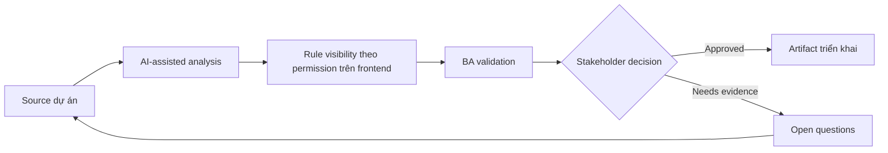

# Rule visibility theo permission trên frontend

<div class="case-meta">
  <span>Frontend, UI, and UX</span>
  <span>Permissioned UI</span>
  <span>Frontend/UI refinement</span>
  <span>Practitioner</span>
  <span>Role-control visibility matrix</span>
  <span>Use case dự án</span>
</div>

## Project context

Admin console có nhiều role: viewer, editor, approver, auditor và tenant admin. Backend enforce permission, nhưng frontend behavior cho hidden, disabled và read-only control chưa rõ. Trong Permissioned UI, công việc này thường bắt đầu khi screen behavior, accessibility, design state, analytics và user feedback phải thành requirement implement được. BA nên xem RBAC matrix và Admin screen design là evidence cần organize, không phải raw material để AI trả lời không kiểm soát. Mục tiêu là làm decision tiếp theo rõ hơn cho người own outcome.

## BA challenge

BA phải specify permission hiển thị trong UI ra sao mà không làm yếu security. User cần clarity, nhưng frontend không bao giờ là source of truth cho authorization. Với Rule visibility theo permission trên frontend, khó khăn thực tế là missing state và UX không đo được. AI có thể tăng tốc UI-state analysis, content critique, accessibility review, event taxonomy và edge-case discovery, nhưng BA vẫn phải làm rõ assumption, approval còn thiếu và điểm cần stakeholder judgment.

## Where AI fits

<div class="ba-workbench-panel">
AI phù hợp với use case Frontend, UI và UX khi được giới hạn vào UI-state analysis, content critique, accessibility review, event taxonomy và edge-case discovery. AI task hữu ích đầu tiên là: Generate role-control visibility matrix. AI không được approve scope, invent policy, bỏ qua wireframe, design token, user journey, analytics question và accessibility expectation, hoặc biến draft thành final decision.
</div>

- Generate role-control visibility matrix.
- Identify action nên hidden, disabled hoặc read-only.
- Draft copy cho unavailable action.
- Map frontend visibility với backend authorization check.

## Inputs to prepare

- RBAC matrix
- Admin screen design
- Backend authorization rules
- Audit policy
- User support notes

Trước khi prompt cho Rule visibility theo permission trên frontend, hãy label từng input theo owner, date, approval status, sensitivity và vai trò trong decision. Evidence lens quan trọng nhất là wireframe, design token, user journey, analytics question và accessibility expectation; nếu thiếu, AI có thể xem old note, draft design và approved rule có authority như nhau.

## BA workflow

1. List role, screen, control, action và data field.
2. Yêu cầu AI tạo role-control visibility matrix.
3. Review control unavailable nên hidden hay disabled.
4. Align mọi UI rule với backend authorization và audit need.
5. Viết acceptance criteria cho role switching và unauthorized deep link.
6. Tạo QA case cho từng role và blocked action.

Chạy workflow như screen-state review trước frontend build: bắt đầu với "List role, screen, control, action và data field.", sau đó giữ decision log visible khi artifact tiến tới Role-control visibility matrix. Cách này ngăn suggestion của AI âm thầm trở thành backlog, design, release hoặc operational commitment.

## Diagram



## Deliverables

| Deliverable | Nội dung | Owner | Done signal |
| --- | --- | --- | --- |
| Role-control visibility matrix | Role, screen, control, hidden/disabled/read-only rule và reason | BA | UI behavior match role rule |
| Authorization trace map | UI control tới backend permission và audit event | Backend lead | Frontend và backend align |
| Unavailable action copy | Disabled reason, tooltip, support path và role guidance | UX | User hiểu limit |
| Permission QA matrix | Role, action, expected UI, expected API result và audit | QA | Permission behavior test end to end |

Hãy xem Role-control visibility matrix là frontend requirement specification do BA own. AI có thể draft structure, nhưng BA phải validate "UI behavior match role rule" có thật sự đúng không, artifact có trace được về evidence không và receiving team có hành động được không.

## Prompt to try

```text
Hãy đóng vai senior Business Analyst hiểu AI. Hỗ trợ tôi áp dụng use case "Rule visibility theo permission trên frontend" vào dự án. Trước hết hỏi source evidence và constraint. Sau đó tạo structured analysis gồm project context, assumption, AI-fit boundary, workflow step, deliverable, risk, control, open question và stakeholder decision. Không tự bịa policy, threshold hoặc approval.
```

## Review checklist

- RBAC matrix được label owner, date, approval status và sensitivity.
- Role-control visibility matrix trace được về source evidence và có human owner rõ.
- AI task nằm trong boundary UI-state analysis, content critique, accessibility review, event taxonomy và edge-case discovery và không approve scope hoặc policy.
- Risk "Security by UI" có control thực tế: Trace mọi action tới backend permission.
- Open assumption được chuyển thành validation question hoặc stakeholder decision.
- Success metric: Permissioned UI behavior dễ hiểu cho user và aligned với backend authorization control.

## Risks and controls

| Rủi ro | Vì sao quan trọng | Control của BA |
| --- | --- | --- |
| Security by UI | Frontend hiding không phải authorization | Trace mọi action tới backend permission |
| User confusion | Hidden action làm user tưởng feature missing | Chọn hidden hoặc disabled có chủ đích |
| Deep link bypass | User có thể access unauthorized route | Specify route guard và backend rejection |
| Role drift | RBAC change có thể không update UI | Maintain permission matrix như source artifact |

Control chính cho risk "Security by UI" là human accountability explicit: Trace mọi action tới backend permission. Nếu evidence yếu, output nên tạo validation question hoặc decision item, không phải final requirement.
