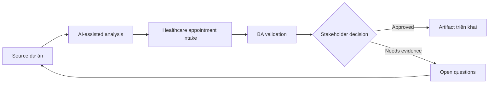

# Healthcare appointment intake

<div class="case-meta">
  <span>Domain project scenarios</span>
  <span>Healthcare operations</span>
  <span>Use case dự án</span>
</div>

## Project context

Một clinic network muốn cải thiện appointment intake và routing. Patient submit symptom, preferred time, insurance information và referral detail trước scheduling. Trong môi trường delivery thật, tình huống này thường xuất hiện dưới áp lực thời gian: stakeholder cần clarity, delivery cần backlog, QA cần behavior test được, operations cần process chịu được exception. BA dùng AI để tăng tốc analysis và synthesis, nhưng BA vẫn chịu trách nhiệm về evidence, business meaning, stakeholder decisioning và artifact quality.

## BA challenge

BA phải đặc tả intake support mà không biến AI thành medical decision maker. System có thể structure information và route request, nhưng clinical triage, emergency guidance, privacy và consent cần boundary nghiêm ngặt. Khó khăn thực tế là AI có thể làm material ban đầu trông hoàn chỉnh hơn mức thật sự. BA giỏi giữ output ở trạng thái reviewable bằng cách tách source-backed fact, assumption, unsupported claim, decision gap và recommended next action. Mục tiêu không phải làm document dài hơn; mục tiêu là làm project decision rõ hơn và an toàn hơn.

## Where AI fits

<div class="ba-workbench-panel">
AI hữu ích trong use case này khi được giới hạn vào analysis support, pattern detection, structured drafting và critique. AI không được approve scope, invent policy, quyết định business trade-off hoặc thay thế judgment của stakeholder chịu trách nhiệm.
</div>

- Structure patient-provided information thành intake field.
- Detect missing insurance, referral hoặc scheduling information.
- Generate routing suggestion có uncertainty label.
- Draft safe messaging và escalation trigger.

## Inputs to prepare

- Scheduling workflow
- Insurance và referral rules
- Privacy requirements
- Clinic specialty list
- Current intake forms

BA nên label các input này trước khi dùng AI: source owner, source date, approval status, sensitivity level, và source đó là fact, opinion, policy, draft hay historical evidence. Việc chuẩn bị này ngăn model xem mọi input đều current và authoritative như nhau.

## BA workflow

1. Define assistant được và không được infer gì từ patient text.
2. Yêu cầu AI map intake field và missing information prompt.
3. Specify routing suggestion như administrative support, không phải diagnosis.
4. Thêm emergency và clinical escalation messaging approved bởi clinical owner.
5. Design privacy, consent và data retention requirement.
6. Tạo evaluation case với incomplete, urgent và sensitive scenario.

Workflow hiệu quả nhất khi dùng AI theo từng stage: trước hết organize evidence, sau đó yêu cầu analysis, tiếp theo tạo artifact, rồi chạy critique pass. BA nên giữ decision log visible xuyên suốt để suggestion do AI sinh ra không âm thầm trở thành approved scope.

## Diagram



## Deliverables

| Deliverable | Nội dung | Owner | Done signal |
| --- | --- | --- | --- |
| Intake field schema | Field, source, validation, sensitivity và required status | BA | Field được privacy review |
| Routing rule matrix | Administrative routing cue, confidence, fallback và owner | Clinic operations | Routing tránh clinical diagnosis |
| Safe messaging set | Missing info, urgent warning, privacy notice và escalation | Clinical owner | Message approved |
| Evaluation cases | Incomplete, urgent, routine và sensitive example | QA và clinical reviewer | Safety case được test |

Các deliverable này nên được xem là artifact do BA own. AI có thể draft, nhưng BA phải validate source support, stakeholder meaning, traceability và artifact đã sẵn sàng handoff hay chưa.

## Prompt to try

```text
Hãy đóng vai senior Business Analyst hiểu AI. Hỗ trợ tôi áp dụng use case "Healthcare appointment intake" vào dự án. Trước hết hỏi source evidence và constraint. Sau đó tạo structured analysis gồm project context, assumption, AI-fit boundary, workflow step, deliverable, risk, control, open question và stakeholder decision. Không tự bịa policy, threshold hoặc approval.
```

## Review checklist

- Mọi statement do AI hỗ trợ đều gắn với source, assumption hoặc validation question.
- BA đã tách drafting assistance khỏi business approval.
- Workflow step có human owner cho decision, review và exception.
- Deliverable trace được về project input và review được bởi QA, product hoặc operations.
- Risk control đủ thực tế để dùng trong meeting dự án thật.
- Success metric: Appointment intake rõ và nhanh hơn trong khi clinical decision nằm ngoài scope AI.

## Risks and controls

| Rủi ro | Vì sao quan trọng | Control của BA |
| --- | --- | --- |
| Clinical overreach | AI có thể trông như diagnose hoặc clinical triage | Limit scope vào intake và approved escalation |
| Privacy violation | Health data sensitive và regulated | Specify consent, retention, access và audit |
| Unsafe delay | Urgent symptom có thể bị xử như normal scheduling | Dùng approved emergency messaging và escalation |
| Insurance confusion | Routing sai có thể delay care | Validate insurance và referral rule |

Control quan trọng nhất là làm uncertainty visible. Nếu evidence yếu, output nên tạo validation question hoặc decision item, không phải final requirement. Nếu artifact ảnh hưởng delivery, release, compliance, customer experience hoặc operational workload, BA nên yêu cầu human review explicit trước khi handoff.
