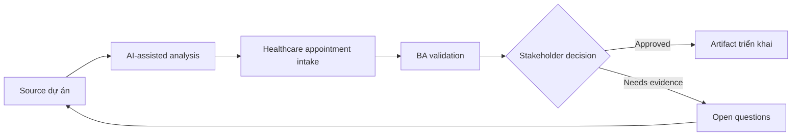

# Healthcare appointment intake

<div class="case-meta">
  <span>Domain project scenarios</span>
  <span>Healthcare operations</span>
  <span>Use case dự án</span>
</div>

## Project context

Một clinic network muốn cải thiện appointment intake và routing. Patient submit symptom, preferred time, insurance information và referral detail trước scheduling. Trong Healthcare operations, công việc này thường bắt đầu khi domain policy, operational exception và regulatory expectation quyết định product có thể làm gì an toàn. BA nên xem Scheduling workflow và Insurance và referral rules là evidence cần organize, không phải raw material để AI trả lời không kiểm soát. Mục tiêu là làm decision tiếp theo rõ hơn cho người own outcome.

## BA challenge

BA phải đặc tả intake support mà không biến AI thành medical decision maker. System có thể structure information và route request, nhưng clinical triage, emergency guidance, privacy và consent cần boundary nghiêm ngặt. Với Healthcare appointment intake, khó khăn thực tế là policy hallucination và exception blindness. AI có thể tăng tốc domain-rule extraction, exception mapping, safe-message drafting và owner review, nhưng BA vẫn phải làm rõ assumption, approval còn thiếu và điểm cần stakeholder judgment.

## Where AI fits

<div class="ba-workbench-panel">
AI phù hợp với use case Tình huống theo domain khi được giới hạn vào domain-rule extraction, exception mapping, safe-message drafting và owner review. AI task hữu ích đầu tiên là: Structure patient-provided information thành intake field. AI không được approve scope, invent policy, bỏ qua policy source, operational sample, compliance constraint và domain-owner decision, hoặc biến draft thành final decision.
</div>

- Structure patient-provided information thành intake field.
- Detect missing insurance, referral hoặc scheduling information.
- Generate routing suggestion có uncertainty label.
- Draft safe messaging và escalation trigger.

## Inputs to prepare

- Scheduling workflow
- Insurance và referral rules
- Privacy requirements
- Clinic specialty list
- Current intake forms

Trước khi prompt cho Healthcare appointment intake, hãy label từng input theo owner, date, approval status, sensitivity và vai trò trong decision. Evidence lens quan trọng nhất là policy source, operational sample, compliance constraint và domain-owner decision; nếu thiếu, AI có thể xem old note, draft design và approved rule có authority như nhau.

## BA workflow

1. Define assistant được và không được infer gì từ patient text.
2. Yêu cầu AI map intake field và missing information prompt.
3. Specify routing suggestion như administrative support, không phải diagnosis.
4. Thêm emergency và clinical escalation messaging approved bởi clinical owner.
5. Design privacy, consent và data retention requirement.
6. Tạo evaluation case với incomplete, urgent và sensitive scenario.

Chạy workflow như domain validation trước implementation detail: bắt đầu với "Define assistant được và không được infer gì từ patient text.", sau đó giữ decision log visible khi artifact tiến tới Intake field schema. Cách này ngăn suggestion của AI âm thầm trở thành backlog, design, release hoặc operational commitment.

## Diagram



## Deliverables

| Deliverable | Nội dung | Owner | Done signal |
| --- | --- | --- | --- |
| Intake field schema | Field, source, validation, sensitivity và required status | BA | Field được privacy review |
| Routing rule matrix | Administrative routing cue, confidence, fallback và owner | Clinic operations | Routing tránh clinical diagnosis |
| Safe messaging set | Missing info, urgent warning, privacy notice và escalation | Clinical owner | Message approved |
| Evaluation cases | Incomplete, urgent, routine và sensitive example | QA và clinical reviewer | Safety case được test |

Hãy xem Intake field schema là domain-specific requirement pack do BA own. AI có thể draft structure, nhưng BA phải validate "Field được privacy review" có thật sự đúng không, artifact có trace được về evidence không và receiving team có hành động được không.

## Prompt to try

```text
Hãy đóng vai senior Business Analyst hiểu AI. Hỗ trợ tôi áp dụng use case "Healthcare appointment intake" vào dự án. Trước hết hỏi source evidence và constraint. Sau đó tạo structured analysis gồm project context, assumption, AI-fit boundary, workflow step, deliverable, risk, control, open question và stakeholder decision. Không tự bịa policy, threshold hoặc approval.
```

## Review checklist

- Scheduling workflow được label owner, date, approval status và sensitivity.
- Intake field schema trace được về source evidence và có human owner rõ.
- AI task nằm trong boundary domain-rule extraction, exception mapping, safe-message drafting và owner review và không approve scope hoặc policy.
- Risk "Clinical overreach" có control thực tế: Limit scope vào intake và approved escalation.
- Open assumption được chuyển thành validation question hoặc stakeholder decision.
- Success metric: Appointment intake rõ và nhanh hơn trong khi clinical decision nằm ngoài scope AI.

## Risks and controls

| Rủi ro | Vì sao quan trọng | Control của BA |
| --- | --- | --- |
| Clinical overreach | AI có thể trông như diagnose hoặc clinical triage | Limit scope vào intake và approved escalation |
| Privacy violation | Health data sensitive và regulated | Specify consent, retention, access và audit |
| Unsafe delay | Urgent symptom có thể bị xử như normal scheduling | Dùng approved emergency messaging và escalation |
| Insurance confusion | Routing sai có thể delay care | Validate insurance và referral rule |

Control chính cho risk "Clinical overreach" là human accountability explicit: Limit scope vào intake và approved escalation. Nếu evidence yếu, output nên tạo validation question hoặc decision item, không phải final requirement.
