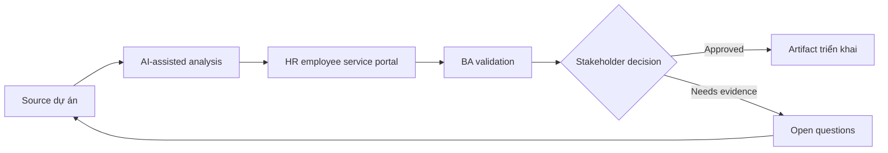

# HR employee service portal

<div class="case-meta">
  <span>Domain project scenarios</span>
  <span>HR service delivery</span>
  <span>Use case dự án</span>
</div>

## Project context

HR muốn portal để employee request letter, hỏi policy, update personal information và track case status. Hiện request xử lý qua email và shared mailbox. Trong môi trường delivery thật, tình huống này thường xuất hiện dưới áp lực thời gian: stakeholder cần clarity, delivery cần backlog, QA cần behavior test được, operations cần process chịu được exception. BA dùng AI để tăng tốc analysis và synthesis, nhưng BA vẫn chịu trách nhiệm về evidence, business meaning, stakeholder decisioning và artifact quality.

## BA challenge

BA phải define service catalog, request form, approval rule, privacy boundary, knowledge search, case status và escalation. AI có thể cải thiện self-service, nhưng HR policy answer và personal data change cần control. Khó khăn thực tế là AI có thể làm material ban đầu trông hoàn chỉnh hơn mức thật sự. BA giỏi giữ output ở trạng thái reviewable bằng cách tách source-backed fact, assumption, unsupported claim, decision gap và recommended next action. Mục tiêu không phải làm document dài hơn; mục tiêu là làm project decision rõ hơn và an toàn hơn.

## Where AI fits

<div class="ba-workbench-panel">
AI hữu ích trong use case này khi được giới hạn vào analysis support, pattern detection, structured drafting và critique. AI không được approve scope, invent policy, quyết định business trade-off hoặc thay thế judgment của stakeholder chịu trách nhiệm.
</div>

- Cluster historical HR email thành service category.
- Draft request form và required field.
- Generate policy assistant requirement có source và fallback rule.
- Identify privacy và role-based access scenario.

## Inputs to prepare

- HR mailbox samples
- Policy documents
- Service catalog drafts
- Approval rules
- Employee data privacy policy

BA nên label các input này trước khi dùng AI: source owner, source date, approval status, sensitivity level, và source đó là fact, opinion, policy, draft hay historical evidence. Việc chuẩn bị này ngăn model xem mọi input đều current và authoritative như nhau.

## BA workflow

1. Analyze historical request và cluster service category.
2. Yêu cầu AI propose request form field và missing rule theo service.
3. Define service catalog có eligibility, SLA, owner và required evidence.
4. Specify policy-answering behavior có citation và fallback tới HR.
5. Review personal data change cho privacy và approval need.
6. Publish service portal requirement và support transition plan.

Workflow hiệu quả nhất khi dùng AI theo từng stage: trước hết organize evidence, sau đó yêu cầu analysis, tiếp theo tạo artifact, rồi chạy critique pass. BA nên giữ decision log visible xuyên suốt để suggestion do AI sinh ra không âm thầm trở thành approved scope.

## Diagram



## Deliverables

| Deliverable | Nội dung | Owner | Done signal |
| --- | --- | --- | --- |
| Service catalog | Service, eligibility, field, SLA, owner và escalation | HR operations | Employee biết đi đâu |
| Request form specification | Field, validation, evidence, permission và status message | BA | Form giảm back-and-forth |
| Policy assistant rules | Source, citation, fallback và conflict behavior | HR policy owner | Answer grounded |
| Privacy matrix | Employee data, role access, audit và approval | Security và HR | Sensitive data protected |

Các deliverable này nên được xem là artifact do BA own. AI có thể draft, nhưng BA phải validate source support, stakeholder meaning, traceability và artifact đã sẵn sàng handoff hay chưa.

## Prompt to try

```text
Hãy đóng vai senior Business Analyst hiểu AI. Hỗ trợ tôi áp dụng use case "HR employee service portal" vào dự án. Trước hết hỏi source evidence và constraint. Sau đó tạo structured analysis gồm project context, assumption, AI-fit boundary, workflow step, deliverable, risk, control, open question và stakeholder decision. Không tự bịa policy, threshold hoặc approval.
```

## Review checklist

- Mọi statement do AI hỗ trợ đều gắn với source, assumption hoặc validation question.
- BA đã tách drafting assistance khỏi business approval.
- Workflow step có human owner cho decision, review và exception.
- Deliverable trace được về project input và review được bởi QA, product hoặc operations.
- Risk control đủ thực tế để dùng trong meeting dự án thật.
- Success metric: Employee hoàn thành common HR request qua structured self-service có status rõ và privacy control.

## Risks and controls

| Rủi ro | Vì sao quan trọng | Control của BA |
| --- | --- | --- |
| Mailbox pattern bias | Historical email phản ánh confusion hiện tại, không phải ideal service design | Validate service catalog với HR owner |
| Policy hallucination | Assistant có thể answer từ stale hoặc wrong policy | Dùng RAG source control và citation |
| Privacy exposure | Employee data change sensitive | Define access, audit và approval |
| Poor adoption | Employee có thể tiếp tục email HR | Thêm status visibility và clear service routing |

Control quan trọng nhất là làm uncertainty visible. Nếu evidence yếu, output nên tạo validation question hoặc decision item, không phải final requirement. Nếu artifact ảnh hưởng delivery, release, compliance, customer experience hoặc operational workload, BA nên yêu cầu human review explicit trước khi handoff.
