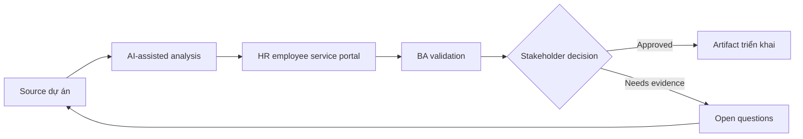

# HR employee service portal

<div class="case-meta">
  <span>Domain project scenarios</span>
  <span>HR service delivery</span>
  <span>Domain workflow</span>
  <span>Core</span>
  <span>Service catalog</span>
  <span>Use case dự án</span>
</div>

## Project context

HR muốn portal để employee request letter, hỏi policy, update personal information và track case status. Hiện request xử lý qua email và shared mailbox. Trong HR service delivery, công việc này thường bắt đầu khi domain policy, operational exception và regulatory expectation quyết định product có thể làm gì an toàn. BA nên xem HR mailbox samples và Policy documents là evidence cần organize, không phải raw material để AI trả lời không kiểm soát. Mục tiêu là làm decision tiếp theo rõ hơn cho người own outcome.

## BA challenge

BA phải define service catalog, request form, approval rule, privacy boundary, knowledge search, case status và escalation. AI có thể cải thiện self-service, nhưng HR policy answer và personal data change cần control. Với HR employee service portal, khó khăn thực tế là policy hallucination và exception blindness. AI có thể tăng tốc domain-rule extraction, exception mapping, safe-message drafting và owner review, nhưng BA vẫn phải làm rõ assumption, approval còn thiếu và điểm cần stakeholder judgment.

## Where AI fits

<div class="ba-workbench-panel">
AI phù hợp với use case Tình huống theo domain khi được giới hạn vào domain-rule extraction, exception mapping, safe-message drafting và owner review. AI task hữu ích đầu tiên là: Cluster historical HR email thành service category. AI không được approve scope, invent policy, bỏ qua policy source, operational sample, compliance constraint và domain-owner decision, hoặc biến draft thành final decision.
</div>

- Cluster historical HR email thành service category.
- Draft request form và required field.
- Generate policy assistant requirement có source và fallback rule.
- Identify privacy và role-based access scenario.

## Inputs to prepare

- HR mailbox samples
- Policy documents
- Service catalog drafts
- Approval rules
- Employee data privacy policy

Trước khi prompt cho HR employee service portal, hãy label từng input theo owner, date, approval status, sensitivity và vai trò trong decision. Evidence lens quan trọng nhất là policy source, operational sample, compliance constraint và domain-owner decision; nếu thiếu, AI có thể xem old note, draft design và approved rule có authority như nhau.

## BA workflow

1. Analyze historical request và cluster service category.
2. Yêu cầu AI propose request form field và missing rule theo service.
3. Define service catalog có eligibility, SLA, owner và required evidence.
4. Specify policy-answering behavior có citation và fallback tới HR.
5. Review personal data change cho privacy và approval need.
6. Publish service portal requirement và support transition plan.

Chạy workflow như domain validation trước implementation detail: bắt đầu với "Analyze historical request và cluster service category.", sau đó giữ decision log visible khi artifact tiến tới Service catalog. Cách này ngăn suggestion của AI âm thầm trở thành backlog, design, release hoặc operational commitment.

## Diagram



## Deliverables

| Deliverable | Nội dung | Owner | Done signal |
| --- | --- | --- | --- |
| Service catalog | Service, eligibility, field, SLA, owner và escalation | HR operations | Employee biết đi đâu |
| Request form specification | Field, validation, evidence, permission và status message | BA | Form giảm back-and-forth |
| Policy assistant rules | Source, citation, fallback và conflict behavior | HR policy owner | Answer grounded |
| Privacy matrix | Employee data, role access, audit và approval | Security và HR | Sensitive data protected |

Hãy xem Service catalog là domain-specific requirement pack do BA own. AI có thể draft structure, nhưng BA phải validate "Employee biết đi đâu" có thật sự đúng không, artifact có trace được về evidence không và receiving team có hành động được không.

## Prompt to try

```text
Hãy đóng vai senior Business Analyst hiểu AI. Hỗ trợ tôi áp dụng use case "HR employee service portal" vào dự án. Trước hết hỏi source evidence và constraint. Sau đó tạo structured analysis gồm project context, assumption, AI-fit boundary, workflow step, deliverable, risk, control, open question và stakeholder decision. Không tự bịa policy, threshold hoặc approval.
```

## Review checklist

- HR mailbox samples được label owner, date, approval status và sensitivity.
- Service catalog trace được về source evidence và có human owner rõ.
- AI task nằm trong boundary domain-rule extraction, exception mapping, safe-message drafting và owner review và không approve scope hoặc policy.
- Risk "Mailbox pattern bias" có control thực tế: Validate service catalog với HR owner.
- Open assumption được chuyển thành validation question hoặc stakeholder decision.
- Success metric: Employee hoàn thành common HR request qua structured self-service có status rõ và privacy control.

## Risks and controls

| Rủi ro | Vì sao quan trọng | Control của BA |
| --- | --- | --- |
| Mailbox pattern bias | Historical email phản ánh confusion hiện tại, không phải ideal service design | Validate service catalog với HR owner |
| Policy hallucination | Assistant có thể answer từ stale hoặc wrong policy | Dùng RAG source control và citation |
| Privacy exposure | Employee data change sensitive | Define access, audit và approval |
| Poor adoption | Employee có thể tiếp tục email HR | Thêm status visibility và clear service routing |

Control chính cho risk "Mailbox pattern bias" là human accountability explicit: Validate service catalog với HR owner. Nếu evidence yếu, output nên tạo validation question hoặc decision item, không phải final requirement.
