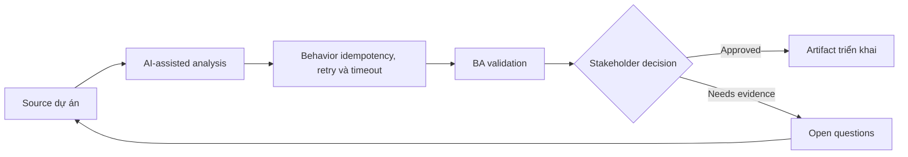

# Behavior idempotency, retry và timeout

<div class="case-meta">
  <span>Backend and API</span>
  <span>Reliability behavior</span>
  <span>Use case dự án</span>
</div>

## Project context

Payment initiation API có thể bị call nhiều lần vì user double-click, browser retry và network request timeout. Xử lý duplicate sẽ tạo risk tài chính và support. Trong Reliability behavior, công việc này thường bắt đầu khi API contract, permission, error, audit và operational behavior phải đủ explicit cho backend delivery. BA nên xem Payment workflow và API contract là evidence cần organize, không phải raw material để AI trả lời không kiểm soát. Mục tiêu là làm decision tiếp theo rõ hơn cho người own outcome.

## BA challenge

BA phải specify reliability behavior bằng business term: thế nào là duplicate, khi nào retry safe, user thấy gì khi timeout và operations reconcile uncertain outcome ra sao. Với Behavior idempotency, retry và timeout, khó khăn thực tế là service behavior mơ hồ và security gap. AI có thể tăng tốc contract critique, rule extraction, error taxonomy, permission review và NFR gap detection, nhưng BA vẫn phải làm rõ assumption, approval còn thiếu và điểm cần stakeholder judgment.

## Where AI fits

<div class="ba-workbench-panel">
AI phù hợp với use case Backend và API khi được giới hạn vào contract critique, rule extraction, error taxonomy, permission review và NFR gap detection. AI task hữu ích đầu tiên là: Generate duplicate và timeout scenario. AI không được approve scope, invent policy, bỏ qua API draft, data model, auth rule, error sample, audit policy và integration need, hoặc biến draft thành final decision.
</div>

- Generate duplicate và timeout scenario.
- Draft idempotency behavior table có user/backend outcome.
- Identify retry ownership chưa rõ giữa frontend, backend và external provider.
- Tạo support và reconciliation question.

## Inputs to prepare

- Payment workflow
- API contract
- External provider rules
- Support process
- Audit và reconciliation requirements

Trước khi prompt cho Behavior idempotency, retry và timeout, hãy label từng input theo owner, date, approval status, sensitivity và vai trò trong decision. Evidence lens quan trọng nhất là API draft, data model, auth rule, error sample, audit policy và integration need; nếu thiếu, AI có thể xem old note, draft design và approved rule có authority như nhau.

## BA workflow

1. Define business consequence của duplicate, delayed và unknown outcome.
2. Yêu cầu AI generate retry, timeout và duplicate scenario.
3. Specify idempotency key behavior và duplicate response rule.
4. Define user messaging cho processing, timeout, success, failure và unknown state.
5. Review reconciliation và support process với operations.
6. Thêm API và UI acceptance criteria cho retry behavior.

Chạy workflow như contract validation trước implementation: bắt đầu với "Define business consequence của duplicate, delayed và unknown outcome.", sau đó giữ decision log visible khi artifact tiến tới Reliability behavior matrix. Cách này ngăn suggestion của AI âm thầm trở thành backlog, design, release hoặc operational commitment.

## Diagram



## Deliverables

| Deliverable | Nội dung | Owner | Done signal |
| --- | --- | --- | --- |
| Reliability behavior matrix | Scenario, duplicate rule, API behavior, UI message và operation action | BA | Retry outcome rõ |
| Idempotency requirement | Key source, validity window, duplicate response và audit | Backend | Prevent duplicate processing |
| Timeout messaging spec | User state, message, next action và support path | UX và BA | User hiểu uncertain outcome |
| Reconciliation playbook | Unknown state, investigation, owner, SLA và correction path | Operations | Operations resolve được exception |

Hãy xem Reliability behavior matrix là backend behavior contract do BA own. AI có thể draft structure, nhưng BA phải validate "Retry outcome rõ" có thật sự đúng không, artifact có trace được về evidence không và receiving team có hành động được không.

## Prompt to try

```text
Hãy đóng vai senior Business Analyst hiểu AI. Hỗ trợ tôi áp dụng use case "Behavior idempotency, retry và timeout" vào dự án. Trước hết hỏi source evidence và constraint. Sau đó tạo structured analysis gồm project context, assumption, AI-fit boundary, workflow step, deliverable, risk, control, open question và stakeholder decision. Không tự bịa policy, threshold hoặc approval.
```

## Review checklist

- Payment workflow được label owner, date, approval status và sensitivity.
- Reliability behavior matrix trace được về source evidence và có human owner rõ.
- AI task nằm trong boundary contract critique, rule extraction, error taxonomy, permission review và NFR gap detection và không approve scope hoặc policy.
- Risk "Duplicate transaction" có control thực tế: Define idempotency và duplicate response.
- Open assumption được chuyển thành validation question hoặc stakeholder decision.
- Success metric: Duplicate và uncertain outcome được prevent hoặc handle bằng API, UI và operations behavior rõ.

## Risks and controls

| Rủi ro | Vì sao quan trọng | Control của BA |
| --- | --- | --- |
| Duplicate transaction | User có thể bị charge hai lần hoặc record duplicate | Define idempotency và duplicate response |
| False failure | Timeout có thể che successful processing | Tạo unknown-state messaging và reconciliation |
| Retry storm | Retry quá aggressive overload service | Specify retry limit và ownership |
| Support confusion | Agent không biết transaction truth | Provide audit và reconciliation playbook |

Control chính cho risk "Duplicate transaction" là human accountability explicit: Define idempotency và duplicate response. Nếu evidence yếu, output nên tạo validation question hoặc decision item, không phải final requirement.
