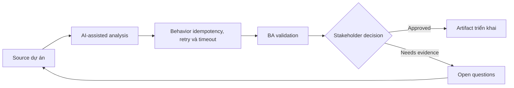

# Behavior idempotency, retry và timeout

<div class="case-meta">
  <span>Backend and API</span>
  <span>Reliability behavior</span>
  <span>Use case dự án</span>
</div>

## Project context

Payment initiation API có thể bị call nhiều lần vì user double-click, browser retry và network request timeout. Xử lý duplicate sẽ tạo risk tài chính và support. Trong môi trường delivery thật, tình huống này thường xuất hiện dưới áp lực thời gian: stakeholder cần clarity, delivery cần backlog, QA cần behavior test được, operations cần process chịu được exception. BA dùng AI để tăng tốc analysis và synthesis, nhưng BA vẫn chịu trách nhiệm về evidence, business meaning, stakeholder decisioning và artifact quality.

## BA challenge

BA phải specify reliability behavior bằng business term: thế nào là duplicate, khi nào retry safe, user thấy gì khi timeout và operations reconcile uncertain outcome ra sao. Khó khăn thực tế là AI có thể làm material ban đầu trông hoàn chỉnh hơn mức thật sự. BA giỏi giữ output ở trạng thái reviewable bằng cách tách source-backed fact, assumption, unsupported claim, decision gap và recommended next action. Mục tiêu không phải làm document dài hơn; mục tiêu là làm project decision rõ hơn và an toàn hơn.

## Where AI fits

<div class="ba-workbench-panel">
AI hữu ích trong use case này khi được giới hạn vào analysis support, pattern detection, structured drafting và critique. AI không được approve scope, invent policy, quyết định business trade-off hoặc thay thế judgment của stakeholder chịu trách nhiệm.
</div>

- Generate duplicate và timeout scenario.
- Draft idempotency behavior table có user/backend outcome.
- Identify retry ownership chưa rõ giữa frontend, backend và external provider.
- Tạo support và reconciliation question.

## Inputs to prepare

- Payment workflow
- API contract
- External provider rules
- Support process
- Audit và reconciliation requirements

BA nên label các input này trước khi dùng AI: source owner, source date, approval status, sensitivity level, và source đó là fact, opinion, policy, draft hay historical evidence. Việc chuẩn bị này ngăn model xem mọi input đều current và authoritative như nhau.

## BA workflow

1. Define business consequence của duplicate, delayed và unknown outcome.
2. Yêu cầu AI generate retry, timeout và duplicate scenario.
3. Specify idempotency key behavior và duplicate response rule.
4. Define user messaging cho processing, timeout, success, failure và unknown state.
5. Review reconciliation và support process với operations.
6. Thêm API và UI acceptance criteria cho retry behavior.

Workflow hiệu quả nhất khi dùng AI theo từng stage: trước hết organize evidence, sau đó yêu cầu analysis, tiếp theo tạo artifact, rồi chạy critique pass. BA nên giữ decision log visible xuyên suốt để suggestion do AI sinh ra không âm thầm trở thành approved scope.

## Diagram



## Deliverables

| Deliverable | Nội dung | Owner | Done signal |
| --- | --- | --- | --- |
| Reliability behavior matrix | Scenario, duplicate rule, API behavior, UI message và operation action | BA | Retry outcome rõ |
| Idempotency requirement | Key source, validity window, duplicate response và audit | Backend | Prevent duplicate processing |
| Timeout messaging spec | User state, message, next action và support path | UX và BA | User hiểu uncertain outcome |
| Reconciliation playbook | Unknown state, investigation, owner, SLA và correction path | Operations | Operations resolve được exception |

Các deliverable này nên được xem là artifact do BA own. AI có thể draft, nhưng BA phải validate source support, stakeholder meaning, traceability và artifact đã sẵn sàng handoff hay chưa.

## Prompt to try

```text
Hãy đóng vai senior Business Analyst hiểu AI. Hỗ trợ tôi áp dụng use case "Behavior idempotency, retry và timeout" vào dự án. Trước hết hỏi source evidence và constraint. Sau đó tạo structured analysis gồm project context, assumption, AI-fit boundary, workflow step, deliverable, risk, control, open question và stakeholder decision. Không tự bịa policy, threshold hoặc approval.
```

## Review checklist

- Mọi statement do AI hỗ trợ đều gắn với source, assumption hoặc validation question.
- BA đã tách drafting assistance khỏi business approval.
- Workflow step có human owner cho decision, review và exception.
- Deliverable trace được về project input và review được bởi QA, product hoặc operations.
- Risk control đủ thực tế để dùng trong meeting dự án thật.
- Success metric: Duplicate và uncertain outcome được prevent hoặc handle bằng API, UI và operations behavior rõ.

## Risks and controls

| Rủi ro | Vì sao quan trọng | Control của BA |
| --- | --- | --- |
| Duplicate transaction | User có thể bị charge hai lần hoặc record duplicate | Define idempotency và duplicate response |
| False failure | Timeout có thể che successful processing | Tạo unknown-state messaging và reconciliation |
| Retry storm | Retry quá aggressive overload service | Specify retry limit và ownership |
| Support confusion | Agent không biết transaction truth | Provide audit và reconciliation playbook |

Control quan trọng nhất là làm uncertainty visible. Nếu evidence yếu, output nên tạo validation question hoặc decision item, không phải final requirement. Nếu artifact ảnh hưởng delivery, release, compliance, customer experience hoặc operational workload, BA nên yêu cầu human review explicit trước khi handoff.
