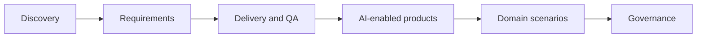

# Use case thực tế trong dự án

Thư viện use case thực tế trong dự án, giúp software Business Analyst áp dụng AI vào discovery, requirements, delivery, AI-enabled product, domain workflow và governance.

Hãy dùng các trang này như playbook làm việc. Chọn use case gần với dự án của bạn, dùng prompt, chuẩn bị source evidence và điều chỉnh deliverable theo team.

## Use case map

<section class="usecase-section"><h2>Discovery and alignment</h2>

<a class="case-card" href="./stakeholder-discovery-from-messy-notes/">Cross-functional product discovery<strong>Discovery stakeholder từ notes lộn xộn</strong><em>Workshop tiếp theo resolve được conflict rủi ro cao nhất và có owner cho mọi open decision.</em></a>
<a class="case-card" href="./project-kickoff-scope-framing/">Project initiation<strong>Framing scope cho project kickoff</strong><em>Kickoff tạo được scope frame đã agreed để delivery, product và operations dùng cho prioritization.</em></a>
<a class="case-card" href="./current-state-process-mapping/">Operations analysis<strong>Mapping current-state process</strong><em>Process map đã validate chỉ ra delay point và decision gap để ưu tiên redesign.</em></a>
<a class="case-card" href="./legacy-modernization-gap-analysis/">Legacy system modernization<strong>Gap analysis cho legacy modernization</strong><em>Migration scope tách rõ behavior phải giữ, redesign và retire dựa trên evidence.</em></a>
<a class="case-card" href="./market-competitor-research-synthesis/">Product strategy<strong>Synthesis market và competitor research</strong><em>Roadmap discussion dùng validated hypothesis và evidence strength thay vì competitor feature list chung chung.</em></a>

</section>
<section class="usecase-section"><h2>Requirements and backlog</h2>

<a class="case-card" href="./user-story-splitting-for-sprint/">Agile delivery<strong>Split user story cho sprint readiness</strong><em>Sprint planning nhận story mà QA và developer có thể estimate, test và release theo increment có ý nghĩa.</em></a>
<a class="case-card" href="./acceptance-criteria-edge-cases/">Requirements quality<strong>Mở rộng acceptance criteria và edge case</strong><em>QA có thể chuyển acceptance criteria thành test case mà không phải hỏi hidden business rule.</em></a>
<a class="case-card" href="./brd-srs-drafting-review/">Formal requirements documentation<strong>Draft và review BRD/SRS</strong><em>BRD hoặc SRS được draft nhanh hơn nhưng vẫn traceable, reviewable và approved bởi đúng owner.</em></a>
<a class="case-card" href="./nfr-risk-workshop/">Quality attributes<strong>Chuẩn bị workshop NFR và risk</strong><em>Quality attribute trở thành requirement đo được và design input trước khi commit architecture.</em></a>
<a class="case-card" href="./traceability-matrix-for-release/">Release governance<strong>Traceability matrix cho release readiness</strong><em>Release sign-off dựa trên coverage và accepted exception visible, không dựa vào artifact rời rạc.</em></a>

</section>
<section class="usecase-section"><h2>Delivery and QA</h2>

<a class="case-card" href="./defect-triage-root-cause/">Defect management<strong>Triage defect và root-cause analysis</strong><em>Triage decision nhanh hơn nhưng root cause vẫn evidence-based và actionable.</em></a>
<a class="case-card" href="./test-scenario-generation/">QA collaboration<strong>Sinh test scenario từ requirements</strong><em>QA nhận scenario coverage traceable, prioritized và aligned với business rule.</em></a>
<a class="case-card" href="./change-impact-analysis/">Change control<strong>Change impact analysis</strong><em>Team accept, defer hoặc split change với impact và artifact owner visible.</em></a>
<a class="case-card" href="./release-readiness-check/">Release management<strong>Kiểm tra release readiness</strong><em>Go-live meeting dùng readiness brief chung dựa trên evidence thay vì status update rời rạc.</em></a>
<a class="case-card" href="./production-incident-requirement-feedback/">Continuous improvement<strong>Từ production incident đến feedback requirement</strong><em>Production incident trở thành backlog improvement có evidence và câu hỏi requirement tốt hơn trong tương lai.</em></a>

</section>
<section class="usecase-section"><h2>AI-enabled product use cases</h2>

<a class="case-card" href="./rag-policy-assistant-requirements/">Knowledge assistant<strong>Requirement cho RAG policy assistant</strong><em>Assistant chỉ trả lời từ trusted source, cite evidence, respect access và escalate an toàn.</em></a>
<a class="case-card" href="./ai-ticket-triage-specification/">Support automation<strong>Đặc tả AI ticket triage</strong><em>Ticket routing cải thiện SLA trong khi case low-confidence và high-risk được human review.</em></a>
<a class="case-card" href="./ai-document-ocr-intake/">Document automation<strong>AI OCR cho document intake</strong><em>Document handling nhanh hơn trong khi sensitive decision vẫn reviewable và evidence-backed.</em></a>
<a class="case-card" href="./ai-recommendation-explanation/">Decision support<strong>Giải thích AI recommendation</strong><em>User hiểu recommendation, giữ quyền decision và cung cấp feedback cải thiện product.</em></a>
<a class="case-card" href="./ai-chatbot-human-handoff/">Customer support<strong>AI chatbot và human handoff</strong><em>Chatbot giảm workload đơn giản trong khi case phức tạp hoặc risky tới human có context và accountability.</em></a>

</section>
<section class="usecase-section"><h2>Domain project scenarios</h2>

<a class="case-card" href="./loan-origination-journey/">Banking and lending<strong>Modernize journey loan origination</strong><em>Loan journey mới nhanh hơn cho customer trong khi credit decision vẫn explainable và compliant.</em></a>
<a class="case-card" href="./insurance-claim-intake/">Insurance<strong>Automation insurance claim intake</strong><em>Claim intake nhanh và rõ hơn trong khi coverage và fraud decision vẫn human-governed.</em></a>
<a class="case-card" href="./ecommerce-return-refund/">E-commerce<strong>Flow return và refund e-commerce</strong><em>Customer hoàn thành eligible return với ít support contact hơn và refund expectation rõ hơn.</em></a>
<a class="case-card" href="./healthcare-appointment-intake/">Healthcare operations<strong>Healthcare appointment intake</strong><em>Appointment intake rõ và nhanh hơn trong khi clinical decision nằm ngoài scope AI.</em></a>
<a class="case-card" href="./hr-employee-service-portal/">HR service delivery<strong>HR employee service portal</strong><em>Employee hoàn thành common HR request qua structured self-service có status rõ và privacy control.</em></a>
<a class="case-card" href="./finance-reconciliation-exception/">Finance operations<strong>Workflow finance reconciliation exception</strong><em>Exception resolution nhanh hơn trong khi finance decision vẫn controlled và auditable.</em></a>

</section>
<section class="usecase-section"><h2>Governance and adoption</h2>

<a class="case-card" href="./vendor-selection-ai-tool/">Vendor evaluation<strong>Chọn vendor cho AI tool</strong><em>Vendor selection được drive bởi BA workflow value, verified control và pilot evidence.</em></a>
<a class="case-card" href="./data-privacy-ai-assessment/">Privacy and compliance<strong>Assessment data privacy cho AI use</strong><em>BA team dùng AI với data boundary rõ, approved tool và privacy control thực tế.</em></a>
<a class="case-card" href="./ba-ai-adoption-playbook/">BA practice leadership<strong>Playbook adoption AI cho BA team</strong><em>BA practice adopt AI bằng shared pattern, review gate và quality improvement đo được.</em></a>
<a class="case-card" href="./portfolio-use-case-prioritization/">Portfolio management<strong>Prioritize portfolio AI use case</strong><em>Leadership fund AI pilot dựa trên value, feasibility, data readiness và risk, không phải hype.</em></a>

</section>
