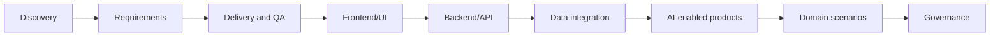

# Use case thực tế trong dự án

Thư viện 70+ use case thực tế trong dự án, giúp software Business Analyst áp dụng AI vào discovery, requirements, frontend/UI, backend/API, data integration, delivery, AI-enabled product, domain workflow và governance.

Hãy dùng các trang này như playbook làm việc. Chọn use case gần với dự án của bạn, dùng prompt, chuẩn bị source evidence và điều chỉnh deliverable theo team.

## Duyệt theo nhóm

<a class="group-card" href="#discovery-and-alignment"><strong>Discovery và alignment</strong>5 use case</a>
<a class="group-card" href="#requirements-and-backlog"><strong>Requirements và backlog</strong>5 use case</a>
<a class="group-card" href="#delivery-and-qa"><strong>Delivery và QA</strong>5 use case</a>
<a class="group-card" href="#ai-enabled-product-use-cases"><strong>AI-enabled product</strong>5 use case</a>
<a class="group-card" href="#domain-project-scenarios"><strong>Tình huống theo domain</strong>6 use case</a>
<a class="group-card" href="#governance-and-adoption"><strong>Governance và adoption</strong>4 use case</a>
<a class="group-card" href="#frontend-ui-and-ux"><strong>Frontend, UI và UX</strong>13 use case</a>
<a class="group-card" href="#backend-and-api"><strong>Backend và API</strong>12 use case</a>
<a class="group-card" href="#data-and-integration"><strong>Data và Integration</strong>8 use case</a>
<a class="group-card" href="#cross-functional-ba-collaboration"><strong>Collaboration cross-functional của BA</strong>8 use case</a>

## Lọc theo bối cảnh dự án

  

    <strong>Theo phase dự án</strong>
    
<a href="#discovery-and-alignment">Discovery</a><a href="#requirements-and-backlog">Refinement</a><a href="#delivery-and-qa">Delivery validation</a><a href="#ai-enabled-product-use-cases">AI product design</a><a href="#domain-project-scenarios">Domain workflow</a><a href="#governance-and-adoption">Governance</a><a href="#frontend-ui-and-ux">Frontend/UI refinement</a><a href="#backend-and-api">Backend/API refinement</a><a href="#data-and-integration">Data and integration</a><a href="#cross-functional-ba-collaboration">Cross-functional alignment</a>

  

  

    <strong>Theo độ khó</strong>
    
CoreAdvancedPractitioner

  

  

    <strong>Theo nhóm collaboration của BA</strong>
    
<a href="#discovery-and-alignment">Discovery và alignment</a><a href="#requirements-and-backlog">Requirements và backlog</a><a href="#delivery-and-qa">Delivery và QA</a><a href="#ai-enabled-product-use-cases">AI-enabled product</a><a href="#domain-project-scenarios">Tình huống theo domain</a><a href="#governance-and-adoption">Governance và adoption</a><a href="#frontend-ui-and-ux">Frontend, UI và UX</a><a href="#backend-and-api">Backend và API</a><a href="#data-and-integration">Data và Integration</a><a href="#cross-functional-ba-collaboration">Collaboration cross-functional của BA</a>

  

## Use case map

<section class="usecase-section"><h2 id="discovery-and-alignment">Discovery và alignment</h2>

<a class="case-card" data-phase="discovery" data-difficulty="core" data-artifact="discovery-synthesis-pack" href="./stakeholder-discovery-from-messy-notes/">Discovery and alignment<strong>Discovery stakeholder từ notes lộn xộn</strong><small>Cross-functional product discovery</small>
<b>Discovery</b><b>Core</b><b>Discovery synthesis pack</b>
<em>Workshop tiếp theo resolve được conflict rủi ro cao nhất và có owner cho mọi open decision.</em></a>
<a class="case-card" data-phase="discovery" data-difficulty="core" data-artifact="scope-framing-canvas" href="./project-kickoff-scope-framing/">Discovery and alignment<strong>Framing scope cho project kickoff</strong><small>Project initiation</small>
<b>Discovery</b><b>Core</b><b>Scope framing canvas</b>
<em>Kickoff tạo được scope frame đã agreed để delivery, product và operations dùng cho prioritization.</em></a>
<a class="case-card" data-phase="discovery" data-difficulty="core" data-artifact="current-state-process-map" href="./current-state-process-mapping/">Discovery and alignment<strong>Mapping current-state process</strong><small>Operations analysis</small>
<b>Discovery</b><b>Core</b><b>Current-state process map</b>
<em>Process map đã validate chỉ ra delay point và decision gap để ưu tiên redesign.</em></a>
<a class="case-card" data-phase="discovery" data-difficulty="core" data-artifact="gap-analysis-matrix" href="./legacy-modernization-gap-analysis/">Discovery and alignment<strong>Gap analysis cho legacy modernization</strong><small>Legacy system modernization</small>
<b>Discovery</b><b>Core</b><b>Gap analysis matrix</b>
<em>Migration scope tách rõ behavior phải giữ, redesign và retire dựa trên evidence.</em></a>
<a class="case-card" data-phase="discovery" data-difficulty="core" data-artifact="research-synthesis-memo" href="./market-competitor-research-synthesis/">Discovery and alignment<strong>Synthesis market và competitor research</strong><small>Product strategy</small>
<b>Discovery</b><b>Core</b><b>Research synthesis memo</b>
<em>Roadmap discussion dùng validated hypothesis và evidence strength thay vì competitor feature list chung chung.</em></a>

</section>
<section class="usecase-section"><h2 id="requirements-and-backlog">Requirements và backlog</h2>

<a class="case-card" data-phase="refinement" data-difficulty="core" data-artifact="story-split-map" href="./user-story-splitting-for-sprint/">Requirements and backlog<strong>Split user story cho sprint readiness</strong><small>Agile delivery</small>
<b>Refinement</b><b>Core</b><b>Story split map</b>
<em>Sprint planning nhận story mà QA và developer có thể estimate, test và release theo increment có ý nghĩa.</em></a>
<a class="case-card" data-phase="refinement" data-difficulty="core" data-artifact="acceptance-criteria-matrix" href="./acceptance-criteria-edge-cases/">Requirements and backlog<strong>Mở rộng acceptance criteria và edge case</strong><small>Requirements quality</small>
<b>Refinement</b><b>Core</b><b>Acceptance criteria matrix</b>
<em>QA có thể chuyển acceptance criteria thành test case mà không phải hỏi hidden business rule.</em></a>
<a class="case-card" data-phase="refinement" data-difficulty="core" data-artifact="brd-ho-c-srs-outline" href="./brd-srs-drafting-review/">Requirements and backlog<strong>Draft và review BRD/SRS</strong><small>Formal requirements documentation</small>
<b>Refinement</b><b>Core</b><b>BRD hoặc SRS outline</b>
<em>BRD hoặc SRS được draft nhanh hơn nhưng vẫn traceable, reviewable và approved bởi đúng owner.</em></a>
<a class="case-card" data-phase="refinement" data-difficulty="core" data-artifact="nfr-workshop-pack" href="./nfr-risk-workshop/">Requirements and backlog<strong>Chuẩn bị workshop NFR và risk</strong><small>Quality attributes</small>
<b>Refinement</b><b>Core</b><b>NFR workshop pack</b>
<em>Quality attribute trở thành requirement đo được và design input trước khi commit architecture.</em></a>
<a class="case-card" data-phase="refinement" data-difficulty="core" data-artifact="traceability-matrix" href="./traceability-matrix-for-release/">Requirements and backlog<strong>Traceability matrix cho release readiness</strong><small>Release governance</small>
<b>Refinement</b><b>Core</b><b>Traceability matrix</b>
<em>Release sign-off dựa trên coverage và accepted exception visible, không dựa vào artifact rời rạc.</em></a>

</section>
<section class="usecase-section"><h2 id="delivery-and-qa">Delivery và QA</h2>

<a class="case-card" data-phase="delivery-validation" data-difficulty="core" data-artifact="defect-classification-board" href="./defect-triage-root-cause/">Delivery and QA<strong>Triage defect và root-cause analysis</strong><small>Defect management</small>
<b>Delivery validation</b><b>Core</b><b>Defect classification board</b>
<em>Triage decision nhanh hơn nhưng root cause vẫn evidence-based và actionable.</em></a>
<a class="case-card" data-phase="delivery-validation" data-difficulty="core" data-artifact="scenario-coverage-matrix" href="./test-scenario-generation/">Delivery and QA<strong>Sinh test scenario từ requirements</strong><small>QA collaboration</small>
<b>Delivery validation</b><b>Core</b><b>Scenario coverage matrix</b>
<em>QA nhận scenario coverage traceable, prioritized và aligned với business rule.</em></a>
<a class="case-card" data-phase="delivery-validation" data-difficulty="core" data-artifact="impact-matrix" href="./change-impact-analysis/">Delivery and QA<strong>Change impact analysis</strong><small>Change control</small>
<b>Delivery validation</b><b>Core</b><b>Impact matrix</b>
<em>Team accept, defer hoặc split change với impact và artifact owner visible.</em></a>
<a class="case-card" data-phase="delivery-validation" data-difficulty="core" data-artifact="readiness-dashboard" href="./release-readiness-check/">Delivery and QA<strong>Kiểm tra release readiness</strong><small>Release management</small>
<b>Delivery validation</b><b>Core</b><b>Readiness dashboard</b>
<em>Go-live meeting dùng readiness brief chung dựa trên evidence thay vì status update rời rạc.</em></a>
<a class="case-card" data-phase="delivery-validation" data-difficulty="core" data-artifact="incident-synthesis" href="./production-incident-requirement-feedback/">Delivery and QA<strong>Từ production incident đến feedback requirement</strong><small>Continuous improvement</small>
<b>Delivery validation</b><b>Core</b><b>Incident synthesis</b>
<em>Production incident trở thành backlog improvement có evidence và câu hỏi requirement tốt hơn trong tương lai.</em></a>

</section>
<section class="usecase-section"><h2 id="ai-enabled-product-use-cases">AI-enabled product</h2>

<a class="case-card" data-phase="ai-product-design" data-difficulty="advanced" data-artifact="knowledge-contract" href="./rag-policy-assistant-requirements/">AI-enabled product use cases<strong>Requirement cho RAG policy assistant</strong><small>Knowledge assistant</small>
<b>AI product design</b><b>Advanced</b><b>Knowledge contract</b>
<em>Assistant chỉ trả lời từ trusted source, cite evidence, respect access và escalate an toàn.</em></a>
<a class="case-card" data-phase="ai-product-design" data-difficulty="advanced" data-artifact="triage-taxonomy" href="./ai-ticket-triage-specification/">AI-enabled product use cases<strong>Đặc tả AI ticket triage</strong><small>Support automation</small>
<b>AI product design</b><b>Advanced</b><b>Triage taxonomy</b>
<em>Ticket routing cải thiện SLA trong khi case low-confidence và high-risk được human review.</em></a>
<a class="case-card" data-phase="ai-product-design" data-difficulty="advanced" data-artifact="extraction-schema" href="./ai-document-ocr-intake/">AI-enabled product use cases<strong>AI OCR cho document intake</strong><small>Document automation</small>
<b>AI product design</b><b>Advanced</b><b>Extraction schema</b>
<em>Document handling nhanh hơn trong khi sensitive decision vẫn reviewable và evidence-backed.</em></a>
<a class="case-card" data-phase="ai-product-design" data-difficulty="advanced" data-artifact="recommendation-canvas" href="./ai-recommendation-explanation/">AI-enabled product use cases<strong>Giải thích AI recommendation</strong><small>Decision support</small>
<b>AI product design</b><b>Advanced</b><b>Recommendation canvas</b>
<em>User hiểu recommendation, giữ quyền decision và cung cấp feedback cải thiện product.</em></a>
<a class="case-card" data-phase="ai-product-design" data-difficulty="advanced" data-artifact="intent-catalog" href="./ai-chatbot-human-handoff/">AI-enabled product use cases<strong>AI chatbot và human handoff</strong><small>Customer support</small>
<b>AI product design</b><b>Advanced</b><b>Intent catalog</b>
<em>Chatbot giảm workload đơn giản trong khi case phức tạp hoặc risky tới human có context và accountability.</em></a>

</section>
<section class="usecase-section"><h2 id="domain-project-scenarios">Tình huống theo domain</h2>

<a class="case-card" data-phase="domain-workflow" data-difficulty="core" data-artifact="loan-journey-map" href="./loan-origination-journey/">Domain project scenarios<strong>Modernize journey loan origination</strong><small>Banking and lending</small>
<b>Domain workflow</b><b>Core</b><b>Loan journey map</b>
<em>Loan journey mới nhanh hơn cho customer trong khi credit decision vẫn explainable và compliant.</em></a>
<a class="case-card" data-phase="domain-workflow" data-difficulty="core" data-artifact="claim-intake-flow" href="./insurance-claim-intake/">Domain project scenarios<strong>Automation insurance claim intake</strong><small>Insurance</small>
<b>Domain workflow</b><b>Core</b><b>Claim intake flow</b>
<em>Claim intake nhanh và rõ hơn trong khi coverage và fraud decision vẫn human-governed.</em></a>
<a class="case-card" data-phase="domain-workflow" data-difficulty="core" data-artifact="return-eligibility-matrix" href="./ecommerce-return-refund/">Domain project scenarios<strong>Flow return và refund e-commerce</strong><small>E-commerce</small>
<b>Domain workflow</b><b>Core</b><b>Return eligibility matrix</b>
<em>Customer hoàn thành eligible return với ít support contact hơn và refund expectation rõ hơn.</em></a>
<a class="case-card" data-phase="domain-workflow" data-difficulty="core" data-artifact="intake-field-schema" href="./healthcare-appointment-intake/">Domain project scenarios<strong>Healthcare appointment intake</strong><small>Healthcare operations</small>
<b>Domain workflow</b><b>Core</b><b>Intake field schema</b>
<em>Appointment intake rõ và nhanh hơn trong khi clinical decision nằm ngoài scope AI.</em></a>
<a class="case-card" data-phase="domain-workflow" data-difficulty="core" data-artifact="service-catalog" href="./hr-employee-service-portal/">Domain project scenarios<strong>HR employee service portal</strong><small>HR service delivery</small>
<b>Domain workflow</b><b>Core</b><b>Service catalog</b>
<em>Employee hoàn thành common HR request qua structured self-service có status rõ và privacy control.</em></a>
<a class="case-card" data-phase="domain-workflow" data-difficulty="core" data-artifact="exception-taxonomy" href="./finance-reconciliation-exception/">Domain project scenarios<strong>Workflow finance reconciliation exception</strong><small>Finance operations</small>
<b>Domain workflow</b><b>Core</b><b>Exception taxonomy</b>
<em>Exception resolution nhanh hơn trong khi finance decision vẫn controlled và auditable.</em></a>

</section>
<section class="usecase-section"><h2 id="governance-and-adoption">Governance và adoption</h2>

<a class="case-card" data-phase="governance" data-difficulty="advanced" data-artifact="vendor-scorecard" href="./vendor-selection-ai-tool/">Governance and adoption<strong>Chọn vendor cho AI tool</strong><small>Vendor evaluation</small>
<b>Governance</b><b>Advanced</b><b>Vendor scorecard</b>
<em>Vendor selection được drive bởi BA workflow value, verified control và pilot evidence.</em></a>
<a class="case-card" data-phase="governance" data-difficulty="advanced" data-artifact="ai-data-use-matrix" href="./data-privacy-ai-assessment/">Governance and adoption<strong>Assessment data privacy cho AI use</strong><small>Privacy and compliance</small>
<b>Governance</b><b>Advanced</b><b>AI data-use matrix</b>
<em>BA team dùng AI với data boundary rõ, approved tool và privacy control thực tế.</em></a>
<a class="case-card" data-phase="governance" data-difficulty="advanced" data-artifact="use-case-portfolio" href="./ba-ai-adoption-playbook/">Governance and adoption<strong>Playbook adoption AI cho BA team</strong><small>BA practice leadership</small>
<b>Governance</b><b>Advanced</b><b>Use-case portfolio</b>
<em>BA practice adopt AI bằng shared pattern, review gate và quality improvement đo được.</em></a>
<a class="case-card" data-phase="governance" data-difficulty="advanced" data-artifact="use-case-scoring-matrix" href="./portfolio-use-case-prioritization/">Governance and adoption<strong>Prioritize portfolio AI use case</strong><small>Portfolio management</small>
<b>Governance</b><b>Advanced</b><b>Use-case scoring matrix</b>
<em>Leadership fund AI pilot dựa trên value, feasibility, data readiness và risk, không phải hype.</em></a>

</section>
<section class="usecase-section"><h2 id="frontend-ui-and-ux">Frontend, UI và UX</h2>

<a class="case-card" data-phase="frontend-ui-refinement" data-difficulty="practitioner" data-artifact="ui-behavior-matrix" href="./figma-design-handoff-requirements/">Frontend, UI, and UX<strong>Từ Figma handoff đến requirement</strong><small>Design handoff</small>
<b>Frontend/UI refinement</b><b>Practitioner</b><b>UI behavior matrix</b>
<em>Design handoff trở thành UI specification test được, có state behavior và backend dependency rõ.</em></a>
<a class="case-card" data-phase="frontend-ui-refinement" data-difficulty="practitioner" data-artifact="state-action-matrix" href="./screen-state-behavior-specification/">Frontend, UI, and UX<strong>Đặc tả behavior theo screen state</strong><small>Screen behavior</small>
<b>Frontend/UI refinement</b><b>Practitioner</b><b>State-action matrix</b>
<em>Frontend, backend và QA dùng chung một state behavior matrix cho implementation và testing.</em></a>
<a class="case-card" data-phase="frontend-ui-refinement" data-difficulty="practitioner" data-artifact="validation-matrix" href="./complex-form-validation-rules/">Frontend, UI, and UX<strong>Rule validation cho form phức tạp</strong><small>Forms and validation</small>
<b>Frontend/UI refinement</b><b>Practitioner</b><b>Validation matrix</b>
<em>Form validation được implement consistent giữa frontend, backend và QA với business rule traceable.</em></a>
<a class="case-card" data-phase="frontend-ui-refinement" data-difficulty="practitioner" data-artifact="ui-state-matrix" href="./empty-loading-error-state-requirements/">Frontend, UI, and UX<strong>Requirement cho empty, loading và error state</strong><small>UI states</small>
<b>Frontend/UI refinement</b><b>Practitioner</b><b>UI state matrix</b>
<em>User nhận guidance rõ theo từng state và QA cover UI behavior ngoài happy path.</em></a>
<a class="case-card" data-phase="frontend-ui-refinement" data-difficulty="practitioner" data-artifact="responsive-behavior-matrix" href="./responsive-mobile-ui-behavior/">Frontend, UI, and UX<strong>Behavior responsive và mobile UI</strong><small>Responsive design</small>
<b>Frontend/UI refinement</b><b>Practitioner</b><b>Responsive behavior matrix</b>
<em>Responsive UI behavior đủ explicit để design, frontend và QA validate qua nhiều device.</em></a>
<a class="case-card" data-phase="frontend-ui-refinement" data-difficulty="practitioner" data-artifact="accessibility-criteria-set" href="./accessibility-acceptance-criteria/">Frontend, UI, and UX<strong>Acceptance criteria cho accessibility</strong><small>Accessibility</small>
<b>Frontend/UI refinement</b><b>Practitioner</b><b>Accessibility criteria set</b>
<em>Accessibility được thể hiện như behavior test được trong user story trước khi frontend implementation bắt đầu.</em></a>
<a class="case-card" data-phase="frontend-ui-refinement" data-difficulty="practitioner" data-artifact="component-behavior-spec" href="./design-system-component-requirements/">Frontend, UI, and UX<strong>Requirement cho design system component</strong><small>Design systems</small>
<b>Frontend/UI refinement</b><b>Practitioner</b><b>Component behavior spec</b>
<em>Reusable component có behavior boundary rõ và product team adopt consistent.</em></a>
<a class="case-card" data-phase="frontend-ui-refinement" data-difficulty="practitioner" data-artifact="message-catalog" href="./ux-microcopy-error-message-review/">Frontend, UI, and UX<strong>Review microcopy và error message UX</strong><small>UX writing</small>
<b>Frontend/UI refinement</b><b>Practitioner</b><b>Message catalog</b>
<em>UI copy trở nên accurate, recoverable, testable và ready cho localization.</em></a>
<a class="case-card" data-phase="frontend-ui-refinement" data-difficulty="practitioner" data-artifact="task-to-navigation-map" href="./navigation-user-flow-analysis/">Frontend, UI, and UX<strong>Phân tích navigation và user flow</strong><small>User flows</small>
<b>Frontend/UI refinement</b><b>Practitioner</b><b>Task-to-navigation map</b>
<em>Navigation choice dựa trên user task, role rule và flow behavior test được.</em></a>
<a class="case-card" data-phase="frontend-ui-refinement" data-difficulty="practitioner" data-artifact="analytics-event-spec" href="./frontend-analytics-event-requirements/">Frontend, UI, and UX<strong>Requirement cho frontend analytics event</strong><small>Product analytics</small>
<b>Frontend/UI refinement</b><b>Practitioner</b><b>Analytics event spec</b>
<em>Frontend instrumentation tạo product data dùng được cho decision mà không vi phạm privacy.</em></a>
<a class="case-card" data-phase="frontend-ui-refinement" data-difficulty="practitioner" data-artifact="localization-requirement-matrix" href="./localization-i18n-ui-requirements/">Frontend, UI, and UX<strong>Requirement localization và i18n UI</strong><small>Localization</small>
<b>Frontend/UI refinement</b><b>Practitioner</b><b>Localization requirement matrix</b>
<em>Localized UI behavior test được trước market rollout và tránh hardcoded assumption.</em></a>
<a class="case-card" data-phase="frontend-ui-refinement" data-difficulty="practitioner" data-artifact="visual-qa-matrix" href="./visual-regression-qa-handoff/">Frontend, UI, and UX<strong>Handoff visual regression và UI QA</strong><small>Visual QA</small>
<b>Frontend/UI refinement</b><b>Practitioner</b><b>Visual QA matrix</b>
<em>Visual QA tập trung regression ảnh hưởng user trên critical page, component và supported viewport.</em></a>
<a class="case-card" data-phase="frontend-ui-refinement" data-difficulty="practitioner" data-artifact="role-control-visibility-matrix" href="./frontend-permission-visibility-rules/">Frontend, UI, and UX<strong>Rule visibility theo permission trên frontend</strong><small>Permissioned UI</small>
<b>Frontend/UI refinement</b><b>Practitioner</b><b>Role-control visibility matrix</b>
<em>Permissioned UI behavior dễ hiểu cho user và aligned với backend authorization control.</em></a>

</section>
<section class="usecase-section"><h2 id="backend-and-api">Backend và API</h2>

<a class="case-card" data-phase="backend-api-refinement" data-difficulty="practitioner" data-artifact="api-behavior-spec" href="./api-contract-requirements/">Backend and API<strong>Requirement cho API contract</strong><small>API contracts</small>
<b>Backend/API refinement</b><b>Practitioner</b><b>API behavior spec</b>
<em>Frontend và backend integrate theo contract trace được tới business behavior.</em></a>
<a class="case-card" data-phase="backend-api-refinement" data-difficulty="practitioner" data-artifact="schema-review-table" href="./request-response-schema-review/">Backend and API<strong>Review schema request và response</strong><small>Schema design</small>
<b>Backend/API refinement</b><b>Practitioner</b><b>Schema review table</b>
<em>API schema field dễ hiểu, testable và aligned với business concept.</em></a>
<a class="case-card" data-phase="backend-api-refinement" data-difficulty="practitioner" data-artifact="error-taxonomy" href="./api-error-code-taxonomy/">Backend and API<strong>Taxonomy error code và message cho API</strong><small>Error handling</small>
<b>Backend/API refinement</b><b>Practitioner</b><b>Error taxonomy</b>
<em>API error trở thành product behavior consistent để frontend, QA và support sử dụng.</em></a>
<a class="case-card" data-phase="backend-api-refinement" data-difficulty="practitioner" data-artifact="rbac-matrix" href="./auth-authorization-rbac-rules/">Backend and API<strong>Rule authentication, authorization và RBAC</strong><small>Authorization</small>
<b>Backend/API refinement</b><b>Practitioner</b><b>RBAC matrix</b>
<em>RBAC behavior enforce được bởi backend, dễ hiểu trên UI và testable bởi QA.</em></a>
<a class="case-card" data-phase="backend-api-refinement" data-difficulty="practitioner" data-artifact="reliability-behavior-matrix" href="./idempotency-retry-timeout-behavior/">Backend and API<strong>Behavior idempotency, retry và timeout</strong><small>Reliability behavior</small>
<b>Backend/API refinement</b><b>Practitioner</b><b>Reliability behavior matrix</b>
<em>Duplicate và uncertain outcome được prevent hoặc handle bằng API, UI và operations behavior rõ.</em></a>
<a class="case-card" data-phase="backend-api-refinement" data-difficulty="practitioner" data-artifact="event-catalog" href="./webhook-event-requirements/">Backend and API<strong>Requirement webhook và event-driven</strong><small>Event-driven integration</small>
<b>Backend/API refinement</b><b>Practitioner</b><b>Event catalog</b>
<em>Event-driven integration có semantic rõ, reliability behavior và documentation sẵn cho partner.</em></a>
<a class="case-card" data-phase="backend-api-refinement" data-difficulty="practitioner" data-artifact="backend-rule-matrix" href="./backend-validation-business-rules/">Backend and API<strong>Backend validation và business rules</strong><small>Business rules</small>
<b>Backend/API refinement</b><b>Practitioner</b><b>Backend rule matrix</b>
<em>Backend validation authoritative, source-backed và aligned với frontend guidance.</em></a>
<a class="case-card" data-phase="backend-api-refinement" data-difficulty="practitioner" data-artifact="batch-process-spec" href="./batch-job-scheduled-process/">Backend and API<strong>Requirement cho batch job và scheduled process</strong><small>Scheduled processing</small>
<b>Backend/API refinement</b><b>Practitioner</b><b>Batch process spec</b>
<em>Scheduled backend work có business rule, monitoring, rerun behavior và operational ownership rõ.</em></a>
<a class="case-card" data-phase="backend-api-refinement" data-difficulty="practitioner" data-artifact="audit-event-catalog" href="./audit-log-operational-logging/">Backend and API<strong>Requirement audit log và operational logging</strong><small>Audit and observability</small>
<b>Backend/API refinement</b><b>Practitioner</b><b>Audit event catalog</b>
<em>Sensitive backend action tạo audit evidence và operational log support compliance và support work.</em></a>
<a class="case-card" data-phase="backend-api-refinement" data-difficulty="practitioner" data-artifact="change-impact-matrix" href="./api-versioning-compatibility/">Backend and API<strong>API versioning và backward compatibility</strong><small>API lifecycle</small>
<b>Backend/API refinement</b><b>Practitioner</b><b>Change impact matrix</b>
<em>API change ship với compatibility behavior, migration support và partner impact visibility rõ.</em></a>
<a class="case-card" data-phase="backend-api-refinement" data-difficulty="practitioner" data-artifact="integration-dependency-map" href="./integration-failure-fallback-behavior/">Backend and API<strong>Behavior khi integration fail và fallback</strong><small>Integration resilience</small>
<b>Backend/API refinement</b><b>Practitioner</b><b>Integration dependency map</b>
<em>Integration failure có behavior rõ cho user, backend, support và operations trước launch.</em></a>
<a class="case-card" data-phase="backend-api-refinement" data-difficulty="practitioner" data-artifact="freshness-requirement-matrix" href="./caching-rate-limit-requirements/">Backend and API<strong>Requirement caching và rate limit</strong><small>Performance controls</small>
<b>Backend/API refinement</b><b>Practitioner</b><b>Freshness requirement matrix</b>
<em>Caching và rate limit cải thiện performance mà không che freshness hoặc customer impact trade-off.</em></a>

</section>
<section class="usecase-section"><h2 id="data-and-integration">Data và Integration</h2>

<a class="case-card" data-phase="data-and-integration" data-difficulty="advanced" data-artifact="data-mapping-matrix" href="./data-mapping-transformation-rules/">Data and Integration<strong>Rule data mapping và transformation</strong><small>Data mapping</small>
<b>Data and integration</b><b>Advanced</b><b>Data mapping matrix</b>
<em>Integration mapping dựa trên business semantics và validate bằng realistic data case.</em></a>
<a class="case-card" data-phase="data-and-integration" data-difficulty="advanced" data-artifact="state-model" href="./entity-lifecycle-state-machine/">Data and Integration<strong>Entity lifecycle và state machine</strong><small>Entity lifecycle</small>
<b>Data and integration</b><b>Advanced</b><b>State model</b>
<em>Lifecycle behavior shared giữa UI, backend, API, reporting và operations.</em></a>
<a class="case-card" data-phase="data-and-integration" data-difficulty="advanced" data-artifact="field-definition-catalog" href="./database-field-business-rule-alignment/">Data and Integration<strong>Align database field và business rule</strong><small>Data model alignment</small>
<b>Data and integration</b><b>Advanced</b><b>Field definition catalog</b>
<em>Database field gắn với business rule trước implementation và migration decision visible.</em></a>
<a class="case-card" data-phase="data-and-integration" data-difficulty="advanced" data-artifact="metric-definition-catalog" href="./reporting-dashboard-metric-definition/">Data and Integration<strong>Định nghĩa metric cho reporting và dashboard</strong><small>Reporting</small>
<b>Data and integration</b><b>Advanced</b><b>Metric definition catalog</b>
<em>Dashboard metric trở nên decision-ready vì definition, source và limitation explicit.</em></a>
<a class="case-card" data-phase="data-and-integration" data-difficulty="advanced" data-artifact="search-behavior-spec" href="./search-filter-sort-requirements/">Data and Integration<strong>Requirement search, filter và sort</strong><small>Search experience</small>
<b>Data and integration</b><b>Advanced</b><b>Search behavior spec</b>
<em>Search và filtering behavior đủ precise để implement, test và explain cho user.</em></a>
<a class="case-card" data-phase="data-and-integration" data-difficulty="advanced" data-artifact="notification-rule-matrix" href="./notification-trigger-template-rules/">Data and Integration<strong>Rule trigger và template notification</strong><small>Notifications</small>
<b>Data and integration</b><b>Advanced</b><b>Notification rule matrix</b>
<em>Notification được trigger, wording, route và monitor theo business rule rõ.</em></a>
<a class="case-card" data-phase="data-and-integration" data-difficulty="advanced" data-artifact="file-behavior-matrix" href="./file-upload-download-behavior/">Data and Integration<strong>Behavior upload và download file</strong><small>Files and documents</small>
<b>Data and integration</b><b>Advanced</b><b>File behavior matrix</b>
<em>File handling an toàn, recoverable, permission-aware và testable qua UI/backend.</em></a>
<a class="case-card" data-phase="data-and-integration" data-difficulty="advanced" data-artifact="integration-inventory" href="./external-system-integration-mapping/">Data and Integration<strong>Mapping integration với external system</strong><small>External integrations</small>
<b>Data and integration</b><b>Advanced</b><b>Integration inventory</b>
<em>External integration có data, failure, ownership và escalation behavior rõ.</em></a>

</section>
<section class="usecase-section"><h2 id="cross-functional-ba-collaboration">Collaboration cross-functional của BA</h2>

<a class="case-card" data-phase="cross-functional-alignment" data-difficulty="practitioner" data-artifact="refinement-prep-pack" href="./ba-developer-refinement-ai/">Cross-functional BA Collaboration<strong>Refinement BA-developer với AI</strong><small>BA and developers</small>
<b>Cross-functional alignment</b><b>Practitioner</b><b>Refinement prep pack</b>
<em>Refinement meeting dành nhiều thời gian decision hơn và ít thời gian phát hiện thiếu requirement cơ bản.</em></a>
<a class="case-card" data-phase="cross-functional-alignment" data-difficulty="practitioner" data-artifact="qa-handoff-matrix" href="./ba-qa-test-handoff-ai/">Cross-functional BA Collaboration<strong>Handoff test BA-QA với AI</strong><small>BA and QA</small>
<b>Cross-functional alignment</b><b>Practitioner</b><b>QA handoff matrix</b>
<em>QA nhận scenario source-backed, prioritized, có expected result và test data need.</em></a>
<a class="case-card" data-phase="cross-functional-alignment" data-difficulty="practitioner" data-artifact="ba-ux-critique-checklist" href="./ba-ux-critique-loop/">Cross-functional BA Collaboration<strong>Vòng critique BA-UX</strong><small>BA and UX</small>
<b>Cross-functional alignment</b><b>Practitioner</b><b>BA-UX critique checklist</b>
<em>Review BA và UX tạo design decision rõ hơn mà không mất user-centered intent.</em></a>
<a class="case-card" data-phase="cross-functional-alignment" data-difficulty="practitioner" data-artifact="nfr-decision-table" href="./ba-tech-lead-nfr-review/">Cross-functional BA Collaboration<strong>Review NFR giữa BA và tech lead</strong><small>BA and architecture</small>
<b>Cross-functional alignment</b><b>Practitioner</b><b>NFR decision table</b>
<em>Technical quality concern trở thành business decision và delivery requirement đo được.</em></a>
<a class="case-card" data-phase="cross-functional-alignment" data-difficulty="practitioner" data-artifact="decision-memo" href="./product-tradeoff-decision-memo/">Cross-functional BA Collaboration<strong>Decision memo cho product trade-off</strong><small>Product decisions</small>
<b>Cross-functional alignment</b><b>Practitioner</b><b>Decision memo</b>
<em>Product trade-off trở nên explicit, evidence-backed và trace được tới follow-up metric.</em></a>
<a class="case-card" data-phase="cross-functional-alignment" data-difficulty="practitioner" data-artifact="issue-to-requirement-analysis" href="./production-issue-ui-api-requirement-update/">Cross-functional BA Collaboration<strong>Từ production issue đến update requirement UI/API</strong><small>Production feedback</small>
<b>Cross-functional alignment</b><b>Practitioner</b><b>Issue-to-requirement analysis</b>
<em>Production issue trở thành UI/API requirement rõ hơn và regression coverage mạnh hơn.</em></a>
<a class="case-card" data-phase="cross-functional-alignment" data-difficulty="practitioner" data-artifact="workshop-agenda" href="./frontend-backend-contract-workshop/">Cross-functional BA Collaboration<strong>Workshop contract frontend-backend</strong><small>Contract workshops</small>
<b>Cross-functional alignment</b><b>Practitioner</b><b>Workshop agenda</b>
<em>Frontend và backend kết thúc workshop với contract decision và test scenario aligned.</em></a>
<a class="case-card" data-phase="cross-functional-alignment" data-difficulty="practitioner" data-artifact="end-to-end-trace-matrix" href="./design-to-api-end-to-end-traceability/">Cross-functional BA Collaboration<strong>Traceability end-to-end từ design đến API</strong><small>Traceability</small>
<b>Cross-functional alignment</b><b>Practitioner</b><b>End-to-end trace matrix</b>
<em>Critical feature behavior traceable từ design qua API, data, analytics và test.</em></a>

</section>
