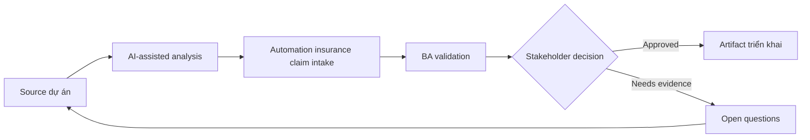

# Automation insurance claim intake

<div class="case-meta">
  <span>Domain project scenarios</span>
  <span>Insurance</span>
  <span>Use case dự án</span>
</div>

## Project context

Insurer muốn digitize claim intake cho property claim. Customer submit claim detail, photo, invoice và incident description, trong khi claims handler cần triage, detect missing information và fraud risk cue. Trong môi trường delivery thật, tình huống này thường xuất hiện dưới áp lực thời gian: stakeholder cần clarity, delivery cần backlog, QA cần behavior test được, operations cần process chịu được exception. BA dùng AI để tăng tốc analysis và synthesis, nhưng BA vẫn chịu trách nhiệm về evidence, business meaning, stakeholder decisioning và artifact quality.

## BA challenge

BA phải đặc tả intake flow cải thiện speed nhưng không tạo unsupported claim decision. AI có thể summarize claim narrative và detect missing document, nhưng coverage decision và fraud escalation cần control rõ. Khó khăn thực tế là AI có thể làm material ban đầu trông hoàn chỉnh hơn mức thật sự. BA giỏi giữ output ở trạng thái reviewable bằng cách tách source-backed fact, assumption, unsupported claim, decision gap và recommended next action. Mục tiêu không phải làm document dài hơn; mục tiêu là làm project decision rõ hơn và an toàn hơn.

## Where AI fits

<div class="ba-workbench-panel">
AI hữu ích trong use case này khi được giới hạn vào analysis support, pattern detection, structured drafting và critique. AI không được approve scope, invent policy, quyết định business trade-off hoặc thay thế judgment của stakeholder chịu trách nhiệm.
</div>

- Extract claim fact từ customer narrative và attachment.
- Identify missing information và document gap.
- Generate triage category và escalation trigger.
- Draft handler summary có evidence và uncertainty label.

## Inputs to prepare

- Claim forms
- Coverage policy
- Document checklist
- Fraud indicators
- Claims handler workflow

BA nên label các input này trước khi dùng AI: source owner, source date, approval status, sensitivity level, và source đó là fact, opinion, policy, draft hay historical evidence. Việc chuẩn bị này ngăn model xem mọi input đều current và authoritative như nhau.

## BA workflow

1. Map customer submission và handler triage journey.
2. Yêu cầu AI draft extraction field và missing information rule.
3. Specify confidence behavior cho extracted fact và document completeness.
4. Define triage category, fraud risk cue và human review trigger.
5. Design customer follow-up message cho missing evidence.
6. Tạo evaluation case cho typical, incomplete và suspicious claim.

Workflow hiệu quả nhất khi dùng AI theo từng stage: trước hết organize evidence, sau đó yêu cầu analysis, tiếp theo tạo artifact, rồi chạy critique pass. BA nên giữ decision log visible xuyên suốt để suggestion do AI sinh ra không âm thầm trở thành approved scope.

## Diagram



## Deliverables

| Deliverable | Nội dung | Owner | Done signal |
| --- | --- | --- | --- |
| Claim intake flow | Customer step, document upload, triage, review và follow-up | BA | Journey cover incomplete submission |
| Extraction and summary schema | Claim fact, source evidence, confidence và uncertainty | Claims operations | Handler thấy evidence label |
| Missing information rules | Required document, condition, customer message và SLA | Claims owner | Request specific và fair |
| Escalation matrix | Trigger, risk level, queue, reviewer và audit record | Risk owner | Suspicious case có controlled path |

Các deliverable này nên được xem là artifact do BA own. AI có thể draft, nhưng BA phải validate source support, stakeholder meaning, traceability và artifact đã sẵn sàng handoff hay chưa.

## Prompt to try

```text
Hãy đóng vai senior Business Analyst hiểu AI. Hỗ trợ tôi áp dụng use case "Automation insurance claim intake" vào dự án. Trước hết hỏi source evidence và constraint. Sau đó tạo structured analysis gồm project context, assumption, AI-fit boundary, workflow step, deliverable, risk, control, open question và stakeholder decision. Không tự bịa policy, threshold hoặc approval.
```

## Review checklist

- Mọi statement do AI hỗ trợ đều gắn với source, assumption hoặc validation question.
- BA đã tách drafting assistance khỏi business approval.
- Workflow step có human owner cho decision, review và exception.
- Deliverable trace được về project input và review được bởi QA, product hoặc operations.
- Risk control đủ thực tế để dùng trong meeting dự án thật.
- Success metric: Claim intake nhanh và rõ hơn trong khi coverage và fraud decision vẫn human-governed.

## Risks and controls

| Rủi ro | Vì sao quan trọng | Control của BA |
| --- | --- | --- |
| Unsupported denial | AI có thể imply claim outcome trước handler review | Tách intake support khỏi coverage decision |
| Evidence mismatch | Photo hoặc invoice có thể không support claim narrative | Yêu cầu source-linked fact extraction |
| Customer frustration | Missing-info message generic tạo repeat contact | Generate request specific và policy-backed |
| Fraud overflagging | False positive làm hại customer trust | Dùng human review và reason code |

Control quan trọng nhất là làm uncertainty visible. Nếu evidence yếu, output nên tạo validation question hoặc decision item, không phải final requirement. Nếu artifact ảnh hưởng delivery, release, compliance, customer experience hoặc operational workload, BA nên yêu cầu human review explicit trước khi handoff.
