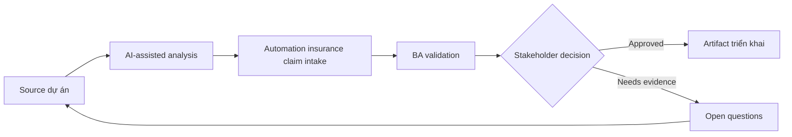

# Automation insurance claim intake

<div class="case-meta">
  <span>Domain project scenarios</span>
  <span>Insurance</span>
  <span>Domain workflow</span>
  <span>Core</span>
  <span>Claim intake flow</span>
  <span>Use case dự án</span>
</div>

## Project context

Insurer muốn digitize claim intake cho property claim. Customer submit claim detail, photo, invoice và incident description, trong khi claims handler cần triage, detect missing information và fraud risk cue. Trong Insurance, công việc này thường bắt đầu khi domain policy, operational exception và regulatory expectation quyết định product có thể làm gì an toàn. BA nên xem Claim forms và Coverage policy là evidence cần organize, không phải raw material để AI trả lời không kiểm soát. Mục tiêu là làm decision tiếp theo rõ hơn cho người own outcome.

## BA challenge

BA phải đặc tả intake flow cải thiện speed nhưng không tạo unsupported claim decision. AI có thể summarize claim narrative và detect missing document, nhưng coverage decision và fraud escalation cần control rõ. Với Automation insurance claim intake, khó khăn thực tế là policy hallucination và exception blindness. AI có thể tăng tốc domain-rule extraction, exception mapping, safe-message drafting và owner review, nhưng BA vẫn phải làm rõ assumption, approval còn thiếu và điểm cần stakeholder judgment.

## Where AI fits

<div class="ba-workbench-panel">
AI phù hợp với use case Tình huống theo domain khi được giới hạn vào domain-rule extraction, exception mapping, safe-message drafting và owner review. AI task hữu ích đầu tiên là: Extract claim fact từ customer narrative và attachment. AI không được approve scope, invent policy, bỏ qua policy source, operational sample, compliance constraint và domain-owner decision, hoặc biến draft thành final decision.
</div>

- Extract claim fact từ customer narrative và attachment.
- Identify missing information và document gap.
- Generate triage category và escalation trigger.
- Draft handler summary có evidence và uncertainty label.

## Inputs to prepare

- Claim forms
- Coverage policy
- Document checklist
- Fraud indicators
- Claims handler workflow

Trước khi prompt cho Automation insurance claim intake, hãy label từng input theo owner, date, approval status, sensitivity và vai trò trong decision. Evidence lens quan trọng nhất là policy source, operational sample, compliance constraint và domain-owner decision; nếu thiếu, AI có thể xem old note, draft design và approved rule có authority như nhau.

## BA workflow

1. Map customer submission và handler triage journey.
2. Yêu cầu AI draft extraction field và missing information rule.
3. Specify confidence behavior cho extracted fact và document completeness.
4. Define triage category, fraud risk cue và human review trigger.
5. Design customer follow-up message cho missing evidence.
6. Tạo evaluation case cho typical, incomplete và suspicious claim.

Chạy workflow như domain validation trước implementation detail: bắt đầu với "Map customer submission và handler triage journey.", sau đó giữ decision log visible khi artifact tiến tới Claim intake flow. Cách này ngăn suggestion của AI âm thầm trở thành backlog, design, release hoặc operational commitment.

## Diagram



## Deliverables

| Deliverable | Nội dung | Owner | Done signal |
| --- | --- | --- | --- |
| Claim intake flow | Customer step, document upload, triage, review và follow-up | BA | Journey cover incomplete submission |
| Extraction and summary schema | Claim fact, source evidence, confidence và uncertainty | Claims operations | Handler thấy evidence label |
| Missing information rules | Required document, condition, customer message và SLA | Claims owner | Request specific và fair |
| Escalation matrix | Trigger, risk level, queue, reviewer và audit record | Risk owner | Suspicious case có controlled path |

Hãy xem Claim intake flow là domain-specific requirement pack do BA own. AI có thể draft structure, nhưng BA phải validate "Journey cover incomplete submission" có thật sự đúng không, artifact có trace được về evidence không và receiving team có hành động được không.

## Prompt to try

```text
Hãy đóng vai senior Business Analyst hiểu AI. Hỗ trợ tôi áp dụng use case "Automation insurance claim intake" vào dự án. Trước hết hỏi source evidence và constraint. Sau đó tạo structured analysis gồm project context, assumption, AI-fit boundary, workflow step, deliverable, risk, control, open question và stakeholder decision. Không tự bịa policy, threshold hoặc approval.
```

## Review checklist

- Claim forms được label owner, date, approval status và sensitivity.
- Claim intake flow trace được về source evidence và có human owner rõ.
- AI task nằm trong boundary domain-rule extraction, exception mapping, safe-message drafting và owner review và không approve scope hoặc policy.
- Risk "Unsupported denial" có control thực tế: Tách intake support khỏi coverage decision.
- Open assumption được chuyển thành validation question hoặc stakeholder decision.
- Success metric: Claim intake nhanh và rõ hơn trong khi coverage và fraud decision vẫn human-governed.

## Risks and controls

| Rủi ro | Vì sao quan trọng | Control của BA |
| --- | --- | --- |
| Unsupported denial | AI có thể imply claim outcome trước handler review | Tách intake support khỏi coverage decision |
| Evidence mismatch | Photo hoặc invoice có thể không support claim narrative | Yêu cầu source-linked fact extraction |
| Customer frustration | Missing-info message generic tạo repeat contact | Generate request specific và policy-backed |
| Fraud overflagging | False positive làm hại customer trust | Dùng human review và reason code |

Control chính cho risk "Unsupported denial" là human accountability explicit: Tách intake support khỏi coverage decision. Nếu evidence yếu, output nên tạo validation question hoặc decision item, không phải final requirement.
