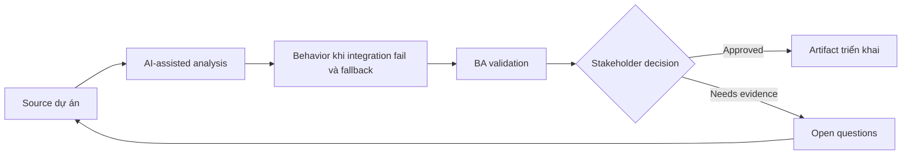

# Behavior khi integration fail và fallback

<div class="case-meta">
  <span>Backend and API</span>
  <span>Integration resilience</span>
  <span>Use case dự án</span>
</div>

## Project context

Checkout flow phụ thuộc payment, tax, shipping và inventory service. Khi một service fail, requirement hiện chỉ nói show error. Trong môi trường delivery thật, tình huống này thường xuất hiện dưới áp lực thời gian: stakeholder cần clarity, delivery cần backlog, QA cần behavior test được, operations cần process chịu được exception. BA dùng AI để tăng tốc analysis và synthesis, nhưng BA vẫn chịu trách nhiệm về evidence, business meaning, stakeholder decisioning và artifact quality.

## BA challenge

BA phải specify fallback behavior business-safe khi integration fail. Failure khác nhau cần user message, retry, manual path và operational alert khác nhau. Khó khăn thực tế là AI có thể làm material ban đầu trông hoàn chỉnh hơn mức thật sự. BA giỏi giữ output ở trạng thái reviewable bằng cách tách source-backed fact, assumption, unsupported claim, decision gap và recommended next action. Mục tiêu không phải làm document dài hơn; mục tiêu là làm project decision rõ hơn và an toàn hơn.

## Where AI fits

<div class="ba-workbench-panel">
AI hữu ích trong use case này khi được giới hạn vào analysis support, pattern detection, structured drafting và critique. AI không được approve scope, invent policy, quyết định business trade-off hoặc thay thế judgment của stakeholder chịu trách nhiệm.
</div>

- Generate integration failure scenario theo service dependency.
- Draft fallback behavior matrix và user messaging.
- Identify retry, manual process và alert need.
- Tạo QA case cho service outage và partial failure.

## Inputs to prepare

- Integration map
- Checkout journey
- Service SLAs
- Manual operations process
- Support scripts

BA nên label các input này trước khi dùng AI: source owner, source date, approval status, sensitivity level, và source đó là fact, opinion, policy, draft hay historical evidence. Việc chuẩn bị này ngăn model xem mọi input đều current và authoritative như nhau.

## BA workflow

1. Map dependency theo user step và business impact.
2. Yêu cầu AI generate failure và partial failure scenario.
3. Define fallback cho từng service: retry, block, degrade, manual review hoặc notify.
4. Review customer messaging và operational alert path.
5. Thêm acceptance criteria cho outage, timeout và partial response.
6. Tạo support và monitoring requirement.

Workflow hiệu quả nhất khi dùng AI theo từng stage: trước hết organize evidence, sau đó yêu cầu analysis, tiếp theo tạo artifact, rồi chạy critique pass. BA nên giữ decision log visible xuyên suốt để suggestion do AI sinh ra không âm thầm trở thành approved scope.

## Diagram



## Deliverables

| Deliverable | Nội dung | Owner | Done signal |
| --- | --- | --- | --- |
| Integration dependency map | Service, user step, data, SLA, failure impact và owner | BA và architect | Dependency visible |
| Fallback behavior matrix | Failure type, user message, retry, manual path, alert và owner | BA | Failure có safe behavior |
| Support runbook requirements | Known failure, customer guidance, escalation và resolution | Support | Support respond được |
| Failure test scenarios | Timeout, outage, partial response, bad data và retry | QA | Resilience behavior testable |

Các deliverable này nên được xem là artifact do BA own. AI có thể draft, nhưng BA phải validate source support, stakeholder meaning, traceability và artifact đã sẵn sàng handoff hay chưa.

## Prompt to try

```text
Hãy đóng vai senior Business Analyst hiểu AI. Hỗ trợ tôi áp dụng use case "Behavior khi integration fail và fallback" vào dự án. Trước hết hỏi source evidence và constraint. Sau đó tạo structured analysis gồm project context, assumption, AI-fit boundary, workflow step, deliverable, risk, control, open question và stakeholder decision. Không tự bịa policy, threshold hoặc approval.
```

## Review checklist

- Mọi statement do AI hỗ trợ đều gắn với source, assumption hoặc validation question.
- BA đã tách drafting assistance khỏi business approval.
- Workflow step có human owner cho decision, review và exception.
- Deliverable trace được về project input và review được bởi QA, product hoặc operations.
- Risk control đủ thực tế để dùng trong meeting dự án thật.
- Success metric: Integration failure có behavior rõ cho user, backend, support và operations trước launch.

## Risks and controls

| Rủi ro | Vì sao quan trọng | Control của BA |
| --- | --- | --- |
| Generic failure handling | Mọi failure có thể block user không cần thiết | Tailor fallback theo service và impact |
| Unsafe continuation | Proceed có thể tạo financial/data risk | Define block vs degrade decision |
| No operational alert | Failure có thể kéo dài mà không ai biết | Specify monitoring và owner |
| Support unprepared | Agent không biết workaround | Tạo support runbook requirement |

Control quan trọng nhất là làm uncertainty visible. Nếu evidence yếu, output nên tạo validation question hoặc decision item, không phải final requirement. Nếu artifact ảnh hưởng delivery, release, compliance, customer experience hoặc operational workload, BA nên yêu cầu human review explicit trước khi handoff.
