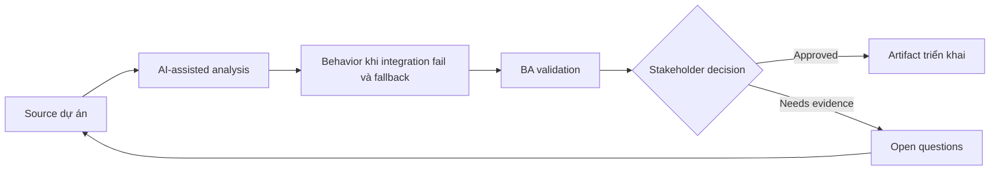

# Behavior khi integration fail và fallback

<div class="case-meta">
  <span>Backend and API</span>
  <span>Integration resilience</span>
  <span>Use case dự án</span>
</div>

## Project context

Checkout flow phụ thuộc payment, tax, shipping và inventory service. Khi một service fail, requirement hiện chỉ nói show error. Trong Integration resilience, công việc này thường bắt đầu khi API contract, permission, error, audit và operational behavior phải đủ explicit cho backend delivery. BA nên xem Integration map và Checkout journey là evidence cần organize, không phải raw material để AI trả lời không kiểm soát. Mục tiêu là làm decision tiếp theo rõ hơn cho người own outcome.

## BA challenge

BA phải specify fallback behavior business-safe khi integration fail. Failure khác nhau cần user message, retry, manual path và operational alert khác nhau. Với Behavior khi integration fail và fallback, khó khăn thực tế là service behavior mơ hồ và security gap. AI có thể tăng tốc contract critique, rule extraction, error taxonomy, permission review và NFR gap detection, nhưng BA vẫn phải làm rõ assumption, approval còn thiếu và điểm cần stakeholder judgment.

## Where AI fits

<div class="ba-workbench-panel">
AI phù hợp với use case Backend và API khi được giới hạn vào contract critique, rule extraction, error taxonomy, permission review và NFR gap detection. AI task hữu ích đầu tiên là: Generate integration failure scenario theo service dependency. AI không được approve scope, invent policy, bỏ qua API draft, data model, auth rule, error sample, audit policy và integration need, hoặc biến draft thành final decision.
</div>

- Generate integration failure scenario theo service dependency.
- Draft fallback behavior matrix và user messaging.
- Identify retry, manual process và alert need.
- Tạo QA case cho service outage và partial failure.

## Inputs to prepare

- Integration map
- Checkout journey
- Service SLAs
- Manual operations process
- Support scripts

Trước khi prompt cho Behavior khi integration fail và fallback, hãy label từng input theo owner, date, approval status, sensitivity và vai trò trong decision. Evidence lens quan trọng nhất là API draft, data model, auth rule, error sample, audit policy và integration need; nếu thiếu, AI có thể xem old note, draft design và approved rule có authority như nhau.

## BA workflow

1. Map dependency theo user step và business impact.
2. Yêu cầu AI generate failure và partial failure scenario.
3. Define fallback cho từng service: retry, block, degrade, manual review hoặc notify.
4. Review customer messaging và operational alert path.
5. Thêm acceptance criteria cho outage, timeout và partial response.
6. Tạo support và monitoring requirement.

Chạy workflow như contract validation trước implementation: bắt đầu với "Map dependency theo user step và business impact.", sau đó giữ decision log visible khi artifact tiến tới Integration dependency map. Cách này ngăn suggestion của AI âm thầm trở thành backlog, design, release hoặc operational commitment.

## Diagram



## Deliverables

| Deliverable | Nội dung | Owner | Done signal |
| --- | --- | --- | --- |
| Integration dependency map | Service, user step, data, SLA, failure impact và owner | BA và architect | Dependency visible |
| Fallback behavior matrix | Failure type, user message, retry, manual path, alert và owner | BA | Failure có safe behavior |
| Support runbook requirements | Known failure, customer guidance, escalation và resolution | Support | Support respond được |
| Failure test scenarios | Timeout, outage, partial response, bad data và retry | QA | Resilience behavior testable |

Hãy xem Integration dependency map là backend behavior contract do BA own. AI có thể draft structure, nhưng BA phải validate "Dependency visible" có thật sự đúng không, artifact có trace được về evidence không và receiving team có hành động được không.

## Prompt to try

```text
Hãy đóng vai senior Business Analyst hiểu AI. Hỗ trợ tôi áp dụng use case "Behavior khi integration fail và fallback" vào dự án. Trước hết hỏi source evidence và constraint. Sau đó tạo structured analysis gồm project context, assumption, AI-fit boundary, workflow step, deliverable, risk, control, open question và stakeholder decision. Không tự bịa policy, threshold hoặc approval.
```

## Review checklist

- Integration map được label owner, date, approval status và sensitivity.
- Integration dependency map trace được về source evidence và có human owner rõ.
- AI task nằm trong boundary contract critique, rule extraction, error taxonomy, permission review và NFR gap detection và không approve scope hoặc policy.
- Risk "Generic failure handling" có control thực tế: Tailor fallback theo service và impact.
- Open assumption được chuyển thành validation question hoặc stakeholder decision.
- Success metric: Integration failure có behavior rõ cho user, backend, support và operations trước launch.

## Risks and controls

| Rủi ro | Vì sao quan trọng | Control của BA |
| --- | --- | --- |
| Generic failure handling | Mọi failure có thể block user không cần thiết | Tailor fallback theo service và impact |
| Unsafe continuation | Proceed có thể tạo financial/data risk | Define block vs degrade decision |
| No operational alert | Failure có thể kéo dài mà không ai biết | Specify monitoring và owner |
| Support unprepared | Agent không biết workaround | Tạo support runbook requirement |

Control chính cho risk "Generic failure handling" là human accountability explicit: Tailor fallback theo service và impact. Nếu evidence yếu, output nên tạo validation question hoặc decision item, không phải final requirement.
