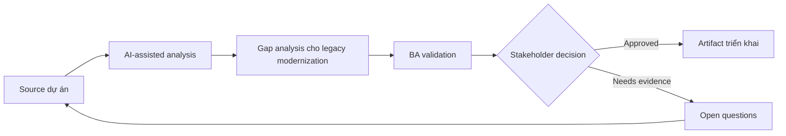

# Gap analysis cho legacy modernization

<div class="case-meta">
  <span>Discovery and alignment</span>
  <span>Legacy system modernization</span>
  <span>Use case dự án</span>
</div>

## Project context

Công ty thay thế hệ thống back-office legacy bằng web platform hiện đại. Legacy system có rule không document, batch job, manual override và report mà business user vẫn phụ thuộc. Trong Legacy system modernization, công việc này thường bắt đầu khi stakeholder mô tả cùng một vấn đề từ incentive và mức chi tiết khác nhau. BA nên xem Legacy screen inventory và SOP và user guide là evidence cần organize, không phải raw material để AI trả lời không kiểm soát. Mục tiêu là làm decision tiếp theo rõ hơn cho người own outcome.

## BA challenge

BA phải phát hiện functional gap giữa current behavior và target capability mà không clone legacy một cách mù quáng. AI có thể mine document và transcript, nhưng BA phải tách business-critical rule khỏi workaround đã lỗi thời. Với Gap analysis cho legacy modernization, khó khăn thực tế là false consensus và invented scope. AI có thể tăng tốc sensemaking, contradiction detection, question generation và workshop preparation, nhưng BA vẫn phải làm rõ assumption, approval còn thiếu và điểm cần stakeholder judgment.

## Where AI fits

<div class="ba-workbench-panel">
AI phù hợp với use case Discovery và alignment khi được giới hạn vào sensemaking, contradiction detection, question generation và workshop preparation. AI task hữu ích đầu tiên là: So sánh legacy feature list với target epic. AI không được approve scope, invent policy, bỏ qua speaker attribution, decision authority và source freshness, hoặc biến draft thành final decision.
</div>

- So sánh legacy feature list với target epic.
- Extract hidden rule từ SOP và user interview.
- Classify gap thành must-keep, redesign, retire hoặc investigate.
- Generate migration question cho business và technical owner.

## Inputs to prepare

- Legacy screen inventory
- SOP và user guide
- Report list
- Target-state epic
- Interview transcript

Trước khi prompt cho Gap analysis cho legacy modernization, hãy label từng input theo owner, date, approval status, sensitivity và vai trò trong decision. Evidence lens quan trọng nhất là speaker attribution, decision authority và source freshness; nếu thiếu, AI có thể xem old note, draft design và approved rule có authority như nhau.

## BA workflow

1. Tạo capability map cho current và target system.
2. Yêu cầu AI identify missing rule, report, role và integration.
3. Classify từng gap theo business impact và modernization intent.
4. Validate must-keep rule với process owner.
5. Mark obsolete workaround riêng khỏi real requirement.
6. Produce gap decision board cho scope và migration planning.

Chạy workflow như gom evidence trước khi bàn solution: bắt đầu với "Tạo capability map cho current và target system.", sau đó giữ decision log visible khi artifact tiến tới Gap analysis matrix. Cách này ngăn suggestion của AI âm thầm trở thành backlog, design, release hoặc operational commitment.

## Diagram



## Deliverables

| Deliverable | Nội dung | Owner | Done signal |
| --- | --- | --- | --- |
| Gap analysis matrix | Current behavior, target behavior, gap type, impact và decision | BA | Mọi high-impact gap có disposition |
| Rule inventory | Hidden business rule và source evidence | BA | Rule có owner và validation status |
| Report dependency list | Report, consumer, purpose và replacement path | Product owner | Critical report có migration plan |
| Modernization decision board | Keep, redesign, retire, investigate decision | Sponsor | Decision approved trước build |

Hãy xem Gap analysis matrix là alignment artifact do BA own. AI có thể draft structure, nhưng BA phải validate "Mọi high-impact gap có disposition" có thật sự đúng không, artifact có trace được về evidence không và receiving team có hành động được không.

## Prompt to try

```text
Hãy đóng vai senior Business Analyst hiểu AI. Hỗ trợ tôi áp dụng use case "Gap analysis cho legacy modernization" vào dự án. Trước hết hỏi source evidence và constraint. Sau đó tạo structured analysis gồm project context, assumption, AI-fit boundary, workflow step, deliverable, risk, control, open question và stakeholder decision. Không tự bịa policy, threshold hoặc approval.
```

## Review checklist

- Legacy screen inventory được label owner, date, approval status và sensitivity.
- Gap analysis matrix trace được về source evidence và có human owner rõ.
- AI task nằm trong boundary sensemaking, contradiction detection, question generation và workshop preparation và không approve scope hoặc policy.
- Risk "Legacy cloning" có control thực tế: Classify từng behavior theo business value và current relevance.
- Open assumption được chuyển thành validation question hoặc stakeholder decision.
- Success metric: Migration scope tách rõ behavior phải giữ, redesign và retire dựa trên evidence.

## Risks and controls

| Rủi ro | Vì sao quan trọng | Control của BA |
| --- | --- | --- |
| Legacy cloning | Team có thể rebuild workaround đã obsolete | Classify từng behavior theo business value và current relevance |
| Rule loss | Rule không document có thể biến mất khi migration | Extract rule từ SOP, ticket và interview |
| Report surprise | User có thể phụ thuộc report không nằm trong scope | Inventory report và consumer sớm |
| Decision delay | Gap chưa rõ có thể block sprint planning | Dùng decision board có owner và due date |

Control chính cho risk "Legacy cloning" là human accountability explicit: Classify từng behavior theo business value và current relevance. Nếu evidence yếu, output nên tạo validation question hoặc decision item, không phải final requirement.
