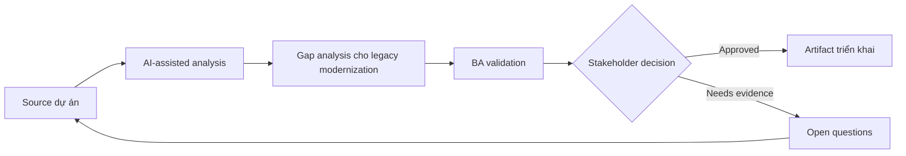

# Gap analysis cho legacy modernization

<div class="case-meta">
  <span>Discovery and alignment</span>
  <span>Legacy system modernization</span>
  <span>Use case dự án</span>
</div>

## Project context

Công ty thay thế hệ thống back-office legacy bằng web platform hiện đại. Legacy system có rule không document, batch job, manual override và report mà business user vẫn phụ thuộc. Trong môi trường delivery thật, tình huống này thường xuất hiện dưới áp lực thời gian: stakeholder cần clarity, delivery cần backlog, QA cần behavior test được, operations cần process chịu được exception. BA dùng AI để tăng tốc analysis và synthesis, nhưng BA vẫn chịu trách nhiệm về evidence, business meaning, stakeholder decisioning và artifact quality.

## BA challenge

BA phải phát hiện functional gap giữa current behavior và target capability mà không clone legacy một cách mù quáng. AI có thể mine document và transcript, nhưng BA phải tách business-critical rule khỏi workaround đã lỗi thời. Khó khăn thực tế là AI có thể làm material ban đầu trông hoàn chỉnh hơn mức thật sự. BA giỏi giữ output ở trạng thái reviewable bằng cách tách source-backed fact, assumption, unsupported claim, decision gap và recommended next action. Mục tiêu không phải làm document dài hơn; mục tiêu là làm project decision rõ hơn và an toàn hơn.

## Where AI fits

<div class="ba-workbench-panel">
AI hữu ích trong use case này khi được giới hạn vào analysis support, pattern detection, structured drafting và critique. AI không được approve scope, invent policy, quyết định business trade-off hoặc thay thế judgment của stakeholder chịu trách nhiệm.
</div>

- So sánh legacy feature list với target epic.
- Extract hidden rule từ SOP và user interview.
- Classify gap thành must-keep, redesign, retire hoặc investigate.
- Generate migration question cho business và technical owner.

## Inputs to prepare

- Legacy screen inventory
- SOP và user guide
- Report list
- Target-state epic
- Interview transcript

BA nên label các input này trước khi dùng AI: source owner, source date, approval status, sensitivity level, và source đó là fact, opinion, policy, draft hay historical evidence. Việc chuẩn bị này ngăn model xem mọi input đều current và authoritative như nhau.

## BA workflow

1. Tạo capability map cho current và target system.
2. Yêu cầu AI identify missing rule, report, role và integration.
3. Classify từng gap theo business impact và modernization intent.
4. Validate must-keep rule với process owner.
5. Mark obsolete workaround riêng khỏi real requirement.
6. Produce gap decision board cho scope và migration planning.

Workflow hiệu quả nhất khi dùng AI theo từng stage: trước hết organize evidence, sau đó yêu cầu analysis, tiếp theo tạo artifact, rồi chạy critique pass. BA nên giữ decision log visible xuyên suốt để suggestion do AI sinh ra không âm thầm trở thành approved scope.

## Diagram



## Deliverables

| Deliverable | Nội dung | Owner | Done signal |
| --- | --- | --- | --- |
| Gap analysis matrix | Current behavior, target behavior, gap type, impact và decision | BA | Mọi high-impact gap có disposition |
| Rule inventory | Hidden business rule và source evidence | BA | Rule có owner và validation status |
| Report dependency list | Report, consumer, purpose và replacement path | Product owner | Critical report có migration plan |
| Modernization decision board | Keep, redesign, retire, investigate decision | Sponsor | Decision approved trước build |

Các deliverable này nên được xem là artifact do BA own. AI có thể draft, nhưng BA phải validate source support, stakeholder meaning, traceability và artifact đã sẵn sàng handoff hay chưa.

## Prompt to try

```text
Hãy đóng vai senior Business Analyst hiểu AI. Hỗ trợ tôi áp dụng use case "Gap analysis cho legacy modernization" vào dự án. Trước hết hỏi source evidence và constraint. Sau đó tạo structured analysis gồm project context, assumption, AI-fit boundary, workflow step, deliverable, risk, control, open question và stakeholder decision. Không tự bịa policy, threshold hoặc approval.
```

## Review checklist

- Mọi statement do AI hỗ trợ đều gắn với source, assumption hoặc validation question.
- BA đã tách drafting assistance khỏi business approval.
- Workflow step có human owner cho decision, review và exception.
- Deliverable trace được về project input và review được bởi QA, product hoặc operations.
- Risk control đủ thực tế để dùng trong meeting dự án thật.
- Success metric: Migration scope tách rõ behavior phải giữ, redesign và retire dựa trên evidence.

## Risks and controls

| Rủi ro | Vì sao quan trọng | Control của BA |
| --- | --- | --- |
| Legacy cloning | Team có thể rebuild workaround đã obsolete | Classify từng behavior theo business value và current relevance |
| Rule loss | Rule không document có thể biến mất khi migration | Extract rule từ SOP, ticket và interview |
| Report surprise | User có thể phụ thuộc report không nằm trong scope | Inventory report và consumer sớm |
| Decision delay | Gap chưa rõ có thể block sprint planning | Dùng decision board có owner và due date |

Control quan trọng nhất là làm uncertainty visible. Nếu evidence yếu, output nên tạo validation question hoặc decision item, không phải final requirement. Nếu artifact ảnh hưởng delivery, release, compliance, customer experience hoặc operational workload, BA nên yêu cầu human review explicit trước khi handoff.
