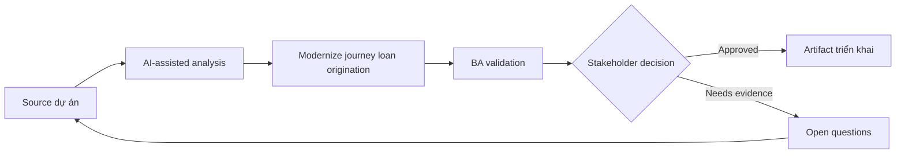

# Modernize journey loan origination

<div class="case-meta">
  <span>Domain project scenarios</span>
  <span>Banking and lending</span>
  <span>Use case dự án</span>
</div>

## Project context

Ngân hàng modernize loan origination cho small business customer. Project cover eligibility, document upload, risk assessment, approval workflow, customer notification và audit evidence. Trong môi trường delivery thật, tình huống này thường xuất hiện dưới áp lực thời gian: stakeholder cần clarity, delivery cần backlog, QA cần behavior test được, operations cần process chịu được exception. BA dùng AI để tăng tốc analysis và synthesis, nhưng BA vẫn chịu trách nhiệm về evidence, business meaning, stakeholder decisioning và artifact quality.

## BA challenge

BA phải coordinate requirement regulated qua customer experience, credit policy, compliance, operations và technology. AI tăng tốc analysis, nhưng mọi rule phải source-backed và mọi automated decision phải có review và audit control. Khó khăn thực tế là AI có thể làm material ban đầu trông hoàn chỉnh hơn mức thật sự. BA giỏi giữ output ở trạng thái reviewable bằng cách tách source-backed fact, assumption, unsupported claim, decision gap và recommended next action. Mục tiêu không phải làm document dài hơn; mục tiêu là làm project decision rõ hơn và an toàn hơn.

## Where AI fits

<div class="ba-workbench-panel">
AI hữu ích trong use case này khi được giới hạn vào analysis support, pattern detection, structured drafting và critique. AI không được approve scope, invent policy, quyết định business trade-off hoặc thay thế judgment của stakeholder chịu trách nhiệm.
</div>

- Map end-to-end customer và operations journey.
- Extract credit policy rule và document requirement.
- Generate exception scenario cho manual review và escalation.
- Draft traceable requirement cho eligibility, notification và audit.

## Inputs to prepare

- Credit policy
- Loan application forms
- Operations SOP
- Regulatory guidance
- Customer complaint themes

BA nên label các input này trước khi dùng AI: source owner, source date, approval status, sensitivity level, và source đó là fact, opinion, policy, draft hay historical evidence. Việc chuẩn bị này ngăn model xem mọi input đều current và authoritative như nhau.

## BA workflow

1. Build journey map qua customer, system, credit analyst và operations role.
2. Yêu cầu AI extract policy rule và required document có source ID.
3. Identify decision point cần human review hoặc audit.
4. Draft requirement cho eligibility check, document intake, status visibility và notification.
5. Review policy và compliance claim với accountable owner.
6. Tạo acceptance criteria và traceability cho regulated decision.

Workflow hiệu quả nhất khi dùng AI theo từng stage: trước hết organize evidence, sau đó yêu cầu analysis, tiếp theo tạo artifact, rồi chạy critique pass. BA nên giữ decision log visible xuyên suốt để suggestion do AI sinh ra không âm thầm trở thành approved scope.

## Diagram



## Deliverables

| Deliverable | Nội dung | Owner | Done signal |
| --- | --- | --- | --- |
| Loan journey map | Customer step, system step, credit review, exception và status message | BA | Mọi actor và handoff visible |
| Policy rule matrix | Rule, source, threshold, decision owner và automation eligibility | Credit policy owner | Rule source-backed |
| Exception workflow | Manual review trigger, queue, SLA và customer communication | Operations | Case risky có human path |
| Audit requirement set | Evidence captured, retention, reviewer và decision trace | Compliance | Auditor reconstruct được decision |

Các deliverable này nên được xem là artifact do BA own. AI có thể draft, nhưng BA phải validate source support, stakeholder meaning, traceability và artifact đã sẵn sàng handoff hay chưa.

## Prompt to try

```text
Hãy đóng vai senior Business Analyst hiểu AI. Hỗ trợ tôi áp dụng use case "Modernize journey loan origination" vào dự án. Trước hết hỏi source evidence và constraint. Sau đó tạo structured analysis gồm project context, assumption, AI-fit boundary, workflow step, deliverable, risk, control, open question và stakeholder decision. Không tự bịa policy, threshold hoặc approval.
```

## Review checklist

- Mọi statement do AI hỗ trợ đều gắn với source, assumption hoặc validation question.
- BA đã tách drafting assistance khỏi business approval.
- Workflow step có human owner cho decision, review và exception.
- Deliverable trace được về project input và review được bởi QA, product hoặc operations.
- Risk control đủ thực tế để dùng trong meeting dự án thật.
- Success metric: Loan journey mới nhanh hơn cho customer trong khi credit decision vẫn explainable và compliant.

## Risks and controls

| Rủi ro | Vì sao quan trọng | Control của BA |
| --- | --- | --- |
| Regulatory misinterpretation | AI có thể paraphrase policy sai | Dùng exact source reference và compliance validation |
| Unfair automation | Eligibility rule ảnh hưởng material tới customer | Define human review và appeal path |
| Document friction | Customer fail vì upload requirement không rõ | Specify guidance, status và resubmission flow |
| Audit gap | Decision có thể không explainable sau này | Capture evidence, source và reviewer |

Control quan trọng nhất là làm uncertainty visible. Nếu evidence yếu, output nên tạo validation question hoặc decision item, không phải final requirement. Nếu artifact ảnh hưởng delivery, release, compliance, customer experience hoặc operational workload, BA nên yêu cầu human review explicit trước khi handoff.
