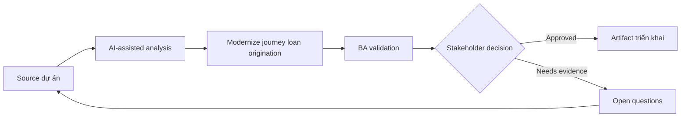

# Modernize journey loan origination

<div class="case-meta">
  <span>Domain project scenarios</span>
  <span>Banking and lending</span>
  <span>Domain workflow</span>
  <span>Core</span>
  <span>Loan journey map</span>
  <span>Use case dự án</span>
</div>

## Project context

Ngân hàng modernize loan origination cho small business customer. Project cover eligibility, document upload, risk assessment, approval workflow, customer notification và audit evidence. Trong Banking and lending, công việc này thường bắt đầu khi domain policy, operational exception và regulatory expectation quyết định product có thể làm gì an toàn. BA nên xem Credit policy và Loan application forms là evidence cần organize, không phải raw material để AI trả lời không kiểm soát. Mục tiêu là làm decision tiếp theo rõ hơn cho người own outcome.

## BA challenge

BA phải coordinate requirement regulated qua customer experience, credit policy, compliance, operations và technology. AI tăng tốc analysis, nhưng mọi rule phải source-backed và mọi automated decision phải có review và audit control. Với Modernize journey loan origination, khó khăn thực tế là policy hallucination và exception blindness. AI có thể tăng tốc domain-rule extraction, exception mapping, safe-message drafting và owner review, nhưng BA vẫn phải làm rõ assumption, approval còn thiếu và điểm cần stakeholder judgment.

## Where AI fits

<div class="ba-workbench-panel">
AI phù hợp với use case Tình huống theo domain khi được giới hạn vào domain-rule extraction, exception mapping, safe-message drafting và owner review. AI task hữu ích đầu tiên là: Map end-to-end customer và operations journey. AI không được approve scope, invent policy, bỏ qua policy source, operational sample, compliance constraint và domain-owner decision, hoặc biến draft thành final decision.
</div>

- Map end-to-end customer và operations journey.
- Extract credit policy rule và document requirement.
- Generate exception scenario cho manual review và escalation.
- Draft traceable requirement cho eligibility, notification và audit.

## Inputs to prepare

- Credit policy
- Loan application forms
- Operations SOP
- Regulatory guidance
- Customer complaint themes

Trước khi prompt cho Modernize journey loan origination, hãy label từng input theo owner, date, approval status, sensitivity và vai trò trong decision. Evidence lens quan trọng nhất là policy source, operational sample, compliance constraint và domain-owner decision; nếu thiếu, AI có thể xem old note, draft design và approved rule có authority như nhau.

## BA workflow

1. Build journey map qua customer, system, credit analyst và operations role.
2. Yêu cầu AI extract policy rule và required document có source ID.
3. Identify decision point cần human review hoặc audit.
4. Draft requirement cho eligibility check, document intake, status visibility và notification.
5. Review policy và compliance claim với accountable owner.
6. Tạo acceptance criteria và traceability cho regulated decision.

Chạy workflow như domain validation trước implementation detail: bắt đầu với "Build journey map qua customer, system, credit analyst và operations role.", sau đó giữ decision log visible khi artifact tiến tới Loan journey map. Cách này ngăn suggestion của AI âm thầm trở thành backlog, design, release hoặc operational commitment.

## Diagram



## Deliverables

| Deliverable | Nội dung | Owner | Done signal |
| --- | --- | --- | --- |
| Loan journey map | Customer step, system step, credit review, exception và status message | BA | Mọi actor và handoff visible |
| Policy rule matrix | Rule, source, threshold, decision owner và automation eligibility | Credit policy owner | Rule source-backed |
| Exception workflow | Manual review trigger, queue, SLA và customer communication | Operations | Case risky có human path |
| Audit requirement set | Evidence captured, retention, reviewer và decision trace | Compliance | Auditor reconstruct được decision |

Hãy xem Loan journey map là domain-specific requirement pack do BA own. AI có thể draft structure, nhưng BA phải validate "Mọi actor và handoff visible" có thật sự đúng không, artifact có trace được về evidence không và receiving team có hành động được không.

## Prompt to try

```text
Hãy đóng vai senior Business Analyst hiểu AI. Hỗ trợ tôi áp dụng use case "Modernize journey loan origination" vào dự án. Trước hết hỏi source evidence và constraint. Sau đó tạo structured analysis gồm project context, assumption, AI-fit boundary, workflow step, deliverable, risk, control, open question và stakeholder decision. Không tự bịa policy, threshold hoặc approval.
```

## Review checklist

- Credit policy được label owner, date, approval status và sensitivity.
- Loan journey map trace được về source evidence và có human owner rõ.
- AI task nằm trong boundary domain-rule extraction, exception mapping, safe-message drafting và owner review và không approve scope hoặc policy.
- Risk "Regulatory misinterpretation" có control thực tế: Dùng exact source reference và compliance validation.
- Open assumption được chuyển thành validation question hoặc stakeholder decision.
- Success metric: Loan journey mới nhanh hơn cho customer trong khi credit decision vẫn explainable và compliant.

## Risks and controls

| Rủi ro | Vì sao quan trọng | Control của BA |
| --- | --- | --- |
| Regulatory misinterpretation | AI có thể paraphrase policy sai | Dùng exact source reference và compliance validation |
| Unfair automation | Eligibility rule ảnh hưởng material tới customer | Define human review và appeal path |
| Document friction | Customer fail vì upload requirement không rõ | Specify guidance, status và resubmission flow |
| Audit gap | Decision có thể không explainable sau này | Capture evidence, source và reviewer |

Control chính cho risk "Regulatory misinterpretation" là human accountability explicit: Dùng exact source reference và compliance validation. Nếu evidence yếu, output nên tạo validation question hoặc decision item, không phải final requirement.
