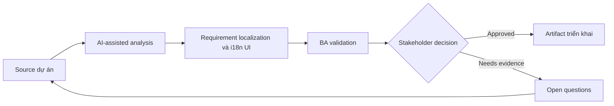

# Requirement localization và i18n UI

<div class="case-meta">
  <span>Frontend, UI, and UX</span>
  <span>Localization</span>
  <span>Use case dự án</span>
</div>

## Project context

SaaS product mở rộng sang nhiều thị trường. Cùng screen phải handle translated copy, date format theo locale, currency, address, name, pluralization và regulatory text. Trong môi trường delivery thật, tình huống này thường xuất hiện dưới áp lực thời gian: stakeholder cần clarity, delivery cần backlog, QA cần behavior test được, operations cần process chịu được exception. BA dùng AI để tăng tốc analysis và synthesis, nhưng BA vẫn chịu trách nhiệm về evidence, business meaning, stakeholder decisioning và artifact quality.

## BA challenge

BA phải capture localization requirement trước khi UI và backend assumption bị hardcode. Bao gồm content length, formatting rule, legal copy, timezone behavior và user locale selection. Khó khăn thực tế là AI có thể làm material ban đầu trông hoàn chỉnh hơn mức thật sự. BA giỏi giữ output ở trạng thái reviewable bằng cách tách source-backed fact, assumption, unsupported claim, decision gap và recommended next action. Mục tiêu không phải làm document dài hơn; mục tiêu là làm project decision rõ hơn và an toàn hơn.

## Where AI fits

<div class="ba-workbench-panel">
AI hữu ích trong use case này khi được giới hạn vào analysis support, pattern detection, structured drafting và critique. AI không được approve scope, invent policy, quyết định business trade-off hoặc thay thế judgment của stakeholder chịu trách nhiệm.
</div>

- Generate localization risk checklist từ UI copy và data field.
- Identify locale-sensitive format và backend dependency.
- Draft i18n acceptance criteria cho frontend component.
- Review risk của translated copy như length, tone và regulatory term.

## Inputs to prepare

- UI copy catalog
- Market list
- Data field definitions
- Legal text requirements
- Locale và timezone rules

BA nên label các input này trước khi dùng AI: source owner, source date, approval status, sensitivity level, và source đó là fact, opinion, policy, draft hay historical evidence. Việc chuẩn bị này ngăn model xem mọi input đều current và authoritative như nhau.

## BA workflow

1. List market, locale, format và regulatory copy difference.
2. Yêu cầu AI find UI element dễ break khi translate.
3. Define formatting requirement cho date, number, currency, address, name và timezone.
4. Review backend storage và display responsibility.
5. Viết acceptance criteria cho locale switching và fallback behavior.
6. Tạo QA matrix cho high-risk locale và long translation.

Workflow hiệu quả nhất khi dùng AI theo từng stage: trước hết organize evidence, sau đó yêu cầu analysis, tiếp theo tạo artifact, rồi chạy critique pass. BA nên giữ decision log visible xuyên suốt để suggestion do AI sinh ra không âm thầm trở thành approved scope.

## Diagram



## Deliverables

| Deliverable | Nội dung | Owner | Done signal |
| --- | --- | --- | --- |
| Localization requirement matrix | Field, locale rule, UI behavior, backend dependency và owner | BA | Locale-sensitive behavior explicit |
| Copy expansion risk list | Component, source text, length risk và fallback | UX và localization | UI handle được translation |
| Formatting rule table | Date, currency, address, number, name và timezone rule | Backend và frontend | Formatting ownership rõ |
| i18n QA matrix | Locale, viewport, data example và expected output | QA | Key locale được test |

Các deliverable này nên được xem là artifact do BA own. AI có thể draft, nhưng BA phải validate source support, stakeholder meaning, traceability và artifact đã sẵn sàng handoff hay chưa.

## Prompt to try

```text
Hãy đóng vai senior Business Analyst hiểu AI. Hỗ trợ tôi áp dụng use case "Requirement localization và i18n UI" vào dự án. Trước hết hỏi source evidence và constraint. Sau đó tạo structured analysis gồm project context, assumption, AI-fit boundary, workflow step, deliverable, risk, control, open question và stakeholder decision. Không tự bịa policy, threshold hoặc approval.
```

## Review checklist

- Mọi statement do AI hỗ trợ đều gắn với source, assumption hoặc validation question.
- BA đã tách drafting assistance khỏi business approval.
- Workflow step có human owner cho decision, review và exception.
- Deliverable trace được về project input và review được bởi QA, product hoặc operations.
- Risk control đủ thực tế để dùng trong meeting dự án thật.
- Success metric: Localized UI behavior test được trước market rollout và tránh hardcoded assumption.

## Risks and controls

| Rủi ro | Vì sao quan trọng | Control của BA |
| --- | --- | --- |
| Hardcoded locale | UI có thể fail ở target market | Specify locale-sensitive rule sớm |
| Copy overflow | Translated text có thể break layout | Test long translation và responsive behavior |
| Regulatory copy error | Legal text có thể khác theo market | Require legal review per market |
| Timezone confusion | Date có thể hiển thị sai | Define storage và display timezone rule |

Control quan trọng nhất là làm uncertainty visible. Nếu evidence yếu, output nên tạo validation question hoặc decision item, không phải final requirement. Nếu artifact ảnh hưởng delivery, release, compliance, customer experience hoặc operational workload, BA nên yêu cầu human review explicit trước khi handoff.
