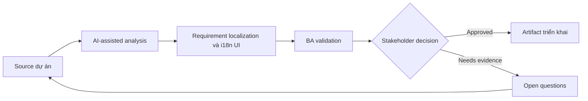

# Requirement localization và i18n UI

<div class="case-meta">
  <span>Frontend, UI, and UX</span>
  <span>Localization</span>
  <span>Frontend/UI refinement</span>
  <span>Practitioner</span>
  <span>Localization requirement matrix</span>
  <span>Use case dự án</span>
</div>

## Project context

SaaS product mở rộng sang nhiều thị trường. Cùng screen phải handle translated copy, date format theo locale, currency, address, name, pluralization và regulatory text. Trong Localization, công việc này thường bắt đầu khi screen behavior, accessibility, design state, analytics và user feedback phải thành requirement implement được. BA nên xem UI copy catalog và Market list là evidence cần organize, không phải raw material để AI trả lời không kiểm soát. Mục tiêu là làm decision tiếp theo rõ hơn cho người own outcome.

## BA challenge

BA phải capture localization requirement trước khi UI và backend assumption bị hardcode. Bao gồm content length, formatting rule, legal copy, timezone behavior và user locale selection. Với Requirement localization và i18n UI, khó khăn thực tế là missing state và UX không đo được. AI có thể tăng tốc UI-state analysis, content critique, accessibility review, event taxonomy và edge-case discovery, nhưng BA vẫn phải làm rõ assumption, approval còn thiếu và điểm cần stakeholder judgment.

## Where AI fits

<div class="ba-workbench-panel">
AI phù hợp với use case Frontend, UI và UX khi được giới hạn vào UI-state analysis, content critique, accessibility review, event taxonomy và edge-case discovery. AI task hữu ích đầu tiên là: Generate localization risk checklist từ UI copy và data field. AI không được approve scope, invent policy, bỏ qua wireframe, design token, user journey, analytics question và accessibility expectation, hoặc biến draft thành final decision.
</div>

- Generate localization risk checklist từ UI copy và data field.
- Identify locale-sensitive format và backend dependency.
- Draft i18n acceptance criteria cho frontend component.
- Review risk của translated copy như length, tone và regulatory term.

## Inputs to prepare

- UI copy catalog
- Market list
- Data field definitions
- Legal text requirements
- Locale và timezone rules

Trước khi prompt cho Requirement localization và i18n UI, hãy label từng input theo owner, date, approval status, sensitivity và vai trò trong decision. Evidence lens quan trọng nhất là wireframe, design token, user journey, analytics question và accessibility expectation; nếu thiếu, AI có thể xem old note, draft design và approved rule có authority như nhau.

## BA workflow

1. List market, locale, format và regulatory copy difference.
2. Yêu cầu AI find UI element dễ break khi translate.
3. Define formatting requirement cho date, number, currency, address, name và timezone.
4. Review backend storage và display responsibility.
5. Viết acceptance criteria cho locale switching và fallback behavior.
6. Tạo QA matrix cho high-risk locale và long translation.

Chạy workflow như screen-state review trước frontend build: bắt đầu với "List market, locale, format và regulatory copy difference.", sau đó giữ decision log visible khi artifact tiến tới Localization requirement matrix. Cách này ngăn suggestion của AI âm thầm trở thành backlog, design, release hoặc operational commitment.

## Diagram



## Deliverables

| Deliverable | Nội dung | Owner | Done signal |
| --- | --- | --- | --- |
| Localization requirement matrix | Field, locale rule, UI behavior, backend dependency và owner | BA | Locale-sensitive behavior explicit |
| Copy expansion risk list | Component, source text, length risk và fallback | UX và localization | UI handle được translation |
| Formatting rule table | Date, currency, address, number, name và timezone rule | Backend và frontend | Formatting ownership rõ |
| i18n QA matrix | Locale, viewport, data example và expected output | QA | Key locale được test |

Hãy xem Localization requirement matrix là frontend requirement specification do BA own. AI có thể draft structure, nhưng BA phải validate "Locale-sensitive behavior explicit" có thật sự đúng không, artifact có trace được về evidence không và receiving team có hành động được không.

## Prompt to try

```text
Hãy đóng vai senior Business Analyst hiểu AI. Hỗ trợ tôi áp dụng use case "Requirement localization và i18n UI" vào dự án. Trước hết hỏi source evidence và constraint. Sau đó tạo structured analysis gồm project context, assumption, AI-fit boundary, workflow step, deliverable, risk, control, open question và stakeholder decision. Không tự bịa policy, threshold hoặc approval.
```

## Review checklist

- UI copy catalog được label owner, date, approval status và sensitivity.
- Localization requirement matrix trace được về source evidence và có human owner rõ.
- AI task nằm trong boundary UI-state analysis, content critique, accessibility review, event taxonomy và edge-case discovery và không approve scope hoặc policy.
- Risk "Hardcoded locale" có control thực tế: Specify locale-sensitive rule sớm.
- Open assumption được chuyển thành validation question hoặc stakeholder decision.
- Success metric: Localized UI behavior test được trước market rollout và tránh hardcoded assumption.

## Risks and controls

| Rủi ro | Vì sao quan trọng | Control của BA |
| --- | --- | --- |
| Hardcoded locale | UI có thể fail ở target market | Specify locale-sensitive rule sớm |
| Copy overflow | Translated text có thể break layout | Test long translation và responsive behavior |
| Regulatory copy error | Legal text có thể khác theo market | Require legal review per market |
| Timezone confusion | Date có thể hiển thị sai | Define storage và display timezone rule |

Control chính cho risk "Hardcoded locale" là human accountability explicit: Specify locale-sensitive rule sớm. Nếu evidence yếu, output nên tạo validation question hoặc decision item, không phải final requirement.
