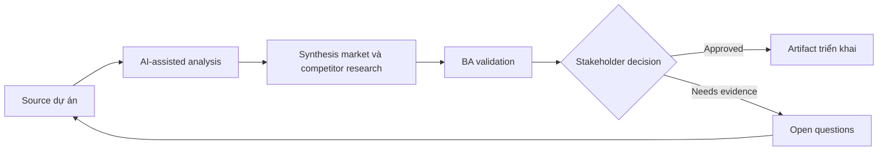

# Synthesis market và competitor research

<div class="case-meta">
  <span>Discovery and alignment</span>
  <span>Product strategy</span>
  <span>Use case dự án</span>
</div>

## Project context

Một SaaS team cân nhắc thêm workflow automation feature. Product leadership gom competitor page, analyst report, customer feedback và sales note, rồi yêu cầu BA synthesize implication cho roadmap. Trong môi trường delivery thật, tình huống này thường xuất hiện dưới áp lực thời gian: stakeholder cần clarity, delivery cần backlog, QA cần behavior test được, operations cần process chịu được exception. BA dùng AI để tăng tốc analysis và synthesis, nhưng BA vẫn chịu trách nhiệm về evidence, business meaning, stakeholder decisioning và artifact quality.

## BA challenge

BA phải biến market signal rộng thành product-relevant hypothesis, capability theme, customer segment, differentiation option và validation question. AI summarize source nhanh, nhưng cũng có thể làm mờ evidence quality và overstate market claim yếu. Khó khăn thực tế là AI có thể làm material ban đầu trông hoàn chỉnh hơn mức thật sự. BA giỏi giữ output ở trạng thái reviewable bằng cách tách source-backed fact, assumption, unsupported claim, decision gap và recommended next action. Mục tiêu không phải làm document dài hơn; mục tiêu là làm project decision rõ hơn và an toàn hơn.

## Where AI fits

<div class="ba-workbench-panel">
AI hữu ích trong use case này khi được giới hạn vào analysis support, pattern detection, structured drafting và critique. AI không được approve scope, invent policy, quyết định business trade-off hoặc thay thế judgment của stakeholder chịu trách nhiệm.
</div>

- Summarize competitor capability theo source.
- Cluster customer pain và market claim thành capability theme.
- Tách observed evidence khỏi analyst opinion và sales anecdote.
- Generate roadmap hypothesis và validation experiment.

## Inputs to prepare

- Competitor page
- Analyst notes
- Win-loss notes
- Customer feedback
- Current product capability map

BA nên label các input này trước khi dùng AI: source owner, source date, approval status, sensitivity level, và source đó là fact, opinion, policy, draft hay historical evidence. Việc chuẩn bị này ngăn model xem mọi input đều current và authoritative như nhau.

## BA workflow

1. Tạo source inventory có evidence type và freshness.
2. Yêu cầu AI summarize từng source riêng trước khi synthesis.
3. Cluster capability theo user problem, không theo feature name của competitor.
4. Map theme với current product gap và strategic option.
5. Identify claim cần customer validation.
6. Produce decision memo cho roadmap discussion.

Workflow hiệu quả nhất khi dùng AI theo từng stage: trước hết organize evidence, sau đó yêu cầu analysis, tiếp theo tạo artifact, rồi chạy critique pass. BA nên giữ decision log visible xuyên suốt để suggestion do AI sinh ra không âm thầm trở thành approved scope.

## Diagram



## Deliverables

| Deliverable | Nội dung | Owner | Done signal |
| --- | --- | --- | --- |
| Research synthesis memo | Theme, evidence strength, source và product implication | BA | Mỗi claim gắn với source type |
| Capability comparison | Competitor capability, user problem, current product support và gap | Product manager | Comparison tránh copy feature name |
| Hypothesis backlog | Roadmap hypothesis, evidence needed và validation method | Product owner | High-value hypothesis có experiment plan |
| Decision memo | Option, trade-off, risk và recommendation | Product leadership | Recommendation tách evidence khỏi assumption |

Các deliverable này nên được xem là artifact do BA own. AI có thể draft, nhưng BA phải validate source support, stakeholder meaning, traceability và artifact đã sẵn sàng handoff hay chưa.

## Prompt to try

```text
Hãy đóng vai senior Business Analyst hiểu AI. Hỗ trợ tôi áp dụng use case "Synthesis market và competitor research" vào dự án. Trước hết hỏi source evidence và constraint. Sau đó tạo structured analysis gồm project context, assumption, AI-fit boundary, workflow step, deliverable, risk, control, open question và stakeholder decision. Không tự bịa policy, threshold hoặc approval.
```

## Review checklist

- Mọi statement do AI hỗ trợ đều gắn với source, assumption hoặc validation question.
- BA đã tách drafting assistance khỏi business approval.
- Workflow step có human owner cho decision, review và exception.
- Deliverable trace được về project input và review được bởi QA, product hoặc operations.
- Risk control đủ thực tế để dùng trong meeting dự án thật.
- Success metric: Roadmap discussion dùng validated hypothesis và evidence strength thay vì competitor feature list chung chung.

## Risks and controls

| Rủi ro | Vì sao quan trọng | Control của BA |
| --- | --- | --- |
| Source overreach | AI có thể xem marketing copy là capability đã chứng minh | Label source type và evidence strength |
| Copycat roadmap | Team có thể copy competitor feature không fit user problem | Map mọi theme tới target segment và user outcome |
| Confirmation bias | Leadership có thể thích evidence ủng hộ idea sẵn có | Include disconfirming signal và open risk |
| Stale research | Competitor page và report thay đổi nhanh | Record source date và freshness confidence |

Control quan trọng nhất là làm uncertainty visible. Nếu evidence yếu, output nên tạo validation question hoặc decision item, không phải final requirement. Nếu artifact ảnh hưởng delivery, release, compliance, customer experience hoặc operational workload, BA nên yêu cầu human review explicit trước khi handoff.
