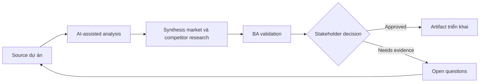

# Synthesis market và competitor research

<div class="case-meta">
  <span>Discovery and alignment</span>
  <span>Product strategy</span>
  <span>Discovery</span>
  <span>Core</span>
  <span>Research synthesis memo</span>
  <span>Use case dự án</span>
</div>

## Project context

Một SaaS team cân nhắc thêm workflow automation feature. Product leadership gom competitor page, analyst report, customer feedback và sales note, rồi yêu cầu BA synthesize implication cho roadmap. Trong Product strategy, công việc này thường bắt đầu khi stakeholder mô tả cùng một vấn đề từ incentive và mức chi tiết khác nhau. BA nên xem Competitor page và Analyst notes là evidence cần organize, không phải raw material để AI trả lời không kiểm soát. Mục tiêu là làm decision tiếp theo rõ hơn cho người own outcome.

## BA challenge

BA phải biến market signal rộng thành product-relevant hypothesis, capability theme, customer segment, differentiation option và validation question. AI summarize source nhanh, nhưng cũng có thể làm mờ evidence quality và overstate market claim yếu. Với Synthesis market và competitor research, khó khăn thực tế là false consensus và invented scope. AI có thể tăng tốc sensemaking, contradiction detection, question generation và workshop preparation, nhưng BA vẫn phải làm rõ assumption, approval còn thiếu và điểm cần stakeholder judgment.

## Where AI fits

<div class="ba-workbench-panel">
AI phù hợp với use case Discovery và alignment khi được giới hạn vào sensemaking, contradiction detection, question generation và workshop preparation. AI task hữu ích đầu tiên là: Summarize competitor capability theo source. AI không được approve scope, invent policy, bỏ qua speaker attribution, decision authority và source freshness, hoặc biến draft thành final decision.
</div>

- Summarize competitor capability theo source.
- Cluster customer pain và market claim thành capability theme.
- Tách observed evidence khỏi analyst opinion và sales anecdote.
- Generate roadmap hypothesis và validation experiment.

## Inputs to prepare

- Competitor page
- Analyst notes
- Win-loss notes
- Customer feedback
- Current product capability map

Trước khi prompt cho Synthesis market và competitor research, hãy label từng input theo owner, date, approval status, sensitivity và vai trò trong decision. Evidence lens quan trọng nhất là speaker attribution, decision authority và source freshness; nếu thiếu, AI có thể xem old note, draft design và approved rule có authority như nhau.

## BA workflow

1. Tạo source inventory có evidence type và freshness.
2. Yêu cầu AI summarize từng source riêng trước khi synthesis.
3. Cluster capability theo user problem, không theo feature name của competitor.
4. Map theme với current product gap và strategic option.
5. Identify claim cần customer validation.
6. Produce decision memo cho roadmap discussion.

Chạy workflow như gom evidence trước khi bàn solution: bắt đầu với "Tạo source inventory có evidence type và freshness.", sau đó giữ decision log visible khi artifact tiến tới Research synthesis memo. Cách này ngăn suggestion của AI âm thầm trở thành backlog, design, release hoặc operational commitment.

## Diagram



## Deliverables

| Deliverable | Nội dung | Owner | Done signal |
| --- | --- | --- | --- |
| Research synthesis memo | Theme, evidence strength, source và product implication | BA | Mỗi claim gắn với source type |
| Capability comparison | Competitor capability, user problem, current product support và gap | Product manager | Comparison tránh copy feature name |
| Hypothesis backlog | Roadmap hypothesis, evidence needed và validation method | Product owner | High-value hypothesis có experiment plan |
| Decision memo | Option, trade-off, risk và recommendation | Product leadership | Recommendation tách evidence khỏi assumption |

Hãy xem Research synthesis memo là alignment artifact do BA own. AI có thể draft structure, nhưng BA phải validate "Mỗi claim gắn với source type" có thật sự đúng không, artifact có trace được về evidence không và receiving team có hành động được không.

## Prompt to try

```text
Hãy đóng vai senior Business Analyst hiểu AI. Hỗ trợ tôi áp dụng use case "Synthesis market và competitor research" vào dự án. Trước hết hỏi source evidence và constraint. Sau đó tạo structured analysis gồm project context, assumption, AI-fit boundary, workflow step, deliverable, risk, control, open question và stakeholder decision. Không tự bịa policy, threshold hoặc approval.
```

## Review checklist

- Competitor page được label owner, date, approval status và sensitivity.
- Research synthesis memo trace được về source evidence và có human owner rõ.
- AI task nằm trong boundary sensemaking, contradiction detection, question generation và workshop preparation và không approve scope hoặc policy.
- Risk "Source overreach" có control thực tế: Label source type và evidence strength.
- Open assumption được chuyển thành validation question hoặc stakeholder decision.
- Success metric: Roadmap discussion dùng validated hypothesis và evidence strength thay vì competitor feature list chung chung.

## Risks and controls

| Rủi ro | Vì sao quan trọng | Control của BA |
| --- | --- | --- |
| Source overreach | AI có thể xem marketing copy là capability đã chứng minh | Label source type và evidence strength |
| Copycat roadmap | Team có thể copy competitor feature không fit user problem | Map mọi theme tới target segment và user outcome |
| Confirmation bias | Leadership có thể thích evidence ủng hộ idea sẵn có | Include disconfirming signal và open risk |
| Stale research | Competitor page và report thay đổi nhanh | Record source date và freshness confidence |

Control chính cho risk "Source overreach" là human accountability explicit: Label source type và evidence strength. Nếu evidence yếu, output nên tạo validation question hoặc decision item, không phải final requirement.
