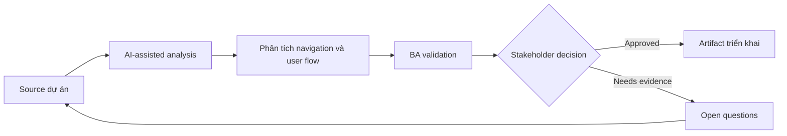

# Phân tích navigation và user flow

<div class="case-meta">
  <span>Frontend, UI, and UX</span>
  <span>User flows</span>
  <span>Use case dự án</span>
</div>

## Project context

Customer portal thêm section billing, documents, support cases và settings. Stakeholder không thống nhất navigation label, entry point và task nào cần one click away. Trong môi trường delivery thật, tình huống này thường xuất hiện dưới áp lực thời gian: stakeholder cần clarity, delivery cần backlog, QA cần behavior test được, operations cần process chịu được exception. BA dùng AI để tăng tốc analysis và synthesis, nhưng BA vẫn chịu trách nhiệm về evidence, business meaning, stakeholder decisioning và artifact quality.

## BA challenge

BA phải chuyển user goal thành navigation requirement, không chỉ menu label. BA cần define task priority, entry point, breadcrumb, deep link, visibility theo permission và failure path. Khó khăn thực tế là AI có thể làm material ban đầu trông hoàn chỉnh hơn mức thật sự. BA giỏi giữ output ở trạng thái reviewable bằng cách tách source-backed fact, assumption, unsupported claim, decision gap và recommended next action. Mục tiêu không phải làm document dài hơn; mục tiêu là làm project decision rõ hơn và an toàn hơn.

## Where AI fits

<div class="ba-workbench-panel">
AI hữu ích trong use case này khi được giới hạn vào analysis support, pattern detection, structured drafting và critique. AI không được approve scope, invent policy, quyết định business trade-off hoặc thay thế judgment của stakeholder chịu trách nhiệm.
</div>

- Cluster task theo user goal và frequency.
- Generate navigation question và alternative IA structure.
- Identify navigation difference theo permission.
- Draft user-flow diagram và acceptance criteria.

## Inputs to prepare

- User journey map
- Task inventory
- Analytics hoặc support data
- Permission rules
- Current navigation

BA nên label các input này trước khi dùng AI: source owner, source date, approval status, sensitivity level, và source đó là fact, opinion, policy, draft hay historical evidence. Việc chuẩn bị này ngăn model xem mọi input đều current và authoritative như nhau.

## BA workflow

1. Tạo task inventory có frequency, role và business value.
2. Yêu cầu AI propose navigation grouping và label risk.
3. Validate label bằng user language và domain terminology.
4. Define entry point, deep link, breadcrumb và empty permission state.
5. Viết acceptance criteria cho role-based navigation visibility.
6. Review với UX, product, frontend và support.

Workflow hiệu quả nhất khi dùng AI theo từng stage: trước hết organize evidence, sau đó yêu cầu analysis, tiếp theo tạo artifact, rồi chạy critique pass. BA nên giữ decision log visible xuyên suốt để suggestion do AI sinh ra không âm thầm trở thành approved scope.

## Diagram



## Deliverables

| Deliverable | Nội dung | Owner | Done signal |
| --- | --- | --- | --- |
| Task-to-navigation map | Task, user role, entry point, label, frequency và priority | BA và UX | Navigation support priority task |
| User flow diagram | Entry, path, decision, permission và fallback | UX | Flow cover key journey |
| Navigation acceptance criteria | Role visibility, deep link, breadcrumb và redirect behavior | BA | Frontend implement an toàn |
| Label decision log | Label option, rationale, evidence và owner | Product owner | Naming decision explicit |

Các deliverable này nên được xem là artifact do BA own. AI có thể draft, nhưng BA phải validate source support, stakeholder meaning, traceability và artifact đã sẵn sàng handoff hay chưa.

## Prompt to try

```text
Hãy đóng vai senior Business Analyst hiểu AI. Hỗ trợ tôi áp dụng use case "Phân tích navigation và user flow" vào dự án. Trước hết hỏi source evidence và constraint. Sau đó tạo structured analysis gồm project context, assumption, AI-fit boundary, workflow step, deliverable, risk, control, open question và stakeholder decision. Không tự bịa policy, threshold hoặc approval.
```

## Review checklist

- Mọi statement do AI hỗ trợ đều gắn với source, assumption hoặc validation question.
- BA đã tách drafting assistance khỏi business approval.
- Workflow step có human owner cho decision, review và exception.
- Deliverable trace được về project input và review được bởi QA, product hoặc operations.
- Risk control đủ thực tế để dùng trong meeting dự án thật.
- Success metric: Navigation choice dựa trên user task, role rule và flow behavior test được.

## Risks and controls

| Rủi ro | Vì sao quan trọng | Control của BA |
| --- | --- | --- |
| Org-chart navigation | Menu reflect internal team thay vì user goal | Cluster theo user task và language |
| Permission dead end | User thấy link nhưng không dùng được | Specify role visibility và redirect |
| Deep link failure | Shared link có thể break với unauthorized user | Define access và fallback behavior |
| Label ambiguity | User không hiểu menu term | Validate label với user language |

Control quan trọng nhất là làm uncertainty visible. Nếu evidence yếu, output nên tạo validation question hoặc decision item, không phải final requirement. Nếu artifact ảnh hưởng delivery, release, compliance, customer experience hoặc operational workload, BA nên yêu cầu human review explicit trước khi handoff.
