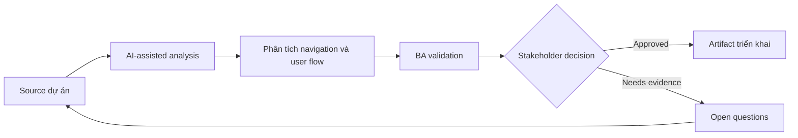

# Phân tích navigation và user flow

<div class="case-meta">
  <span>Frontend, UI, and UX</span>
  <span>User flows</span>
  <span>Frontend/UI refinement</span>
  <span>Practitioner</span>
  <span>Task-to-navigation map</span>
  <span>Use case dự án</span>
</div>

## Project context

Customer portal thêm section billing, documents, support cases và settings. Stakeholder không thống nhất navigation label, entry point và task nào cần one click away. Trong User flows, công việc này thường bắt đầu khi screen behavior, accessibility, design state, analytics và user feedback phải thành requirement implement được. BA nên xem User journey map và Task inventory là evidence cần organize, không phải raw material để AI trả lời không kiểm soát. Mục tiêu là làm decision tiếp theo rõ hơn cho người own outcome.

## BA challenge

BA phải chuyển user goal thành navigation requirement, không chỉ menu label. BA cần define task priority, entry point, breadcrumb, deep link, visibility theo permission và failure path. Với Phân tích navigation và user flow, khó khăn thực tế là missing state và UX không đo được. AI có thể tăng tốc UI-state analysis, content critique, accessibility review, event taxonomy và edge-case discovery, nhưng BA vẫn phải làm rõ assumption, approval còn thiếu và điểm cần stakeholder judgment.

## Where AI fits

<div class="ba-workbench-panel">
AI phù hợp với use case Frontend, UI và UX khi được giới hạn vào UI-state analysis, content critique, accessibility review, event taxonomy và edge-case discovery. AI task hữu ích đầu tiên là: Cluster task theo user goal và frequency. AI không được approve scope, invent policy, bỏ qua wireframe, design token, user journey, analytics question và accessibility expectation, hoặc biến draft thành final decision.
</div>

- Cluster task theo user goal và frequency.
- Generate navigation question và alternative IA structure.
- Identify navigation difference theo permission.
- Draft user-flow diagram và acceptance criteria.

## Inputs to prepare

- User journey map
- Task inventory
- Analytics hoặc support data
- Permission rules
- Current navigation

Trước khi prompt cho Phân tích navigation và user flow, hãy label từng input theo owner, date, approval status, sensitivity và vai trò trong decision. Evidence lens quan trọng nhất là wireframe, design token, user journey, analytics question và accessibility expectation; nếu thiếu, AI có thể xem old note, draft design và approved rule có authority như nhau.

## BA workflow

1. Tạo task inventory có frequency, role và business value.
2. Yêu cầu AI propose navigation grouping và label risk.
3. Validate label bằng user language và domain terminology.
4. Define entry point, deep link, breadcrumb và empty permission state.
5. Viết acceptance criteria cho role-based navigation visibility.
6. Review với UX, product, frontend và support.

Chạy workflow như screen-state review trước frontend build: bắt đầu với "Tạo task inventory có frequency, role và business value.", sau đó giữ decision log visible khi artifact tiến tới Task-to-navigation map. Cách này ngăn suggestion của AI âm thầm trở thành backlog, design, release hoặc operational commitment.

## Diagram



## Deliverables

| Deliverable | Nội dung | Owner | Done signal |
| --- | --- | --- | --- |
| Task-to-navigation map | Task, user role, entry point, label, frequency và priority | BA và UX | Navigation support priority task |
| User flow diagram | Entry, path, decision, permission và fallback | UX | Flow cover key journey |
| Navigation acceptance criteria | Role visibility, deep link, breadcrumb và redirect behavior | BA | Frontend implement an toàn |
| Label decision log | Label option, rationale, evidence và owner | Product owner | Naming decision explicit |

Hãy xem Task-to-navigation map là frontend requirement specification do BA own. AI có thể draft structure, nhưng BA phải validate "Navigation support priority task" có thật sự đúng không, artifact có trace được về evidence không và receiving team có hành động được không.

## Prompt to try

```text
Hãy đóng vai senior Business Analyst hiểu AI. Hỗ trợ tôi áp dụng use case "Phân tích navigation và user flow" vào dự án. Trước hết hỏi source evidence và constraint. Sau đó tạo structured analysis gồm project context, assumption, AI-fit boundary, workflow step, deliverable, risk, control, open question và stakeholder decision. Không tự bịa policy, threshold hoặc approval.
```

## Review checklist

- User journey map được label owner, date, approval status và sensitivity.
- Task-to-navigation map trace được về source evidence và có human owner rõ.
- AI task nằm trong boundary UI-state analysis, content critique, accessibility review, event taxonomy và edge-case discovery và không approve scope hoặc policy.
- Risk "Org-chart navigation" có control thực tế: Cluster theo user task và language.
- Open assumption được chuyển thành validation question hoặc stakeholder decision.
- Success metric: Navigation choice dựa trên user task, role rule và flow behavior test được.

## Risks and controls

| Rủi ro | Vì sao quan trọng | Control của BA |
| --- | --- | --- |
| Org-chart navigation | Menu reflect internal team thay vì user goal | Cluster theo user task và language |
| Permission dead end | User thấy link nhưng không dùng được | Specify role visibility và redirect |
| Deep link failure | Shared link có thể break với unauthorized user | Define access và fallback behavior |
| Label ambiguity | User không hiểu menu term | Validate label với user language |

Control chính cho risk "Org-chart navigation" là human accountability explicit: Cluster theo user task và language. Nếu evidence yếu, output nên tạo validation question hoặc decision item, không phải final requirement.
