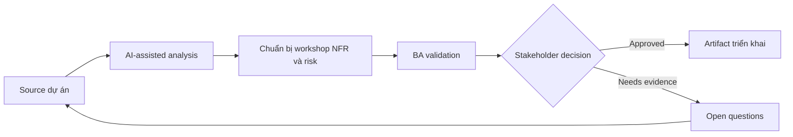

# Chuẩn bị workshop NFR và risk

<div class="case-meta">
  <span>Requirements and backlog</span>
  <span>Quality attributes</span>
  <span>Use case dự án</span>
</div>

## Project context

Team đang xây customer portal self-service. Functional scope đã rõ, nhưng performance, availability, security, accessibility, audit và support expectation chưa được document trước architecture decision. Trong môi trường delivery thật, tình huống này thường xuất hiện dưới áp lực thời gian: stakeholder cần clarity, delivery cần backlog, QA cần behavior test được, operations cần process chịu được exception. BA dùng AI để tăng tốc analysis và synthesis, nhưng BA vẫn chịu trách nhiệm về evidence, business meaning, stakeholder decisioning và artifact quality.

## BA challenge

BA phải chuẩn bị NFR workshop giúp stakeholder làm rõ quality trade-off. AI có thể đề xuất NFR category và scenario, nhưng BA phải dịch chúng thành threshold đo được và business risk. Khó khăn thực tế là AI có thể làm material ban đầu trông hoàn chỉnh hơn mức thật sự. BA giỏi giữ output ở trạng thái reviewable bằng cách tách source-backed fact, assumption, unsupported claim, decision gap và recommended next action. Mục tiêu không phải làm document dài hơn; mục tiêu là làm project decision rõ hơn và an toàn hơn.

## Where AI fits

<div class="ba-workbench-panel">
AI hữu ích trong use case này khi được giới hạn vào analysis support, pattern detection, structured drafting và critique. AI không được approve scope, invent policy, quyết định business trade-off hoặc thay thế judgment của stakeholder chịu trách nhiệm.
</div>

- Generate NFR elicitation question theo quality attribute.
- Tạo risk scenario và user impact statement.
- Draft measurable candidate threshold để discussion.
- Map NFR với acceptance criteria và monitoring signal.

## Inputs to prepare

- Feature scope
- User segment
- Business criticality
- Compliance constraint
- Current system performance notes

BA nên label các input này trước khi dùng AI: source owner, source date, approval status, sensitivity level, và source đó là fact, opinion, policy, draft hay historical evidence. Việc chuẩn bị này ngăn model xem mọi input đều current và authoritative như nhau.

## BA workflow

1. Yêu cầu AI đề xuất NFR category relevant với product context.
2. Chuyển generic attribute thành risk scenario và user harm.
3. Chuẩn bị workshop question buộc quyết định trade-off.
4. Draft candidate threshold và mark là assumption.
5. Validate threshold với business, architecture, security và support owner.
6. Publish NFR decision kèm acceptance và monitoring implication.

Workflow hiệu quả nhất khi dùng AI theo từng stage: trước hết organize evidence, sau đó yêu cầu analysis, tiếp theo tạo artifact, rồi chạy critique pass. BA nên giữ decision log visible xuyên suốt để suggestion do AI sinh ra không âm thầm trở thành approved scope.

## Diagram



## Deliverables

| Deliverable | Nội dung | Owner | Done signal |
| --- | --- | --- | --- |
| NFR workshop pack | Quality attribute, risk scenario và decision question | BA | Stakeholder thảo luận trade-off |
| NFR requirement table | Attribute, scenario, threshold, owner và measurement method | BA | Mọi NFR đo được |
| Risk register | Risk, impact, likelihood, mitigation và owner | Project manager | High risk có control |
| Monitoring map | NFR tới operational signal và alert owner | Operations owner | Critical NFR có monitoring path |

Các deliverable này nên được xem là artifact do BA own. AI có thể draft, nhưng BA phải validate source support, stakeholder meaning, traceability và artifact đã sẵn sàng handoff hay chưa.

## Prompt to try

```text
Hãy đóng vai senior Business Analyst hiểu AI. Hỗ trợ tôi áp dụng use case "Chuẩn bị workshop NFR và risk" vào dự án. Trước hết hỏi source evidence và constraint. Sau đó tạo structured analysis gồm project context, assumption, AI-fit boundary, workflow step, deliverable, risk, control, open question và stakeholder decision. Không tự bịa policy, threshold hoặc approval.
```

## Review checklist

- Mọi statement do AI hỗ trợ đều gắn với source, assumption hoặc validation question.
- BA đã tách drafting assistance khỏi business approval.
- Workflow step có human owner cho decision, review và exception.
- Deliverable trace được về project input và review được bởi QA, product hoặc operations.
- Risk control đủ thực tế để dùng trong meeting dự án thật.
- Success metric: Quality attribute trở thành requirement đo được và design input trước khi commit architecture.

## Risks and controls

| Rủi ro | Vì sao quan trọng | Control của BA |
| --- | --- | --- |
| Vague NFRs | Fast, secure và reliable không test được | Dùng measurable threshold và scenario |
| Late quality decisions | Architecture có thể được chọn trước khi biết NFR | Chạy workshop trước design lock |
| Stakeholder avoidance | Team có thể né trade-off vì khó chịu | Frame NFR như business risk decision |
| Monitoring gap | Requirement pass test nhưng fail production | Map NFR với operational metric |

Control quan trọng nhất là làm uncertainty visible. Nếu evidence yếu, output nên tạo validation question hoặc decision item, không phải final requirement. Nếu artifact ảnh hưởng delivery, release, compliance, customer experience hoặc operational workload, BA nên yêu cầu human review explicit trước khi handoff.
