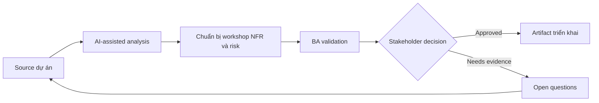

# Chuẩn bị workshop NFR và risk

<div class="case-meta">
  <span>Requirements and backlog</span>
  <span>Quality attributes</span>
  <span>Refinement</span>
  <span>Core</span>
  <span>NFR workshop pack</span>
  <span>Use case dự án</span>
</div>

## Project context

Team đang xây customer portal self-service. Functional scope đã rõ, nhưng performance, availability, security, accessibility, audit và support expectation chưa được document trước architecture decision. Trong Quality attributes, công việc này thường bắt đầu khi story phải test được mà không mất business rule, exception, data need hoặc NFR. BA nên xem Feature scope và User segment là evidence cần organize, không phải raw material để AI trả lời không kiểm soát. Mục tiêu là làm decision tiếp theo rõ hơn cho người own outcome.

## BA challenge

BA phải chuẩn bị NFR workshop giúp stakeholder làm rõ quality trade-off. AI có thể đề xuất NFR category và scenario, nhưng BA phải dịch chúng thành threshold đo được và business risk. Với Chuẩn bị workshop NFR và risk, khó khăn thực tế là criteria mơ hồ và assumption không owner. AI có thể tăng tốc gap finding, rewrite critique, edge-case expansion và acceptance-criteria drafting, nhưng BA vẫn phải làm rõ assumption, approval còn thiếu và điểm cần stakeholder judgment.

## Where AI fits

<div class="ba-workbench-panel">
AI phù hợp với use case Requirements và backlog khi được giới hạn vào gap finding, rewrite critique, edge-case expansion và acceptance-criteria drafting. AI task hữu ích đầu tiên là: Generate NFR elicitation question theo quality attribute. AI không được approve scope, invent policy, bỏ qua rule đã approve, example, edge case và expectation của QA, hoặc biến draft thành final decision.
</div>

- Generate NFR elicitation question theo quality attribute.
- Tạo risk scenario và user impact statement.
- Draft measurable candidate threshold để discussion.
- Map NFR với acceptance criteria và monitoring signal.

## Inputs to prepare

- Feature scope
- User segment
- Business criticality
- Compliance constraint
- Current system performance notes

Trước khi prompt cho Chuẩn bị workshop NFR và risk, hãy label từng input theo owner, date, approval status, sensitivity và vai trò trong decision. Evidence lens quan trọng nhất là rule đã approve, example, edge case và expectation của QA; nếu thiếu, AI có thể xem old note, draft design và approved rule có authority như nhau.

## BA workflow

1. Yêu cầu AI đề xuất NFR category relevant với product context.
2. Chuyển generic attribute thành risk scenario và user harm.
3. Chuẩn bị workshop question buộc quyết định trade-off.
4. Draft candidate threshold và mark là assumption.
5. Validate threshold với business, architecture, security và support owner.
6. Publish NFR decision kèm acceptance và monitoring implication.

Chạy workflow như clarify requirement trước khi commit sprint: bắt đầu với "Yêu cầu AI đề xuất NFR category relevant với product context.", sau đó giữ decision log visible khi artifact tiến tới NFR workshop pack. Cách này ngăn suggestion của AI âm thầm trở thành backlog, design, release hoặc operational commitment.

## Diagram



## Deliverables

| Deliverable | Nội dung | Owner | Done signal |
| --- | --- | --- | --- |
| NFR workshop pack | Quality attribute, risk scenario và decision question | BA | Stakeholder thảo luận trade-off |
| NFR requirement table | Attribute, scenario, threshold, owner và measurement method | BA | Mọi NFR đo được |
| Risk register | Risk, impact, likelihood, mitigation và owner | Project manager | High risk có control |
| Monitoring map | NFR tới operational signal và alert owner | Operations owner | Critical NFR có monitoring path |

Hãy xem NFR workshop pack là delivery-ready backlog artifact do BA own. AI có thể draft structure, nhưng BA phải validate "Stakeholder thảo luận trade-off" có thật sự đúng không, artifact có trace được về evidence không và receiving team có hành động được không.

## Prompt to try

```text
Hãy đóng vai senior Business Analyst hiểu AI. Hỗ trợ tôi áp dụng use case "Chuẩn bị workshop NFR và risk" vào dự án. Trước hết hỏi source evidence và constraint. Sau đó tạo structured analysis gồm project context, assumption, AI-fit boundary, workflow step, deliverable, risk, control, open question và stakeholder decision. Không tự bịa policy, threshold hoặc approval.
```

## Review checklist

- Feature scope được label owner, date, approval status và sensitivity.
- NFR workshop pack trace được về source evidence và có human owner rõ.
- AI task nằm trong boundary gap finding, rewrite critique, edge-case expansion và acceptance-criteria drafting và không approve scope hoặc policy.
- Risk "Vague NFRs" có control thực tế: Dùng measurable threshold và scenario.
- Open assumption được chuyển thành validation question hoặc stakeholder decision.
- Success metric: Quality attribute trở thành requirement đo được và design input trước khi commit architecture.

## Risks and controls

| Rủi ro | Vì sao quan trọng | Control của BA |
| --- | --- | --- |
| Vague NFRs | Fast, secure và reliable không test được | Dùng measurable threshold và scenario |
| Late quality decisions | Architecture có thể được chọn trước khi biết NFR | Chạy workshop trước design lock |
| Stakeholder avoidance | Team có thể né trade-off vì khó chịu | Frame NFR như business risk decision |
| Monitoring gap | Requirement pass test nhưng fail production | Map NFR với operational metric |

Control chính cho risk "Vague NFRs" là human accountability explicit: Dùng measurable threshold và scenario. Nếu evidence yếu, output nên tạo validation question hoặc decision item, không phải final requirement.
