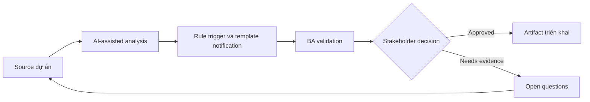

# Rule trigger và template notification

<div class="case-meta">
  <span>Data and Integration</span>
  <span>Notifications</span>
  <span>Use case dự án</span>
</div>

## Project context

Workflow gửi email, SMS và in-app notification cho approval, missing document, status change và SLA breach. Stakeholder chưa thống nhất timing và message content. Trong Notifications, công việc này thường bắt đầu khi data movement, mapping, reconciliation, privacy và lineage decision ảnh hưởng nhiều system và owner. BA nên xem Workflow states và Recipient roles là evidence cần organize, không phải raw material để AI trả lời không kiểm soát. Mục tiêu là làm decision tiếp theo rõ hơn cho người own outcome.

## BA challenge

BA phải define notification rule connect event trigger, recipient, channel, template, personalization, suppression, retry và audit evidence. Với Rule trigger và template notification, khó khăn thực tế là silent data loss và lineage yếu. AI có thể tăng tốc field mapping, rule comparison, reconciliation design, lineage review và exception analysis, nhưng BA vẫn phải làm rõ assumption, approval còn thiếu và điểm cần stakeholder judgment.

## Where AI fits

<div class="ba-workbench-panel">
AI phù hợp với use case Data và Integration khi được giới hạn vào field mapping, rule comparison, reconciliation design, lineage review và exception analysis. AI task hữu ích đầu tiên là: Generate notification trigger matrix từ workflow state. AI không được approve scope, invent policy, bỏ qua source schema, sample payload, mapping rule, data-quality report và ownership matrix, hoặc biến draft thành final decision.
</div>

- Generate notification trigger matrix từ workflow state.
- Draft template variant và personalization field.
- Identify duplicate, suppression và escalation scenario.
- Tạo acceptance criteria cho channel và retry behavior.

## Inputs to prepare

- Workflow states
- Recipient roles
- Communication policy
- Template drafts
- Channel capabilities

Trước khi prompt cho Rule trigger và template notification, hãy label từng input theo owner, date, approval status, sensitivity và vai trò trong decision. Evidence lens quan trọng nhất là source schema, sample payload, mapping rule, data-quality report và ownership matrix; nếu thiếu, AI có thể xem old note, draft design và approved rule có authority như nhau.

## BA workflow

1. Map workflow event và recipient need.
2. Yêu cầu AI draft trigger-channel-recipient matrix.
3. Define template content, variable, localization và legal copy constraint.
4. Specify suppression, duplicate prevention, retry và escalation behavior.
5. Review với product, support, legal và operations.
6. Thêm QA case cho event timing, channel failure và personalization.

Chạy workflow như data contract review trước integration build: bắt đầu với "Map workflow event và recipient need.", sau đó giữ decision log visible khi artifact tiến tới Notification rule matrix. Cách này ngăn suggestion của AI âm thầm trở thành backlog, design, release hoặc operational commitment.

## Diagram



## Deliverables

| Deliverable | Nội dung | Owner | Done signal |
| --- | --- | --- | --- |
| Notification rule matrix | Trigger, recipient, channel, timing, suppression và owner | BA | Mọi event có rule |
| Template catalog | Template, variable, copy, localization và approval status | UX/legal | Message approved |
| Retry and fallback rules | Channel failure, retry count, fallback channel và alert | Operations | Failure có path |
| Notification QA scenarios | Trigger, duplicate, suppression, retry và personalization case | QA | Notification testable |

Hãy xem Notification rule matrix là data and integration control pack do BA own. AI có thể draft structure, nhưng BA phải validate "Mọi event có rule" có thật sự đúng không, artifact có trace được về evidence không và receiving team có hành động được không.

## Prompt to try

```text
Hãy đóng vai senior Business Analyst hiểu AI. Hỗ trợ tôi áp dụng use case "Rule trigger và template notification" vào dự án. Trước hết hỏi source evidence và constraint. Sau đó tạo structured analysis gồm project context, assumption, AI-fit boundary, workflow step, deliverable, risk, control, open question và stakeholder decision. Không tự bịa policy, threshold hoặc approval.
```

## Review checklist

- Workflow states được label owner, date, approval status và sensitivity.
- Notification rule matrix trace được về source evidence và có human owner rõ.
- AI task nằm trong boundary field mapping, rule comparison, reconciliation design, lineage review và exception analysis và không approve scope hoặc policy.
- Risk "Notification spam" có control thực tế: Define suppression và duplicate prevention.
- Open assumption được chuyển thành validation question hoặc stakeholder decision.
- Success metric: Notification được trigger, wording, route và monitor theo business rule rõ.

## Risks and controls

| Rủi ro | Vì sao quan trọng | Control của BA |
| --- | --- | --- |
| Notification spam | User nhận duplicate hoặc quá nhiều message | Define suppression và duplicate prevention |
| Wrong recipient | Sensitive info gửi sai role | Map recipient và permission |
| Template drift | Copy inconsistent giữa channel | Maintain template catalog |
| Channel failure | Important message không gửi được | Define retry và fallback channel |

Control chính cho risk "Notification spam" là human accountability explicit: Define suppression và duplicate prevention. Nếu evidence yếu, output nên tạo validation question hoặc decision item, không phải final requirement.
