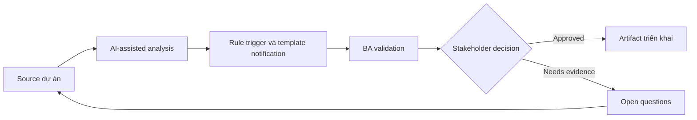

# Rule trigger và template notification

<div class="case-meta">
  <span>Data and Integration</span>
  <span>Notifications</span>
  <span>Use case dự án</span>
</div>

## Project context

Workflow gửi email, SMS và in-app notification cho approval, missing document, status change và SLA breach. Stakeholder chưa thống nhất timing và message content. Trong môi trường delivery thật, tình huống này thường xuất hiện dưới áp lực thời gian: stakeholder cần clarity, delivery cần backlog, QA cần behavior test được, operations cần process chịu được exception. BA dùng AI để tăng tốc analysis và synthesis, nhưng BA vẫn chịu trách nhiệm về evidence, business meaning, stakeholder decisioning và artifact quality.

## BA challenge

BA phải define notification rule connect event trigger, recipient, channel, template, personalization, suppression, retry và audit evidence. Khó khăn thực tế là AI có thể làm material ban đầu trông hoàn chỉnh hơn mức thật sự. BA giỏi giữ output ở trạng thái reviewable bằng cách tách source-backed fact, assumption, unsupported claim, decision gap và recommended next action. Mục tiêu không phải làm document dài hơn; mục tiêu là làm project decision rõ hơn và an toàn hơn.

## Where AI fits

<div class="ba-workbench-panel">
AI hữu ích trong use case này khi được giới hạn vào analysis support, pattern detection, structured drafting và critique. AI không được approve scope, invent policy, quyết định business trade-off hoặc thay thế judgment của stakeholder chịu trách nhiệm.
</div>

- Generate notification trigger matrix từ workflow state.
- Draft template variant và personalization field.
- Identify duplicate, suppression và escalation scenario.
- Tạo acceptance criteria cho channel và retry behavior.

## Inputs to prepare

- Workflow states
- Recipient roles
- Communication policy
- Template drafts
- Channel capabilities

BA nên label các input này trước khi dùng AI: source owner, source date, approval status, sensitivity level, và source đó là fact, opinion, policy, draft hay historical evidence. Việc chuẩn bị này ngăn model xem mọi input đều current và authoritative như nhau.

## BA workflow

1. Map workflow event và recipient need.
2. Yêu cầu AI draft trigger-channel-recipient matrix.
3. Define template content, variable, localization và legal copy constraint.
4. Specify suppression, duplicate prevention, retry và escalation behavior.
5. Review với product, support, legal và operations.
6. Thêm QA case cho event timing, channel failure và personalization.

Workflow hiệu quả nhất khi dùng AI theo từng stage: trước hết organize evidence, sau đó yêu cầu analysis, tiếp theo tạo artifact, rồi chạy critique pass. BA nên giữ decision log visible xuyên suốt để suggestion do AI sinh ra không âm thầm trở thành approved scope.

## Diagram



## Deliverables

| Deliverable | Nội dung | Owner | Done signal |
| --- | --- | --- | --- |
| Notification rule matrix | Trigger, recipient, channel, timing, suppression và owner | BA | Mọi event có rule |
| Template catalog | Template, variable, copy, localization và approval status | UX/legal | Message approved |
| Retry and fallback rules | Channel failure, retry count, fallback channel và alert | Operations | Failure có path |
| Notification QA scenarios | Trigger, duplicate, suppression, retry và personalization case | QA | Notification testable |

Các deliverable này nên được xem là artifact do BA own. AI có thể draft, nhưng BA phải validate source support, stakeholder meaning, traceability và artifact đã sẵn sàng handoff hay chưa.

## Prompt to try

```text
Hãy đóng vai senior Business Analyst hiểu AI. Hỗ trợ tôi áp dụng use case "Rule trigger và template notification" vào dự án. Trước hết hỏi source evidence và constraint. Sau đó tạo structured analysis gồm project context, assumption, AI-fit boundary, workflow step, deliverable, risk, control, open question và stakeholder decision. Không tự bịa policy, threshold hoặc approval.
```

## Review checklist

- Mọi statement do AI hỗ trợ đều gắn với source, assumption hoặc validation question.
- BA đã tách drafting assistance khỏi business approval.
- Workflow step có human owner cho decision, review và exception.
- Deliverable trace được về project input và review được bởi QA, product hoặc operations.
- Risk control đủ thực tế để dùng trong meeting dự án thật.
- Success metric: Notification được trigger, wording, route và monitor theo business rule rõ.

## Risks and controls

| Rủi ro | Vì sao quan trọng | Control của BA |
| --- | --- | --- |
| Notification spam | User nhận duplicate hoặc quá nhiều message | Define suppression và duplicate prevention |
| Wrong recipient | Sensitive info gửi sai role | Map recipient và permission |
| Template drift | Copy inconsistent giữa channel | Maintain template catalog |
| Channel failure | Important message không gửi được | Define retry và fallback channel |

Control quan trọng nhất là làm uncertainty visible. Nếu evidence yếu, output nên tạo validation question hoặc decision item, không phải final requirement. Nếu artifact ảnh hưởng delivery, release, compliance, customer experience hoặc operational workload, BA nên yêu cầu human review explicit trước khi handoff.
