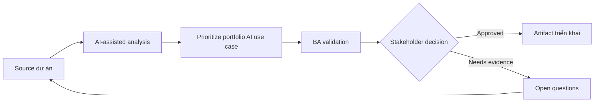

# Prioritize portfolio AI use case

<div class="case-meta">
  <span>Governance and adoption</span>
  <span>Portfolio management</span>
  <span>Governance</span>
  <span>Advanced</span>
  <span>Use-case scoring matrix</span>
  <span>Use case dự án</span>
</div>

## Project context

Leadership có list dài AI idea: meeting summary, requirements drafting, policy assistant, ticket triage, document extraction, sales recommendation và customer chatbot. Team cần cách prioritize hợp lý. Trong Portfolio management, công việc này thường bắt đầu khi cách dùng AI phải scale qua nhiều team mà không leak sensitive data hoặc tạo decision không review được. BA nên xem AI idea backlog và Business goals là evidence cần organize, không phải raw material để AI trả lời không kiểm soát. Mục tiêu là làm decision tiếp theo rõ hơn cho người own outcome.

## BA challenge

BA lead phải compare idea theo business value, feasibility, data readiness, risk, user impact, governance cost và measurement clarity. AI có thể structure portfolio, nhưng prioritization vẫn là business decision. Với Prioritize portfolio AI use case, khó khăn thực tế là shadow AI use và accountability yếu. AI có thể tăng tốc portfolio analysis, policy drafting, risk-tiering, playbook creation và adoption measurement, nhưng BA vẫn phải làm rõ assumption, approval còn thiếu và điểm cần stakeholder judgment.

## Where AI fits

<div class="ba-workbench-panel">
AI phù hợp với use case Governance và adoption khi được giới hạn vào portfolio analysis, policy drafting, risk-tiering, playbook creation và adoption measurement. AI task hữu ích đầu tiên là: Classify idea theo AI pattern và problem type. AI không được approve scope, invent policy, bỏ qua data policy, approved tool, risk appetite, audit need và capability của team, hoặc biến draft thành final decision.
</div>

- Classify idea theo AI pattern và problem type.
- Generate value-risk-feasibility scoring criteria.
- Identify missing data, control và evaluation need.
- Draft pilot roadmap option và decision memo.

## Inputs to prepare

- AI idea backlog
- Business goals
- Data readiness notes
- Risk policy
- Delivery capacity

Trước khi prompt cho Prioritize portfolio AI use case, hãy label từng input theo owner, date, approval status, sensitivity và vai trò trong decision. Evidence lens quan trọng nhất là data policy, approved tool, risk appetite, audit need và capability của team; nếu thiếu, AI có thể xem old note, draft design và approved rule có authority như nhau.

## BA workflow

1. Normalize từng idea thành problem, user, decision, outcome và AI pattern.
2. Yêu cầu AI score từng idea bằng criteria transparent và evidence gap.
3. Review score với business, technology, data, security và operations stakeholder.
4. Tách quick win khỏi high-risk strategic bet.
5. Define pilot có success metric, control và owner.
6. Publish portfolio roadmap có rationale và rejected idea.

Chạy workflow như governance design trước rollout rộng: bắt đầu với "Normalize từng idea thành problem, user, decision, outcome và AI pattern.", sau đó giữ decision log visible khi artifact tiến tới Use-case scoring matrix. Cách này ngăn suggestion của AI âm thầm trở thành backlog, design, release hoặc operational commitment.

## Diagram



## Deliverables

| Deliverable | Nội dung | Owner | Done signal |
| --- | --- | --- | --- |
| Use-case scoring matrix | Idea, value, feasibility, data readiness, risk, governance cost và score | BA lead | Score explainable |
| AI pattern classification | GenAI, RAG, predictive AI, rules automation hoặc hybrid | BA | Solution category fit problem |
| Pilot roadmap | Use case, phase, owner, metric, control và decision gate | Sponsor | Pilot evaluate được |
| Decision memo | Recommendation, trade-off, rejected idea và evidence gap | Leadership | Portfolio choice explicit |

Hãy xem Use-case scoring matrix là AI adoption control pack do BA own. AI có thể draft structure, nhưng BA phải validate "Score explainable" có thật sự đúng không, artifact có trace được về evidence không và receiving team có hành động được không.

## Prompt to try

```text
Hãy đóng vai senior Business Analyst hiểu AI. Hỗ trợ tôi áp dụng use case "Prioritize portfolio AI use case" vào dự án. Trước hết hỏi source evidence và constraint. Sau đó tạo structured analysis gồm project context, assumption, AI-fit boundary, workflow step, deliverable, risk, control, open question và stakeholder decision. Không tự bịa policy, threshold hoặc approval.
```

## Review checklist

- AI idea backlog được label owner, date, approval status và sensitivity.
- Use-case scoring matrix trace được về source evidence và có human owner rõ.
- AI task nằm trong boundary portfolio analysis, policy drafting, risk-tiering, playbook creation và adoption measurement và không approve scope hoặc policy.
- Risk "Hype prioritization" có control thực tế: Dùng transparent scoring và evidence gap.
- Open assumption được chuyển thành validation question hoặc stakeholder decision.
- Success metric: Leadership fund AI pilot dựa trên value, feasibility, data readiness và risk, không phải hype.

## Risks and controls

| Rủi ro | Vì sao quan trọng | Control của BA |
| --- | --- | --- |
| Hype prioritization | Idea thắng vì nghe innovative | Dùng transparent scoring và evidence gap |
| Data readiness blind spot | Idea high-value có thể fail vì thiếu usable data | Score data availability và ownership |
| Risk underestimation | Customer-facing AI cần nhiều control hơn | Include governance cost và harm potential |
| Pilot sprawl | Quá nhiều pilot làm loãng learning | Limit pilot và define decision gate |

Control chính cho risk "Hype prioritization" là human accountability explicit: Dùng transparent scoring và evidence gap. Nếu evidence yếu, output nên tạo validation question hoặc decision item, không phải final requirement.
