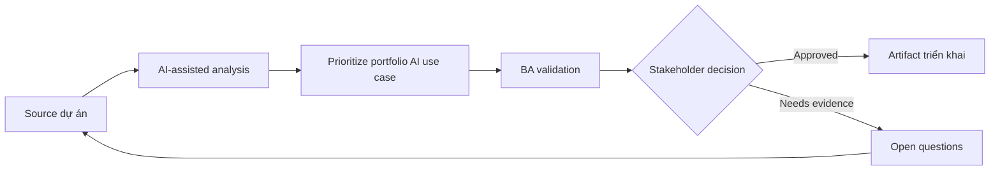

# Prioritize portfolio AI use case

<div class="case-meta">
  <span>Governance and adoption</span>
  <span>Portfolio management</span>
  <span>Use case dự án</span>
</div>

## Project context

Leadership có list dài AI idea: meeting summary, requirements drafting, policy assistant, ticket triage, document extraction, sales recommendation và customer chatbot. Team cần cách prioritize hợp lý. Trong môi trường delivery thật, tình huống này thường xuất hiện dưới áp lực thời gian: stakeholder cần clarity, delivery cần backlog, QA cần behavior test được, operations cần process chịu được exception. BA dùng AI để tăng tốc analysis và synthesis, nhưng BA vẫn chịu trách nhiệm về evidence, business meaning, stakeholder decisioning và artifact quality.

## BA challenge

BA lead phải compare idea theo business value, feasibility, data readiness, risk, user impact, governance cost và measurement clarity. AI có thể structure portfolio, nhưng prioritization vẫn là business decision. Khó khăn thực tế là AI có thể làm material ban đầu trông hoàn chỉnh hơn mức thật sự. BA giỏi giữ output ở trạng thái reviewable bằng cách tách source-backed fact, assumption, unsupported claim, decision gap và recommended next action. Mục tiêu không phải làm document dài hơn; mục tiêu là làm project decision rõ hơn và an toàn hơn.

## Where AI fits

<div class="ba-workbench-panel">
AI hữu ích trong use case này khi được giới hạn vào analysis support, pattern detection, structured drafting và critique. AI không được approve scope, invent policy, quyết định business trade-off hoặc thay thế judgment của stakeholder chịu trách nhiệm.
</div>

- Classify idea theo AI pattern và problem type.
- Generate value-risk-feasibility scoring criteria.
- Identify missing data, control và evaluation need.
- Draft pilot roadmap option và decision memo.

## Inputs to prepare

- AI idea backlog
- Business goals
- Data readiness notes
- Risk policy
- Delivery capacity

BA nên label các input này trước khi dùng AI: source owner, source date, approval status, sensitivity level, và source đó là fact, opinion, policy, draft hay historical evidence. Việc chuẩn bị này ngăn model xem mọi input đều current và authoritative như nhau.

## BA workflow

1. Normalize từng idea thành problem, user, decision, outcome và AI pattern.
2. Yêu cầu AI score từng idea bằng criteria transparent và evidence gap.
3. Review score với business, technology, data, security và operations stakeholder.
4. Tách quick win khỏi high-risk strategic bet.
5. Define pilot có success metric, control và owner.
6. Publish portfolio roadmap có rationale và rejected idea.

Workflow hiệu quả nhất khi dùng AI theo từng stage: trước hết organize evidence, sau đó yêu cầu analysis, tiếp theo tạo artifact, rồi chạy critique pass. BA nên giữ decision log visible xuyên suốt để suggestion do AI sinh ra không âm thầm trở thành approved scope.

## Diagram



## Deliverables

| Deliverable | Nội dung | Owner | Done signal |
| --- | --- | --- | --- |
| Use-case scoring matrix | Idea, value, feasibility, data readiness, risk, governance cost và score | BA lead | Score explainable |
| AI pattern classification | GenAI, RAG, predictive AI, rules automation hoặc hybrid | BA | Solution category fit problem |
| Pilot roadmap | Use case, phase, owner, metric, control và decision gate | Sponsor | Pilot evaluate được |
| Decision memo | Recommendation, trade-off, rejected idea và evidence gap | Leadership | Portfolio choice explicit |

Các deliverable này nên được xem là artifact do BA own. AI có thể draft, nhưng BA phải validate source support, stakeholder meaning, traceability và artifact đã sẵn sàng handoff hay chưa.

## Prompt to try

```text
Hãy đóng vai senior Business Analyst hiểu AI. Hỗ trợ tôi áp dụng use case "Prioritize portfolio AI use case" vào dự án. Trước hết hỏi source evidence và constraint. Sau đó tạo structured analysis gồm project context, assumption, AI-fit boundary, workflow step, deliverable, risk, control, open question và stakeholder decision. Không tự bịa policy, threshold hoặc approval.
```

## Review checklist

- Mọi statement do AI hỗ trợ đều gắn với source, assumption hoặc validation question.
- BA đã tách drafting assistance khỏi business approval.
- Workflow step có human owner cho decision, review và exception.
- Deliverable trace được về project input và review được bởi QA, product hoặc operations.
- Risk control đủ thực tế để dùng trong meeting dự án thật.
- Success metric: Leadership fund AI pilot dựa trên value, feasibility, data readiness và risk, không phải hype.

## Risks and controls

| Rủi ro | Vì sao quan trọng | Control của BA |
| --- | --- | --- |
| Hype prioritization | Idea thắng vì nghe innovative | Dùng transparent scoring và evidence gap |
| Data readiness blind spot | Idea high-value có thể fail vì thiếu usable data | Score data availability và ownership |
| Risk underestimation | Customer-facing AI cần nhiều control hơn | Include governance cost và harm potential |
| Pilot sprawl | Quá nhiều pilot làm loãng learning | Limit pilot và define decision gate |

Control quan trọng nhất là làm uncertainty visible. Nếu evidence yếu, output nên tạo validation question hoặc decision item, không phải final requirement. Nếu artifact ảnh hưởng delivery, release, compliance, customer experience hoặc operational workload, BA nên yêu cầu human review explicit trước khi handoff.
