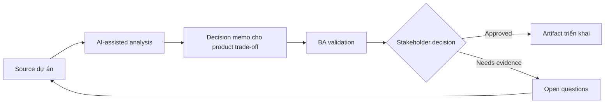

# Decision memo cho product trade-off

<div class="case-meta">
  <span>Cross-functional BA Collaboration</span>
  <span>Product decisions</span>
  <span>Use case dự án</span>
</div>

## Project context

Product owner phải chọn giữa release nhanh có manual review, delay release để full automation hoặc partial rollout cho segment user nhỏ hơn. Trong Product decisions, công việc này thường bắt đầu khi mỗi role cần artifact khác nhau, nhưng BA phải giữ decision nhất quán giữa product, design, engineering, QA, data và operations. BA nên xem Decision options và Delivery estimates là evidence cần organize, không phải raw material để AI trả lời không kiểm soát. Mục tiêu là làm decision tiếp theo rõ hơn cho người own outcome.

## BA challenge

BA phải present trade-off rõ qua user value, delivery cost, risk, operational effort, compliance và learning value. AI có thể structure option, nhưng decision thuộc stakeholder accountable. Với Decision memo cho product trade-off, khó khăn thực tế là role misalignment và hidden trade-off. AI có thể tăng tốc role-specific synthesis, decision memo drafting, conflict surfacing và shared artifact critique, nhưng BA vẫn phải làm rõ assumption, approval còn thiếu và điểm cần stakeholder judgment.

## Where AI fits

<div class="ba-workbench-panel">
AI phù hợp với use case Collaboration cross-functional của BA khi được giới hạn vào role-specific synthesis, decision memo drafting, conflict surfacing và shared artifact critique. AI task hữu ích đầu tiên là: Generate decision option và trade-off dimension. AI không được approve scope, invent policy, bỏ qua role feedback, decision log, design note, technical constraint, test concern và support need, hoặc biến draft thành final decision.
</div>

- Generate decision option và trade-off dimension.
- Draft impact analysis qua product, engineering, QA, operations và compliance.
- Identify missing evidence và assumption.
- Tạo recommendation memo ngắn gọn.

## Inputs to prepare

- Decision options
- Delivery estimates
- Risk register
- User impact notes
- Operational constraints

Trước khi prompt cho Decision memo cho product trade-off, hãy label từng input theo owner, date, approval status, sensitivity và vai trò trong decision. Evidence lens quan trọng nhất là role feedback, decision log, design note, technical constraint, test concern và support need; nếu thiếu, AI có thể xem old note, draft design và approved rule có authority như nhau.

## BA workflow

1. Define decision và option bằng neutral language.
2. Yêu cầu AI build comparison dimension và missing evidence list.
3. Điền evidence từ project source và mark assumption.
4. Review impact với functional owner.
5. Draft recommendation và rejected alternative.
6. Record decision, rationale, owner và follow-up measure.

Chạy workflow như cross-role decision alignment trước handoff: bắt đầu với "Define decision và option bằng neutral language.", sau đó giữ decision log visible khi artifact tiến tới Decision memo. Cách này ngăn suggestion của AI âm thầm trở thành backlog, design, release hoặc operational commitment.

## Diagram



## Deliverables

| Deliverable | Nội dung | Owner | Done signal |
| --- | --- | --- | --- |
| Decision memo | Decision, option, evidence, trade-off, recommendation và owner | BA | Decision rõ |
| Trade-off matrix | Option, user value, cost, risk, operations, compliance và learning | Product owner | Option comparable |
| Assumption list | Assumption, confidence, validation action và owner | BA | Uncertainty visible |
| Decision log update | Chosen option, rationale, date, owner và follow-up metric | Product owner | Decision traceable |

Hãy xem Decision memo là collaboration decision artifact do BA own. AI có thể draft structure, nhưng BA phải validate "Decision rõ" có thật sự đúng không, artifact có trace được về evidence không và receiving team có hành động được không.

## Prompt to try

```text
Hãy đóng vai senior Business Analyst hiểu AI. Hỗ trợ tôi áp dụng use case "Decision memo cho product trade-off" vào dự án. Trước hết hỏi source evidence và constraint. Sau đó tạo structured analysis gồm project context, assumption, AI-fit boundary, workflow step, deliverable, risk, control, open question và stakeholder decision. Không tự bịa policy, threshold hoặc approval.
```

## Review checklist

- Decision options được label owner, date, approval status và sensitivity.
- Decision memo trace được về source evidence và có human owner rõ.
- AI task nằm trong boundary role-specific synthesis, decision memo drafting, conflict surfacing và shared artifact critique và không approve scope hoặc policy.
- Risk "Biased recommendation" có control thực tế: Tách evidence và assumption.
- Open assumption được chuyển thành validation question hoặc stakeholder decision.
- Success metric: Product trade-off trở nên explicit, evidence-backed và trace được tới follow-up metric.

## Risks and controls

| Rủi ro | Vì sao quan trọng | Control của BA |
| --- | --- | --- |
| Biased recommendation | AI hoặc BA favor một option thiếu evidence | Tách evidence và assumption |
| Hidden operations cost | Manual review burden team | Include operations impact |
| Compliance blind spot | Fast release tạo control gap | Review với compliance owner |
| Decision drift | Team quên vì sao chọn option | Record rationale và metric |

Control chính cho risk "Biased recommendation" là human accountability explicit: Tách evidence và assumption. Nếu evidence yếu, output nên tạo validation question hoặc decision item, không phải final requirement.
