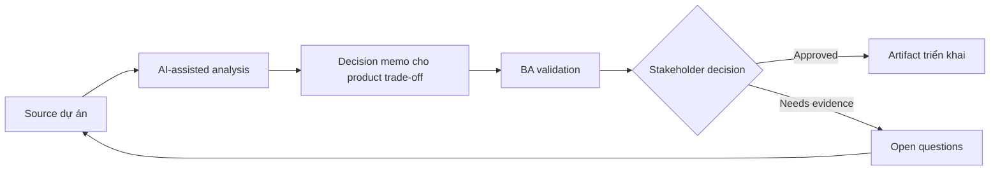

# Decision memo cho product trade-off

<div class="case-meta">
  <span>Cross-functional BA Collaboration</span>
  <span>Product decisions</span>
  <span>Use case dự án</span>
</div>

## Project context

Product owner phải chọn giữa release nhanh có manual review, delay release để full automation hoặc partial rollout cho segment user nhỏ hơn. Trong môi trường delivery thật, tình huống này thường xuất hiện dưới áp lực thời gian: stakeholder cần clarity, delivery cần backlog, QA cần behavior test được, operations cần process chịu được exception. BA dùng AI để tăng tốc analysis và synthesis, nhưng BA vẫn chịu trách nhiệm về evidence, business meaning, stakeholder decisioning và artifact quality.

## BA challenge

BA phải present trade-off rõ qua user value, delivery cost, risk, operational effort, compliance và learning value. AI có thể structure option, nhưng decision thuộc stakeholder accountable. Khó khăn thực tế là AI có thể làm material ban đầu trông hoàn chỉnh hơn mức thật sự. BA giỏi giữ output ở trạng thái reviewable bằng cách tách source-backed fact, assumption, unsupported claim, decision gap và recommended next action. Mục tiêu không phải làm document dài hơn; mục tiêu là làm project decision rõ hơn và an toàn hơn.

## Where AI fits

<div class="ba-workbench-panel">
AI hữu ích trong use case này khi được giới hạn vào analysis support, pattern detection, structured drafting và critique. AI không được approve scope, invent policy, quyết định business trade-off hoặc thay thế judgment của stakeholder chịu trách nhiệm.
</div>

- Generate decision option và trade-off dimension.
- Draft impact analysis qua product, engineering, QA, operations và compliance.
- Identify missing evidence và assumption.
- Tạo recommendation memo ngắn gọn.

## Inputs to prepare

- Decision options
- Delivery estimates
- Risk register
- User impact notes
- Operational constraints

BA nên label các input này trước khi dùng AI: source owner, source date, approval status, sensitivity level, và source đó là fact, opinion, policy, draft hay historical evidence. Việc chuẩn bị này ngăn model xem mọi input đều current và authoritative như nhau.

## BA workflow

1. Define decision và option bằng neutral language.
2. Yêu cầu AI build comparison dimension và missing evidence list.
3. Điền evidence từ project source và mark assumption.
4. Review impact với functional owner.
5. Draft recommendation và rejected alternative.
6. Record decision, rationale, owner và follow-up measure.

Workflow hiệu quả nhất khi dùng AI theo từng stage: trước hết organize evidence, sau đó yêu cầu analysis, tiếp theo tạo artifact, rồi chạy critique pass. BA nên giữ decision log visible xuyên suốt để suggestion do AI sinh ra không âm thầm trở thành approved scope.

## Diagram



## Deliverables

| Deliverable | Nội dung | Owner | Done signal |
| --- | --- | --- | --- |
| Decision memo | Decision, option, evidence, trade-off, recommendation và owner | BA | Decision rõ |
| Trade-off matrix | Option, user value, cost, risk, operations, compliance và learning | Product owner | Option comparable |
| Assumption list | Assumption, confidence, validation action và owner | BA | Uncertainty visible |
| Decision log update | Chosen option, rationale, date, owner và follow-up metric | Product owner | Decision traceable |

Các deliverable này nên được xem là artifact do BA own. AI có thể draft, nhưng BA phải validate source support, stakeholder meaning, traceability và artifact đã sẵn sàng handoff hay chưa.

## Prompt to try

```text
Hãy đóng vai senior Business Analyst hiểu AI. Hỗ trợ tôi áp dụng use case "Decision memo cho product trade-off" vào dự án. Trước hết hỏi source evidence và constraint. Sau đó tạo structured analysis gồm project context, assumption, AI-fit boundary, workflow step, deliverable, risk, control, open question và stakeholder decision. Không tự bịa policy, threshold hoặc approval.
```

## Review checklist

- Mọi statement do AI hỗ trợ đều gắn với source, assumption hoặc validation question.
- BA đã tách drafting assistance khỏi business approval.
- Workflow step có human owner cho decision, review và exception.
- Deliverable trace được về project input và review được bởi QA, product hoặc operations.
- Risk control đủ thực tế để dùng trong meeting dự án thật.
- Success metric: Product trade-off trở nên explicit, evidence-backed và trace được tới follow-up metric.

## Risks and controls

| Rủi ro | Vì sao quan trọng | Control của BA |
| --- | --- | --- |
| Biased recommendation | AI hoặc BA favor một option thiếu evidence | Tách evidence và assumption |
| Hidden operations cost | Manual review burden team | Include operations impact |
| Compliance blind spot | Fast release tạo control gap | Review với compliance owner |
| Decision drift | Team quên vì sao chọn option | Record rationale và metric |

Control quan trọng nhất là làm uncertainty visible. Nếu evidence yếu, output nên tạo validation question hoặc decision item, không phải final requirement. Nếu artifact ảnh hưởng delivery, release, compliance, customer experience hoặc operational workload, BA nên yêu cầu human review explicit trước khi handoff.
