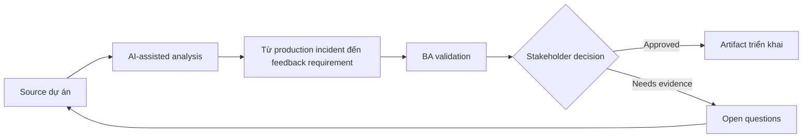

# Từ production incident đến feedback requirement

<div class="case-meta">
  <span>Delivery and QA</span>
  <span>Continuous improvement</span>
  <span>Use case dự án</span>
</div>

## Project context

Sau launch, customer report notification preference hoạt động bất ngờ khi account ownership thay đổi. Support ticket cho thấy confusion, engineering thấy code không defect, product nghi requirement miss ownership scenario. Trong môi trường delivery thật, tình huống này thường xuất hiện dưới áp lực thời gian: stakeholder cần clarity, delivery cần backlog, QA cần behavior test được, operations cần process chịu được exception. BA dùng AI để tăng tốc analysis và synthesis, nhưng BA vẫn chịu trách nhiệm về evidence, business meaning, stakeholder decisioning và artifact quality.

## BA challenge

BA phải chuyển production signal thành requirement learning. AI có thể summarize incident và ticket, nhưng BA phải tách defect, requirement gap, UX confusion, data issue và training need trước khi đổi backlog scope. Khó khăn thực tế là AI có thể làm material ban đầu trông hoàn chỉnh hơn mức thật sự. BA giỏi giữ output ở trạng thái reviewable bằng cách tách source-backed fact, assumption, unsupported claim, decision gap và recommended next action. Mục tiêu không phải làm document dài hơn; mục tiêu là làm project decision rõ hơn và an toàn hơn.

## Where AI fits

<div class="ba-workbench-panel">
AI hữu ích trong use case này khi được giới hạn vào analysis support, pattern detection, structured drafting và critique. AI không được approve scope, invent policy, quyết định business trade-off hoặc thay thế judgment của stakeholder chịu trách nhiệm.
</div>

- Cluster incident theo user journey và symptom.
- Map incident với requirement, criteria và release decision.
- Identify missing scenario và ambiguous wording.
- Draft backlog update và stakeholder validation question.

## Inputs to prepare

- Incident report
- Support tickets
- Release requirements
- Audit logs
- User journey notes

BA nên label các input này trước khi dùng AI: source owner, source date, approval status, sensitivity level, và source đó là fact, opinion, policy, draft hay historical evidence. Việc chuẩn bị này ngăn model xem mọi input đều current và authoritative như nhau.

## BA workflow

1. Collect incident evidence và giữ customer example.
2. Yêu cầu AI cluster symptom và map tới original requirement.
3. Review behavior có match requirement, test và user expectation không.
4. Classify từng finding là defect, requirement gap, UX confusion, data issue hoặc training need.
5. Draft backlog change có impact và evidence.
6. Update lessons learned và prevention checklist.

Workflow hiệu quả nhất khi dùng AI theo từng stage: trước hết organize evidence, sau đó yêu cầu analysis, tiếp theo tạo artifact, rồi chạy critique pass. BA nên giữ decision log visible xuyên suốt để suggestion do AI sinh ra không âm thầm trở thành approved scope.

## Diagram



## Deliverables

| Deliverable | Nội dung | Owner | Done signal |
| --- | --- | --- | --- |
| Incident synthesis | Symptom, affected user, evidence và journey step | BA | Pattern source-backed |
| Requirement gap analysis | Original requirement, missing scenario, impact và proposed update | BA | Gap actionable |
| Backlog update pack | Story, acceptance criteria, test note và priority | Product owner | Update gồm evidence và severity |
| Prevention checklist | Question cần hỏi trong refinement tương lai | BA practice | Learning đi vào future analysis |

Các deliverable này nên được xem là artifact do BA own. AI có thể draft, nhưng BA phải validate source support, stakeholder meaning, traceability và artifact đã sẵn sàng handoff hay chưa.

## Prompt to try

```text
Hãy đóng vai senior Business Analyst hiểu AI. Hỗ trợ tôi áp dụng use case "Từ production incident đến feedback requirement" vào dự án. Trước hết hỏi source evidence và constraint. Sau đó tạo structured analysis gồm project context, assumption, AI-fit boundary, workflow step, deliverable, risk, control, open question và stakeholder decision. Không tự bịa policy, threshold hoặc approval.
```

## Review checklist

- Mọi statement do AI hỗ trợ đều gắn với source, assumption hoặc validation question.
- BA đã tách drafting assistance khỏi business approval.
- Workflow step có human owner cho decision, review và exception.
- Deliverable trace được về project input và review được bởi QA, product hoặc operations.
- Risk control đủ thực tế để dùng trong meeting dự án thật.
- Success metric: Production incident trở thành backlog improvement có evidence và câu hỏi requirement tốt hơn trong tương lai.

## Risks and controls

| Rủi ro | Vì sao quan trọng | Control của BA |
| --- | --- | --- |
| Ticket summary bias | AI có thể flatten customer-specific context | Giữ representative example và source ID |
| Wrong category | Requirement gap có thể bị xem là code defect | So sánh actual behavior với approved requirement |
| Overreaction | Issue hiếm có thể kéo scope quá lớn | Dùng frequency, severity và user impact |
| Lost learning | Fix xảy ra nhưng BA process không cải thiện | Thêm prevention question vào refinement checklist |

Control quan trọng nhất là làm uncertainty visible. Nếu evidence yếu, output nên tạo validation question hoặc decision item, không phải final requirement. Nếu artifact ảnh hưởng delivery, release, compliance, customer experience hoặc operational workload, BA nên yêu cầu human review explicit trước khi handoff.
