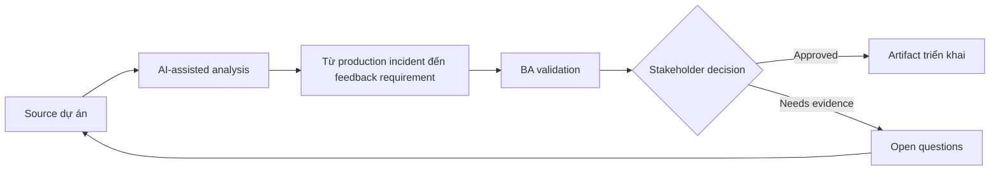

# Từ production incident đến feedback requirement

<div class="case-meta">
  <span>Delivery and QA</span>
  <span>Continuous improvement</span>
  <span>Delivery validation</span>
  <span>Core</span>
  <span>Incident synthesis</span>
  <span>Use case dự án</span>
</div>

## Project context

Sau launch, customer report notification preference hoạt động bất ngờ khi account ownership thay đổi. Support ticket cho thấy confusion, engineering thấy code không defect, product nghi requirement miss ownership scenario. Trong Continuous improvement, công việc này thường bắt đầu khi delivery decision, test evidence và release readiness phải còn nối với intent ban đầu. BA nên xem Incident report và Support tickets là evidence cần organize, không phải raw material để AI trả lời không kiểm soát. Mục tiêu là làm decision tiếp theo rõ hơn cho người own outcome.

## BA challenge

BA phải chuyển production signal thành requirement learning. AI có thể summarize incident và ticket, nhưng BA phải tách defect, requirement gap, UX confusion, data issue và training need trước khi đổi backlog scope. Với Từ production incident đến feedback requirement, khó khăn thực tế là optimistic status và late requirement discovery. AI có thể tăng tốc scenario generation, defect triage support, readiness synthesis và risk surfacing, nhưng BA vẫn phải làm rõ assumption, approval còn thiếu và điểm cần stakeholder judgment.

## Where AI fits

<div class="ba-workbench-panel">
AI phù hợp với use case Delivery và QA khi được giới hạn vào scenario generation, defect triage support, readiness synthesis và risk surfacing. AI task hữu ích đầu tiên là: Cluster incident theo user journey và symptom. AI không được approve scope, invent policy, bỏ qua requirement baseline, test result, defect history và release decision, hoặc biến draft thành final decision.
</div>

- Cluster incident theo user journey và symptom.
- Map incident với requirement, criteria và release decision.
- Identify missing scenario và ambiguous wording.
- Draft backlog update và stakeholder validation question.

## Inputs to prepare

- Incident report
- Support tickets
- Release requirements
- Audit logs
- User journey notes

Trước khi prompt cho Từ production incident đến feedback requirement, hãy label từng input theo owner, date, approval status, sensitivity và vai trò trong decision. Evidence lens quan trọng nhất là requirement baseline, test result, defect history và release decision; nếu thiếu, AI có thể xem old note, draft design và approved rule có authority như nhau.

## BA workflow

1. Collect incident evidence và giữ customer example.
2. Yêu cầu AI cluster symptom và map tới original requirement.
3. Review behavior có match requirement, test và user expectation không.
4. Classify từng finding là defect, requirement gap, UX confusion, data issue hoặc training need.
5. Draft backlog change có impact và evidence.
6. Update lessons learned và prevention checklist.

Chạy workflow như quality review trước release hoặc rework decision: bắt đầu với "Collect incident evidence và giữ customer example.", sau đó giữ decision log visible khi artifact tiến tới Incident synthesis. Cách này ngăn suggestion của AI âm thầm trở thành backlog, design, release hoặc operational commitment.

## Diagram



## Deliverables

| Deliverable | Nội dung | Owner | Done signal |
| --- | --- | --- | --- |
| Incident synthesis | Symptom, affected user, evidence và journey step | BA | Pattern source-backed |
| Requirement gap analysis | Original requirement, missing scenario, impact và proposed update | BA | Gap actionable |
| Backlog update pack | Story, acceptance criteria, test note và priority | Product owner | Update gồm evidence và severity |
| Prevention checklist | Question cần hỏi trong refinement tương lai | BA practice | Learning đi vào future analysis |

Hãy xem Incident synthesis là QA và delivery handoff artifact do BA own. AI có thể draft structure, nhưng BA phải validate "Pattern source-backed" có thật sự đúng không, artifact có trace được về evidence không và receiving team có hành động được không.

## Prompt to try

```text
Hãy đóng vai senior Business Analyst hiểu AI. Hỗ trợ tôi áp dụng use case "Từ production incident đến feedback requirement" vào dự án. Trước hết hỏi source evidence và constraint. Sau đó tạo structured analysis gồm project context, assumption, AI-fit boundary, workflow step, deliverable, risk, control, open question và stakeholder decision. Không tự bịa policy, threshold hoặc approval.
```

## Review checklist

- Incident report được label owner, date, approval status và sensitivity.
- Incident synthesis trace được về source evidence và có human owner rõ.
- AI task nằm trong boundary scenario generation, defect triage support, readiness synthesis và risk surfacing và không approve scope hoặc policy.
- Risk "Ticket summary bias" có control thực tế: Giữ representative example và source ID.
- Open assumption được chuyển thành validation question hoặc stakeholder decision.
- Success metric: Production incident trở thành backlog improvement có evidence và câu hỏi requirement tốt hơn trong tương lai.

## Risks and controls

| Rủi ro | Vì sao quan trọng | Control của BA |
| --- | --- | --- |
| Ticket summary bias | AI có thể flatten customer-specific context | Giữ representative example và source ID |
| Wrong category | Requirement gap có thể bị xem là code defect | So sánh actual behavior với approved requirement |
| Overreaction | Issue hiếm có thể kéo scope quá lớn | Dùng frequency, severity và user impact |
| Lost learning | Fix xảy ra nhưng BA process không cải thiện | Thêm prevention question vào refinement checklist |

Control chính cho risk "Ticket summary bias" là human accountability explicit: Giữ representative example và source ID. Nếu evidence yếu, output nên tạo validation question hoặc decision item, không phải final requirement.
