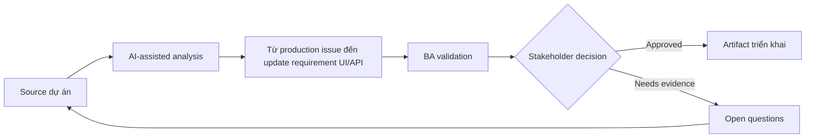

# Từ production issue đến update requirement UI/API

<div class="case-meta">
  <span>Cross-functional BA Collaboration</span>
  <span>Production feedback</span>
  <span>Use case dự án</span>
</div>

## Project context

Sau release, user report nút save trông như success dù backend reject một field. Issue liên quan UI messaging, API error behavior, validation và support script. Trong môi trường delivery thật, tình huống này thường xuất hiện dưới áp lực thời gian: stakeholder cần clarity, delivery cần backlog, QA cần behavior test được, operations cần process chịu được exception. BA dùng AI để tăng tốc analysis và synthesis, nhưng BA vẫn chịu trách nhiệm về evidence, business meaning, stakeholder decisioning và artifact quality.

## BA challenge

BA phải chuyển production evidence thành requirement update qua UI và API. Đây không chỉ là fix bug; mà là clarify expected behavior và ngăn ambiguity lặp lại. Khó khăn thực tế là AI có thể làm material ban đầu trông hoàn chỉnh hơn mức thật sự. BA giỏi giữ output ở trạng thái reviewable bằng cách tách source-backed fact, assumption, unsupported claim, decision gap và recommended next action. Mục tiêu không phải làm document dài hơn; mục tiêu là làm project decision rõ hơn và an toàn hơn.

## Where AI fits

<div class="ba-workbench-panel">
AI hữu ích trong use case này khi được giới hạn vào analysis support, pattern detection, structured drafting và critique. AI không được approve scope, invent policy, quyết định business trade-off hoặc thay thế judgment của stakeholder chịu trách nhiệm.
</div>

- Cluster incident evidence và identify affected requirement area.
- Draft gap analysis UI/API behavior.
- Generate updated acceptance criteria và regression scenario.
- Tạo question cho support communication và release note.

## Inputs to prepare

- Production issue reports
- API logs
- Original story
- Support tickets
- Current UI behavior

BA nên label các input này trước khi dùng AI: source owner, source date, approval status, sensitivity level, và source đó là fact, opinion, policy, draft hay historical evidence. Việc chuẩn bị này ngăn model xem mọi input đều current và authoritative như nhau.

## BA workflow

1. Collect evidence từ support, log, user và reproduction step.
2. Yêu cầu AI map issue tới UI behavior, API error, validation và test gap.
3. Classify là defect, requirement gap hoặc cả hai.
4. Draft updated UI/API requirement và acceptance criteria.
5. Review với frontend, backend, QA, support và product.
6. Update backlog, regression suite và support script.

Workflow hiệu quả nhất khi dùng AI theo từng stage: trước hết organize evidence, sau đó yêu cầu analysis, tiếp theo tạo artifact, rồi chạy critique pass. BA nên giữ decision log visible xuyên suốt để suggestion do AI sinh ra không âm thầm trở thành approved scope.

## Diagram



## Deliverables

| Deliverable | Nội dung | Owner | Done signal |
| --- | --- | --- | --- |
| Issue-to-requirement analysis | Evidence, affected behavior, root cause type và requirement gap | BA | Problem framed rõ |
| Updated UI/API behavior spec | Expected UI state, API error, validation, copy và support path | BA và engineers | Behavior aligned |
| Regression scenarios | Original failure, related edge case và expected result | QA | Issue không recur |
| Support update | Known issue, customer explanation, workaround và fix status | Support | Support respond consistent |

Các deliverable này nên được xem là artifact do BA own. AI có thể draft, nhưng BA phải validate source support, stakeholder meaning, traceability và artifact đã sẵn sàng handoff hay chưa.

## Prompt to try

```text
Hãy đóng vai senior Business Analyst hiểu AI. Hỗ trợ tôi áp dụng use case "Từ production issue đến update requirement UI/API" vào dự án. Trước hết hỏi source evidence và constraint. Sau đó tạo structured analysis gồm project context, assumption, AI-fit boundary, workflow step, deliverable, risk, control, open question và stakeholder decision. Không tự bịa policy, threshold hoặc approval.
```

## Review checklist

- Mọi statement do AI hỗ trợ đều gắn với source, assumption hoặc validation question.
- BA đã tách drafting assistance khỏi business approval.
- Workflow step có human owner cho decision, review và exception.
- Deliverable trace được về project input và review được bởi QA, product hoặc operations.
- Risk control đủ thực tế để dùng trong meeting dự án thật.
- Success metric: Production issue trở thành UI/API requirement rõ hơn và regression coverage mạnh hơn.

## Risks and controls

| Rủi ro | Vì sao quan trọng | Control của BA |
| --- | --- | --- |
| Bug-only fix | Team patch code nhưng không clarify requirement | Update UI/API behavior spec |
| Evidence loss | Production context có thể biến mất | Preserve log và user example |
| Regression miss | Related state vẫn broken | Add regression scenario |
| Support inconsistency | Agent explain issue khác nhau | Update support script |

Control quan trọng nhất là làm uncertainty visible. Nếu evidence yếu, output nên tạo validation question hoặc decision item, không phải final requirement. Nếu artifact ảnh hưởng delivery, release, compliance, customer experience hoặc operational workload, BA nên yêu cầu human review explicit trước khi handoff.
