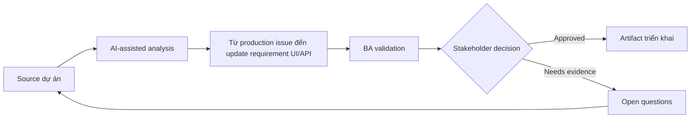

# Từ production issue đến update requirement UI/API

<div class="case-meta">
  <span>Cross-functional BA Collaboration</span>
  <span>Production feedback</span>
  <span>Use case dự án</span>
</div>

## Project context

Sau release, user report nút save trông như success dù backend reject một field. Issue liên quan UI messaging, API error behavior, validation và support script. Trong Production feedback, công việc này thường bắt đầu khi mỗi role cần artifact khác nhau, nhưng BA phải giữ decision nhất quán giữa product, design, engineering, QA, data và operations. BA nên xem Production issue reports và API logs là evidence cần organize, không phải raw material để AI trả lời không kiểm soát. Mục tiêu là làm decision tiếp theo rõ hơn cho người own outcome.

## BA challenge

BA phải chuyển production evidence thành requirement update qua UI và API. Đây không chỉ là fix bug; mà là clarify expected behavior và ngăn ambiguity lặp lại. Với Từ production issue đến update requirement UI/API, khó khăn thực tế là role misalignment và hidden trade-off. AI có thể tăng tốc role-specific synthesis, decision memo drafting, conflict surfacing và shared artifact critique, nhưng BA vẫn phải làm rõ assumption, approval còn thiếu và điểm cần stakeholder judgment.

## Where AI fits

<div class="ba-workbench-panel">
AI phù hợp với use case Collaboration cross-functional của BA khi được giới hạn vào role-specific synthesis, decision memo drafting, conflict surfacing và shared artifact critique. AI task hữu ích đầu tiên là: Cluster incident evidence và identify affected requirement area. AI không được approve scope, invent policy, bỏ qua role feedback, decision log, design note, technical constraint, test concern và support need, hoặc biến draft thành final decision.
</div>

- Cluster incident evidence và identify affected requirement area.
- Draft gap analysis UI/API behavior.
- Generate updated acceptance criteria và regression scenario.
- Tạo question cho support communication và release note.

## Inputs to prepare

- Production issue reports
- API logs
- Original story
- Support tickets
- Current UI behavior

Trước khi prompt cho Từ production issue đến update requirement UI/API, hãy label từng input theo owner, date, approval status, sensitivity và vai trò trong decision. Evidence lens quan trọng nhất là role feedback, decision log, design note, technical constraint, test concern và support need; nếu thiếu, AI có thể xem old note, draft design và approved rule có authority như nhau.

## BA workflow

1. Collect evidence từ support, log, user và reproduction step.
2. Yêu cầu AI map issue tới UI behavior, API error, validation và test gap.
3. Classify là defect, requirement gap hoặc cả hai.
4. Draft updated UI/API requirement và acceptance criteria.
5. Review với frontend, backend, QA, support và product.
6. Update backlog, regression suite và support script.

Chạy workflow như cross-role decision alignment trước handoff: bắt đầu với "Collect evidence từ support, log, user và reproduction step.", sau đó giữ decision log visible khi artifact tiến tới Issue-to-requirement analysis. Cách này ngăn suggestion của AI âm thầm trở thành backlog, design, release hoặc operational commitment.

## Diagram



## Deliverables

| Deliverable | Nội dung | Owner | Done signal |
| --- | --- | --- | --- |
| Issue-to-requirement analysis | Evidence, affected behavior, root cause type và requirement gap | BA | Problem framed rõ |
| Updated UI/API behavior spec | Expected UI state, API error, validation, copy và support path | BA và engineers | Behavior aligned |
| Regression scenarios | Original failure, related edge case và expected result | QA | Issue không recur |
| Support update | Known issue, customer explanation, workaround và fix status | Support | Support respond consistent |

Hãy xem Issue-to-requirement analysis là collaboration decision artifact do BA own. AI có thể draft structure, nhưng BA phải validate "Problem framed rõ" có thật sự đúng không, artifact có trace được về evidence không và receiving team có hành động được không.

## Prompt to try

```text
Hãy đóng vai senior Business Analyst hiểu AI. Hỗ trợ tôi áp dụng use case "Từ production issue đến update requirement UI/API" vào dự án. Trước hết hỏi source evidence và constraint. Sau đó tạo structured analysis gồm project context, assumption, AI-fit boundary, workflow step, deliverable, risk, control, open question và stakeholder decision. Không tự bịa policy, threshold hoặc approval.
```

## Review checklist

- Production issue reports được label owner, date, approval status và sensitivity.
- Issue-to-requirement analysis trace được về source evidence và có human owner rõ.
- AI task nằm trong boundary role-specific synthesis, decision memo drafting, conflict surfacing và shared artifact critique và không approve scope hoặc policy.
- Risk "Bug-only fix" có control thực tế: Update UI/API behavior spec.
- Open assumption được chuyển thành validation question hoặc stakeholder decision.
- Success metric: Production issue trở thành UI/API requirement rõ hơn và regression coverage mạnh hơn.

## Risks and controls

| Rủi ro | Vì sao quan trọng | Control của BA |
| --- | --- | --- |
| Bug-only fix | Team patch code nhưng không clarify requirement | Update UI/API behavior spec |
| Evidence loss | Production context có thể biến mất | Preserve log và user example |
| Regression miss | Related state vẫn broken | Add regression scenario |
| Support inconsistency | Agent explain issue khác nhau | Update support script |

Control chính cho risk "Bug-only fix" là human accountability explicit: Update UI/API behavior spec. Nếu evidence yếu, output nên tạo validation question hoặc decision item, không phải final requirement.
