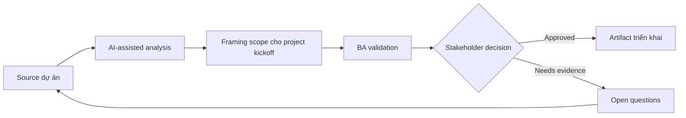

# Framing scope cho project kickoff

<div class="case-meta">
  <span>Discovery and alignment</span>
  <span>Project initiation</span>
  <span>Use case dự án</span>
</div>

## Project context

Một dự án internal platform bắt đầu với mandate rất rộng: hiện đại hóa trải nghiệm request intake. Executive muốn tiến độ nhanh, delivery team cần boundary rõ, operations lo các manual exception hiện tại bị bỏ qua. Trong môi trường delivery thật, tình huống này thường xuất hiện dưới áp lực thời gian: stakeholder cần clarity, delivery cần backlog, QA cần behavior test được, operations cần process chịu được exception. BA dùng AI để tăng tốc analysis và synthesis, nhưng BA vẫn chịu trách nhiệm về evidence, business meaning, stakeholder decisioning và artifact quality.

## BA challenge

BA phải chuyển mandate mơ hồ thành problem statement chung, outcome đo được, scope in, scope out, assumption, dependency và decision criteria cho release đầu. AI có thể giúp draft structure, nhưng BA phải ngăn AI tự bịa strategy. Khó khăn thực tế là AI có thể làm material ban đầu trông hoàn chỉnh hơn mức thật sự. BA giỏi giữ output ở trạng thái reviewable bằng cách tách source-backed fact, assumption, unsupported claim, decision gap và recommended next action. Mục tiêu không phải làm document dài hơn; mục tiêu là làm project decision rõ hơn và an toàn hơn.

## Where AI fits

<div class="ba-workbench-panel">
AI hữu ích trong use case này khi được giới hạn vào analysis support, pattern detection, structured drafting và critique. AI không được approve scope, invent policy, quyết định business trade-off hoặc thay thế judgment của stakeholder chịu trách nhiệm.
</div>

- Tạo scope framing canvas từ kickoff notes.
- Identify missing stakeholder, dependency và decision right.
- Draft measurable outcome và anti-goal để thảo luận.
- Tạo assumption backlog được rank theo risk.

## Inputs to prepare

- Kickoff notes
- Executive goals
- Pain point hiện tại
- Known constraints
- Roadmap hoặc budget window ban đầu

BA nên label các input này trước khi dùng AI: source owner, source date, approval status, sensitivity level, và source đó là fact, opinion, policy, draft hay historical evidence. Việc chuẩn bị này ngăn model xem mọi input đều current và authoritative như nhau.

## BA workflow

1. Summarize mandate thành business outcome và user outcome.
2. Yêu cầu AI đề xuất scope boundary và mark assumption.
3. Review từng boundary với owner product, operations, technology và compliance.
4. Chuyển goal mơ hồ thành success indicator đo được.
5. Tạo decision log cho item chưa thể chốt trong kickoff.
6. Publish scope framing artifact một trang trước khi solution design bắt đầu.

Workflow hiệu quả nhất khi dùng AI theo từng stage: trước hết organize evidence, sau đó yêu cầu analysis, tiếp theo tạo artifact, rồi chạy critique pass. BA nên giữ decision log visible xuyên suốt để suggestion do AI sinh ra không âm thầm trở thành approved scope.

## Diagram



## Deliverables

| Deliverable | Nội dung | Owner | Done signal |
| --- | --- | --- | --- |
| Scope framing canvas | Problem statement, outcome, scope in, scope out, assumption và constraint | BA | Stakeholder hiểu rõ phần không included |
| Outcome metric table | Business metric, baseline, target, owner và measurement source | Product owner | Ít nhất một metric đo được trước build |
| Assumption backlog | Assumption chưa validate được rank theo risk và dependency | BA | High-risk assumption có validation action |
| Decision log | Open decision, option, impact, owner và due date | Sponsor | Không major scope item nào thiếu owner |

Các deliverable này nên được xem là artifact do BA own. AI có thể draft, nhưng BA phải validate source support, stakeholder meaning, traceability và artifact đã sẵn sàng handoff hay chưa.

## Prompt to try

```text
Hãy đóng vai senior Business Analyst hiểu AI. Hỗ trợ tôi áp dụng use case "Framing scope cho project kickoff" vào dự án. Trước hết hỏi source evidence và constraint. Sau đó tạo structured analysis gồm project context, assumption, AI-fit boundary, workflow step, deliverable, risk, control, open question và stakeholder decision. Không tự bịa policy, threshold hoặc approval.
```

## Review checklist

- Mọi statement do AI hỗ trợ đều gắn với source, assumption hoặc validation question.
- BA đã tách drafting assistance khỏi business approval.
- Workflow step có human owner cho decision, review và exception.
- Deliverable trace được về project input và review được bởi QA, product hoặc operations.
- Risk control đủ thực tế để dùng trong meeting dự án thật.
- Success metric: Kickoff tạo được scope frame đã agreed để delivery, product và operations dùng cho prioritization.

## Risks and controls

| Rủi ro | Vì sao quan trọng | Control của BA |
| --- | --- | --- |
| Mandate biến thành solution | Team có thể nhảy vào feature trước khi thống nhất outcome | Tách problem, outcome và solution section |
| Scope creep | Mọi thứ liên quan intake có thể bị kéo vào release one | Định nghĩa scope out và anti-goal explicit |
| Metric theater | Success measure nghe hay nhưng không đo được | Ghi baseline và data source cho từng metric |
| Hidden dependency | Manual exception process có thể block launch | Dùng AI để sinh dependency discovery question |

Control quan trọng nhất là làm uncertainty visible. Nếu evidence yếu, output nên tạo validation question hoặc decision item, không phải final requirement. Nếu artifact ảnh hưởng delivery, release, compliance, customer experience hoặc operational workload, BA nên yêu cầu human review explicit trước khi handoff.
