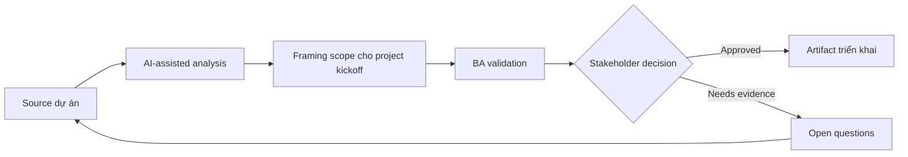

# Framing scope cho project kickoff

<div class="case-meta">
  <span>Discovery and alignment</span>
  <span>Project initiation</span>
  <span>Discovery</span>
  <span>Core</span>
  <span>Scope framing canvas</span>
  <span>Use case dự án</span>
</div>

## Project context

Một dự án internal platform bắt đầu với mandate rất rộng: hiện đại hóa trải nghiệm request intake. Executive muốn tiến độ nhanh, delivery team cần boundary rõ, operations lo các manual exception hiện tại bị bỏ qua. Trong Project initiation, công việc này thường bắt đầu khi stakeholder mô tả cùng một vấn đề từ incentive và mức chi tiết khác nhau. BA nên xem Kickoff notes và Executive goals là evidence cần organize, không phải raw material để AI trả lời không kiểm soát. Mục tiêu là làm decision tiếp theo rõ hơn cho người own outcome.

## BA challenge

BA phải chuyển mandate mơ hồ thành problem statement chung, outcome đo được, scope in, scope out, assumption, dependency và decision criteria cho release đầu. AI có thể giúp draft structure, nhưng BA phải ngăn AI tự bịa strategy. Với Framing scope cho project kickoff, khó khăn thực tế là false consensus và invented scope. AI có thể tăng tốc sensemaking, contradiction detection, question generation và workshop preparation, nhưng BA vẫn phải làm rõ assumption, approval còn thiếu và điểm cần stakeholder judgment.

## Where AI fits

<div class="ba-workbench-panel">
AI phù hợp với use case Discovery và alignment khi được giới hạn vào sensemaking, contradiction detection, question generation và workshop preparation. AI task hữu ích đầu tiên là: Tạo scope framing canvas từ kickoff notes. AI không được approve scope, invent policy, bỏ qua speaker attribution, decision authority và source freshness, hoặc biến draft thành final decision.
</div>

- Tạo scope framing canvas từ kickoff notes.
- Identify missing stakeholder, dependency và decision right.
- Draft measurable outcome và anti-goal để thảo luận.
- Tạo assumption backlog được rank theo risk.

## Inputs to prepare

- Kickoff notes
- Executive goals
- Pain point hiện tại
- Known constraints
- Roadmap hoặc budget window ban đầu

Trước khi prompt cho Framing scope cho project kickoff, hãy label từng input theo owner, date, approval status, sensitivity và vai trò trong decision. Evidence lens quan trọng nhất là speaker attribution, decision authority và source freshness; nếu thiếu, AI có thể xem old note, draft design và approved rule có authority như nhau.

## BA workflow

1. Summarize mandate thành business outcome và user outcome.
2. Yêu cầu AI đề xuất scope boundary và mark assumption.
3. Review từng boundary với owner product, operations, technology và compliance.
4. Chuyển goal mơ hồ thành success indicator đo được.
5. Tạo decision log cho item chưa thể chốt trong kickoff.
6. Publish scope framing artifact một trang trước khi solution design bắt đầu.

Chạy workflow như gom evidence trước khi bàn solution: bắt đầu với "Summarize mandate thành business outcome và user outcome.", sau đó giữ decision log visible khi artifact tiến tới Scope framing canvas. Cách này ngăn suggestion của AI âm thầm trở thành backlog, design, release hoặc operational commitment.

## Diagram



## Deliverables

| Deliverable | Nội dung | Owner | Done signal |
| --- | --- | --- | --- |
| Scope framing canvas | Problem statement, outcome, scope in, scope out, assumption và constraint | BA | Stakeholder hiểu rõ phần không included |
| Outcome metric table | Business metric, baseline, target, owner và measurement source | Product owner | Ít nhất một metric đo được trước build |
| Assumption backlog | Assumption chưa validate được rank theo risk và dependency | BA | High-risk assumption có validation action |
| Decision log | Open decision, option, impact, owner và due date | Sponsor | Không major scope item nào thiếu owner |

Hãy xem Scope framing canvas là alignment artifact do BA own. AI có thể draft structure, nhưng BA phải validate "Stakeholder hiểu rõ phần không included" có thật sự đúng không, artifact có trace được về evidence không và receiving team có hành động được không.

## Prompt to try

```text
Hãy đóng vai senior Business Analyst hiểu AI. Hỗ trợ tôi áp dụng use case "Framing scope cho project kickoff" vào dự án. Trước hết hỏi source evidence và constraint. Sau đó tạo structured analysis gồm project context, assumption, AI-fit boundary, workflow step, deliverable, risk, control, open question và stakeholder decision. Không tự bịa policy, threshold hoặc approval.
```

## Review checklist

- Kickoff notes được label owner, date, approval status và sensitivity.
- Scope framing canvas trace được về source evidence và có human owner rõ.
- AI task nằm trong boundary sensemaking, contradiction detection, question generation và workshop preparation và không approve scope hoặc policy.
- Risk "Mandate biến thành solution" có control thực tế: Tách problem, outcome và solution section.
- Open assumption được chuyển thành validation question hoặc stakeholder decision.
- Success metric: Kickoff tạo được scope frame đã agreed để delivery, product và operations dùng cho prioritization.

## Risks and controls

| Rủi ro | Vì sao quan trọng | Control của BA |
| --- | --- | --- |
| Mandate biến thành solution | Team có thể nhảy vào feature trước khi thống nhất outcome | Tách problem, outcome và solution section |
| Scope creep | Mọi thứ liên quan intake có thể bị kéo vào release one | Định nghĩa scope out và anti-goal explicit |
| Metric theater | Success measure nghe hay nhưng không đo được | Ghi baseline và data source cho từng metric |
| Hidden dependency | Manual exception process có thể block launch | Dùng AI để sinh dependency discovery question |

Control chính cho risk "Mandate biến thành solution" là human accountability explicit: Tách problem, outcome và solution section. Nếu evidence yếu, output nên tạo validation question hoặc decision item, không phải final requirement.
